# BaseAPIKey — Architecture Document

> **Version:** 1.0
> **Last Updated:** 2026-08-06
> **Status:** Draft
> **Author:** Architecture Team

---

## Table of Contents

1. [Overall Architecture](#1-overall-architecture)
2. [Folder Structure](#2-folder-structure)
3. [Monorepo Layout](#3-monorepo-layout)
4. [Request Flow](#4-request-flow)
5. [AI Gateway Flow](#5-ai-gateway-flow)
6. [Provider Abstraction](#6-provider-abstraction)
7. [Security Architecture](#7-security-architecture)
8. [Deployment Architecture](#8-deployment-architecture)
9. [Sequence Diagrams](#9-sequence-diagrams)

---

## 1. Overall Architecture

### 1.1 High-Level Overview

BaseAPIKey follows a **microservices-ready modular monolith** strategy. The platform separates into two primary planes:

- **Data Plane (Gateway):** High-throughput Fastify API that processes AI requests, enforces rate limits, and streams responses. Optimized for minimal latency.
- **Control Plane (Dashboard):** Next.js application providing user management, API key operations, analytics, and administrative functions.

Both planes share a common database schema, logging library, and type definitions through internal packages within a Turborepo monorepo.

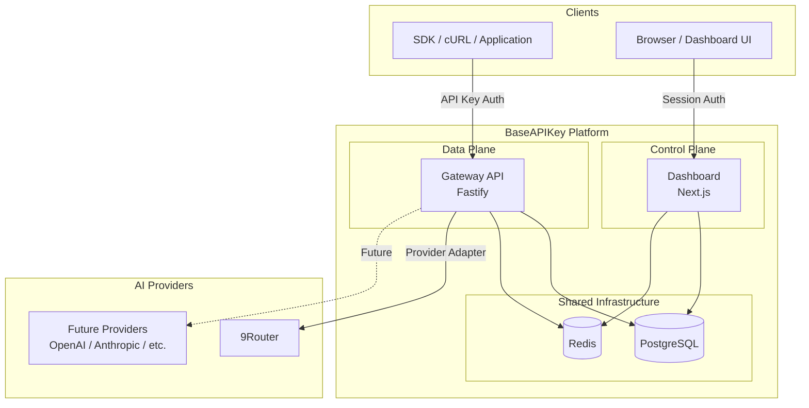

### 1.2 Architectural Decisions Record (ADR)

| ID      | Decision                           | Rationale                                                                                        |
| ------- | ---------------------------------- | ------------------------------------------------------------------------------------------------ |
| ADR-001 | **Monorepo with Turborepo + pnpm** | Type safety across boundaries, shared packages, unified CI, simplified dependency management     |
| ADR-002 | **Fastify for Gateway**            | 2-3x faster than Express, native streaming support, schema-based validation, plugin architecture |
| ADR-003 | **Next.js 14+ for Dashboard**      | App Router for server components, built-in auth support, SSR for SEO, React ecosystem            |
| ADR-004 | **PostgreSQL as primary DB**       | ACID compliance critical for billing, JSONB for flexible metadata, mature ecosystem              |
| ADR-005 | **Redis for ephemeral state**      | Sub-millisecond rate limiting, caching, session store, async job queuing                         |
| ADR-006 | **Drizzle ORM**                    | Type-safe queries, lightweight (no runtime overhead), excellent migration tooling                |
| ADR-007 | **Clean Architecture in Gateway**  | Business logic isolation enables provider swapping, testability, and framework independence      |
| ADR-008 | **UUID v7 for primary keys**       | Time-ordered for B-tree efficiency, globally unique, no central coordination needed              |
| ADR-009 | **Async usage tracking**           | Decouples billing from request path, reduces gateway latency, enables batch processing           |
| ADR-010 | **OpenAI-compatible API format**   | Massive existing ecosystem, drop-in replacement, reduces developer learning curve                |

### 1.3 Technology Stack

| Layer            | Technology           | Version      | Purpose                                         |
| ---------------- | -------------------- | ------------ | ----------------------------------------------- |
| Language         | TypeScript           | 5.x (strict) | Type-safe development across all packages       |
| Runtime          | Node.js              | 20+ LTS      | Server-side execution                           |
| Monorepo         | Turborepo            | Latest       | Build orchestration, caching, task dependencies |
| Package Manager  | pnpm                 | 9+           | Fast, disk-efficient package management         |
| Gateway API      | Fastify              | 5.x          | High-performance HTTP framework                 |
| Dashboard        | Next.js              | 14+          | Full-stack React framework (App Router)         |
| Database         | PostgreSQL           | 16+          | Relational database (ACID, JSONB)               |
| Cache/Queue      | Redis                | 7+           | Rate limiting, caching, job queues              |
| ORM              | Drizzle ORM          | Latest       | Type-safe SQL, migrations                       |
| Auth (Dashboard) | NextAuth.js          | 5.x          | Session-based authentication                    |
| Validation       | Zod                  | 3.x          | Runtime type validation                         |
| Logging          | Pino                 | 9.x          | Structured JSON logging                         |
| Testing          | Vitest / Playwright  | Latest       | Unit / E2E testing                              |
| API Docs         | Scalar               | Latest       | OpenAPI 3.1 documentation                       |
| Monitoring       | Prometheus + Grafana | Latest       | Metrics collection and visualization            |
| Error Tracking   | Sentry               | Latest       | Exception monitoring and alerting               |
| CI/CD            | GitHub Actions       | —            | Automated testing and deployment                |
| Containers       | Docker               | Latest       | Application containerization                    |
| Orchestration    | Kubernetes           | 1.28+        | Production container orchestration              |

---

## 2. Folder Structure

```
baseapikey/
├── apps/
│   ├── gateway/                        # Data Plane — AI Gateway API (Fastify)
│   │   ├── src/
│   │   │   ├── domain/                 # Business entities & rules (no dependencies)
│   │   │   │   ├── entities/           # Core domain objects
│   │   │   │   │   ├── api-key.entity.ts
│   │   │   │   │   ├── model.entity.ts
│   │   │   │   │   ├── provider.entity.ts
│   │   │   │   │   └── request-log.entity.ts
│   │   │   │   ├── value-objects/      # Immutable domain primitives
│   │   │   │   │   ├── api-key-hash.vo.ts
│   │   │   │   │   ├── token-count.vo.ts
│   │   │   │   │   └── cost.vo.ts
│   │   │   │   └── errors/             # Domain-specific errors
│   │   │   │       ├── spending-limit-exceeded.error.ts
│   │   │   │       └── model-not-found.error.ts
│   │   │   │
│   │   │   ├── application/            # Use cases & ports (depends on domain only)
│   │   │   │   ├── use-cases/          # Application business logic
│   │   │   │   │   ├── chat-completion.use-case.ts
│   │   │   │   │   ├── list-models.use-case.ts
│   │   │   │   │   └── validate-api-key.use-case.ts
│   │   │   │   ├── ports/              # Interfaces for infrastructure
│   │   │   │   │   ├── provider-adapter.port.ts
│   │   │   │   │   ├── api-key-repository.port.ts
│   │   │   │   │   ├── model-repository.port.ts
│   │   │   │   │   ├── rate-limiter.port.ts
│   │   │   │   │   └── usage-tracker.port.ts
│   │   │   │   ├── dtos/               # Data transfer objects
│   │   │   │   │   ├── chat-completion.dto.ts
│   │   │   │   │   └── model-list.dto.ts
│   │   │   │   └── services/           # Application services
│   │   │   │       ├── cost-calculator.service.ts
│   │   │   │       └── token-counter.service.ts
│   │   │   │
│   │   │   ├── infrastructure/         # External implementations (depends on application + domain)
│   │   │   │   ├── database/           # Database repositories
│   │   │   │   │   ├── api-key.repository.ts
│   │   │   │   │   ├── model.repository.ts
│   │   │   │   │   └── request-log.repository.ts
│   │   │   │   ├── providers/          # AI provider adapters
│   │   │   │   │   ├── base-provider.adapter.ts
│   │   │   │   │   └── nine-router.adapter.ts
│   │   │   │   ├── cache/              # Redis implementations
│   │   │   │   │   ├── redis-rate-limiter.ts
│   │   │   │   │   └── redis-cache.ts
│   │   │   │   └── queue/              # Async job processing
│   │   │   │       └── usage-tracking.queue.ts
│   │   │   │
│   │   │   ├── presentation/           # HTTP layer (depends on application + domain)
│   │   │   │   ├── routes/             # Fastify route definitions
│   │   │   │   │   ├── chat-completions.route.ts
│   │   │   │   │   ├── models.route.ts
│   │   │   │   │   └── health.route.ts
│   │   │   │   ├── controllers/        # Request handlers
│   │   │   │   │   ├── chat-completions.controller.ts
│   │   │   │   │   └── models.controller.ts
│   │   │   │   ├── middleware/         # Fastify hooks & middleware
│   │   │   │   │   ├── auth.middleware.ts
│   │   │   │   │   ├── rate-limit.middleware.ts
│   │   │   │   │   ├── request-id.middleware.ts
│   │   │   │   │   └── error-handler.middleware.ts
│   │   │   │   └── validators/         # Zod schemas for requests
│   │   │   │       ├── chat-completion.validator.ts
│   │   │   │       └── common.validator.ts
│   │   │   │
│   │   │   ├── config/                 # App configuration
│   │   │   │   ├── env.ts              # Zod-validated env vars
│   │   │   │   ├── container.ts        # DI container setup
│   │   │   │   └── plugins.ts          # Fastify plugin registration
│   │   │   │
│   │   │   └── server.ts              # Application entry point
│   │   │
│   │   ├── Dockerfile
│   │   ├── package.json
│   │   └── tsconfig.json
│   │
│   ├── dashboard/                      # Control Plane — Admin & User Dashboard (Next.js)
│   │   ├── src/
│   │   │   ├── app/                    # Next.js App Router
│   │   │   │   ├── (auth)/             # Auth route group
│   │   │   │   │   ├── login/page.tsx
│   │   │   │   │   └── register/page.tsx
│   │   │   │   ├── (dashboard)/        # Authenticated route group
│   │   │   │   │   ├── layout.tsx      # Dashboard shell (sidebar, header)
│   │   │   │   │   ├── page.tsx        # Overview / home
│   │   │   │   │   ├── keys/page.tsx   # API key management
│   │   │   │   │   ├── usage/page.tsx  # Usage analytics
│   │   │   │   │   ├── models/page.tsx # Model catalog
│   │   │   │   │   ├── settings/page.tsx
│   │   │   │   │   └── admin/          # Admin-only pages
│   │   │   │   │       ├── providers/page.tsx
│   │   │   │   │       └── users/page.tsx
│   │   │   │   ├── api/                # Next.js API routes (dashboard API)
│   │   │   │   │   └── [...]/route.ts
│   │   │   │   ├── layout.tsx          # Root layout
│   │   │   │   └── page.tsx            # Landing / redirect
│   │   │   ├── components/             # React components
│   │   │   │   ├── ui/                 # Base UI components (Button, Card, etc.)
│   │   │   │   ├── charts/             # Usage chart components
│   │   │   │   ├── forms/              # Form components
│   │   │   │   └── layout/             # Layout components (Sidebar, Header)
│   │   │   ├── lib/                    # Client-side utilities
│   │   │   │   ├── api-client.ts       # Typed fetch wrapper
│   │   │   │   ├── auth.ts             # NextAuth configuration
│   │   │   │   └── utils.ts            # General utilities
│   │   │   ├── hooks/                  # Custom React hooks
│   │   │   │   ├── use-api-keys.ts
│   │   │   │   └── use-usage-stats.ts
│   │   │   └── styles/                 # Global styles
│   │   │       └── globals.css
│   │   ├── Dockerfile
│   │   ├── package.json
│   │   └── tsconfig.json
│   │
│   └── docs-site/                      # Public API documentation (Scalar)
│       ├── src/
│       ├── package.json
│       └── tsconfig.json
│
├── packages/
│   ├── database/                       # Shared database package
│   │   ├── src/
│   │   │   ├── schema/                 # Drizzle table definitions
│   │   │   │   ├── users.ts
│   │   │   │   ├── organizations.ts
│   │   │   │   ├── api-keys.ts
│   │   │   │   ├── providers.ts
│   │   │   │   ├── models.ts
│   │   │   │   ├── requests.ts
│   │   │   │   ├── usage-records.ts
│   │   │   │   ├── rate-limit-rules.ts
│   │   │   │   ├── audit-logs.ts
│   │   │   │   ├── webhooks.ts
│   │   │   │   └── index.ts            # Barrel export
│   │   │   ├── migrations/             # Generated SQL migrations
│   │   │   ├── seeds/                  # Development seed data
│   │   │   │   └── seed.ts
│   │   │   ├── client.ts               # Database connection client
│   │   │   └── index.ts                # Package entry point
│   │   ├── drizzle.config.ts
│   │   ├── package.json
│   │   └── tsconfig.json
│   │
│   ├── shared/                         # Shared types, utilities, constants
│   │   ├── src/
│   │   │   ├── types/                  # Shared TypeScript types
│   │   │   │   ├── api.type.ts         # API request/response envelopes
│   │   │   │   ├── auth.type.ts        # Auth-related types
│   │   │   │   └── provider.type.ts    # Provider interface types
│   │   │   ├── constants/              # Shared constants
│   │   │   │   ├── error-codes.constant.ts
│   │   │   │   ├── roles.constant.ts
│   │   │   │   └── limits.constant.ts
│   │   │   ├── utils/                  # Shared utility functions
│   │   │   │   ├── hash.util.ts
│   │   │   │   ├── id.util.ts          # UUID v7 generation
│   │   │   │   └── result.util.ts      # Result<T, E> type
│   │   │   ├── errors/                 # Shared error classes
│   │   │   │   ├── app-error.ts
│   │   │   │   ├── validation-error.ts
│   │   │   │   ├── auth-error.ts
│   │   │   │   └── not-found-error.ts
│   │   │   └── index.ts
│   │   ├── package.json
│   │   └── tsconfig.json
│   │
│   ├── config/                         # Shared configuration packages
│   │   ├── eslint/                     # ESLint configurations
│   │   │   ├── base.js
│   │   │   ├── next.js
│   │   │   └── node.js
│   │   ├── tsconfig/                   # TypeScript configurations
│   │   │   ├── base.json
│   │   │   ├── next.json
│   │   │   └── node.json
│   │   └── prettier/                   # Prettier configuration
│   │       └── index.js
│   │
│   └── logger/                         # Shared Pino-based logger
│       ├── src/
│       │   ├── logger.ts               # Logger factory
│       │   ├── redaction.ts            # PII redaction paths
│       │   └── index.ts
│       ├── package.json
│       └── tsconfig.json
│
├── infrastructure/
│   ├── docker/
│   │   ├── Dockerfile.gateway          # Gateway production build
│   │   ├── Dockerfile.dashboard        # Dashboard production build
│   │   ├── docker-compose.yml          # Local development
│   │   └── docker-compose.prod.yml     # Production deployment
│   ├── k8s/
│   │   ├── gateway/
│   │   │   ├── deployment.yaml
│   │   │   ├── service.yaml
│   │   │   └── hpa.yaml
│   │   ├── dashboard/
│   │   │   ├── deployment.yaml
│   │   │   ├── service.yaml
│   │   │   └── hpa.yaml
│   │   ├── ingress.yaml
│   │   ├── configmap.yaml
│   │   └── secrets.yaml
│   └── monitoring/
│       ├── prometheus.yml
│       ├── grafana-dashboards/
│       └── alertmanager.yml
│
├── docs/                               # Project documentation
│   ├── PRD.md
│   ├── ARCHITECTURE.md
│   ├── DATABASE.md
│   ├── CODING_STANDARD.md
│   └── TASKS.md
│
├── .github/
│   └── workflows/
│       ├── ci.yml                      # Lint, type-check, test on PR
│       ├── deploy-staging.yml          # Deploy to staging
│       └── deploy-production.yml       # Deploy to production
│
├── turbo.json                          # Turborepo pipeline configuration
├── pnpm-workspace.yaml                 # pnpm workspace definitions
├── package.json                        # Root package.json
├── .env.example                        # Environment variable template
├── .gitignore
├── .prettierrc
└── README.md
```

### 2.1 Directory Responsibilities

| Directory           | Responsibility                                                                                                                      |
| ------------------- | ----------------------------------------------------------------------------------------------------------------------------------- |
| `apps/gateway`      | Core AI Gateway API — handles all incoming AI API requests, authentication, rate limiting, provider routing, and response streaming |
| `apps/dashboard`    | Web UI for users and admins — API key management, usage analytics, organization settings, provider administration                   |
| `apps/docs-site`    | Public-facing API documentation powered by Scalar with OpenAPI 3.1 spec                                                             |
| `packages/database` | Single source of truth for database schema (Drizzle), migrations, seeds, and connection client                                      |
| `packages/shared`   | Cross-cutting types, constants, utility functions, and error classes used by all apps                                               |
| `packages/config`   | Shared ESLint, TypeScript, and Prettier configurations for consistent code quality                                                  |
| `packages/logger`   | Pino-based structured logging wrapper with PII redaction                                                                            |
| `infrastructure/`   | Docker, Kubernetes, and monitoring configuration for all environments                                                               |

---

## 3. Monorepo Layout

### 3.1 Turborepo Configuration

```jsonc
// turbo.json
{
  "$schema": "https://turbo.build/schema.json",
  "globalDependencies": [".env"],
  "tasks": {
    "build": {
      "dependsOn": ["^build"],
      "outputs": ["dist/**", ".next/**"],
    },
    "dev": {
      "cache": false,
      "persistent": true,
    },
    "lint": {
      "dependsOn": ["^build"],
    },
    "type-check": {
      "dependsOn": ["^build"],
    },
    "test": {
      "dependsOn": ["^build"],
    },
    "db:generate": {
      "cache": false,
    },
    "db:migrate": {
      "cache": false,
    },
    "db:seed": {
      "cache": false,
    },
  },
}
```

### 3.2 pnpm Workspace

```yaml
# pnpm-workspace.yaml
packages:
  - 'apps/*'
  - 'packages/*'
```

### 3.3 Package Dependency Graph

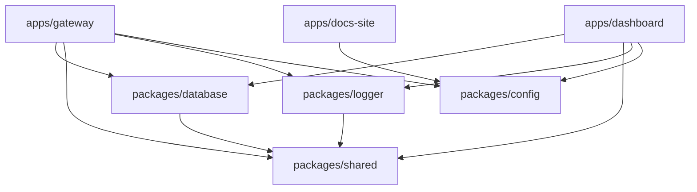

### 3.4 Shared Package Consumption

Internal packages are referenced in `package.json` using the `workspace:*` protocol:

```jsonc
// apps/gateway/package.json
{
  "dependencies": {
    "@baseapikey/database": "workspace:*",
    "@baseapikey/shared": "workspace:*",
    "@baseapikey/logger": "workspace:*",
  },
}
```

### 3.5 Build Pipeline

1. **`packages/config`** — Built first (ESLint, TSConfig, Prettier configs)
2. **`packages/shared`** — Types and utilities (depends on nothing)
3. **`packages/logger`** — Logger wrapper (depends on shared)
4. **`packages/database`** — Schema and client (depends on shared)
5. **`apps/gateway`** — Gateway API (depends on database, shared, logger)
6. **`apps/dashboard`** — Dashboard UI (depends on database, shared, logger)
7. **`apps/docs-site`** — Documentation site (depends on config)

---

## 4. Request Flow

### 4.1 Complete Request Lifecycle

When a client sends a request to the BaseAPIKey gateway, it passes through these stages:

```
Client Request
    │
    ▼
┌─────────────────┐
│ 1. Receive       │  Gateway receives HTTP request
├─────────────────┤
│ 2. Request ID    │  Generate/forward X-Request-Id
├─────────────────┤
│ 3. Authenticate  │  Extract Bearer token → SHA-256 hash → DB lookup
├─────────────────┤
│ 4. Rate Limit    │  Sliding window check in Redis
├─────────────────┤
│ 5. Validate      │  Zod schema validation of request body
├─────────────────┤
│ 6. Spend Check   │  Verify org hasn't exceeded spending limit
├─────────────────┤
│ 7. Route         │  Resolve model → provider adapter
├─────────────────┤
│ 8. Transform     │  Normalize request to provider format
├─────────────────┤
│ 9. Forward       │  Send to AI provider (9Router)
├─────────────────┤
│ 10. Stream/Return│  Stream SSE chunks or return JSON response
├─────────────────┤
│ 11. Async Log    │  Queue: log usage, update counters, webhooks
└─────────────────┘
```

### 4.2 Request Flow Sequence Diagram

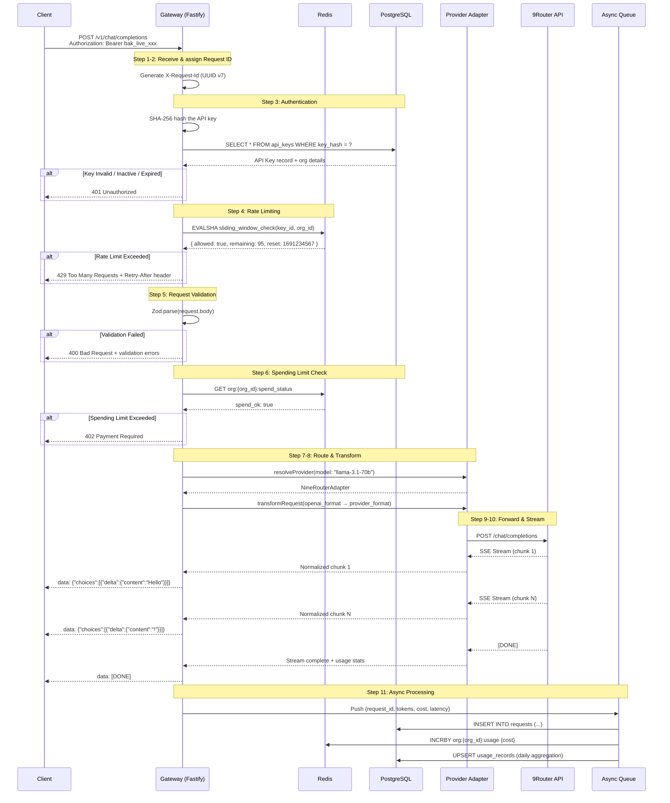

---

## 5. AI Gateway Flow

### 5.1 Gateway Processing Pipeline

The AI Gateway implements a multi-stage pipeline for processing requests:

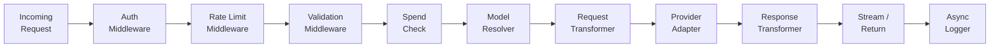

### 5.2 Streaming (SSE) Architecture

For streaming responses, the gateway uses Node.js readable streams piped through Fastify's reply:

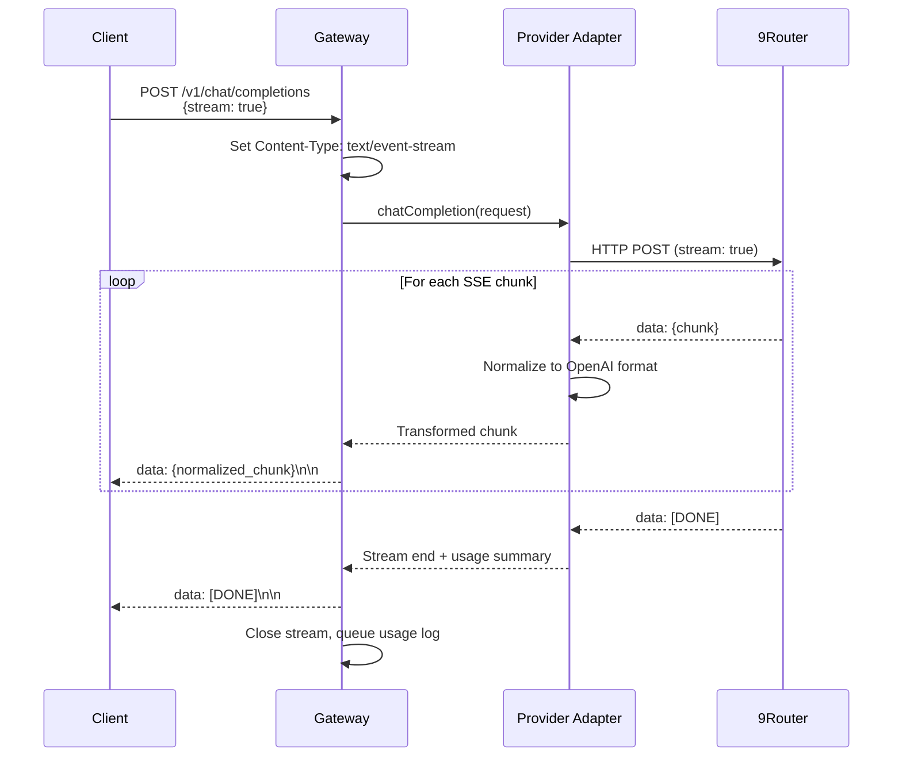

### 5.3 Circuit Breaker Pattern

The gateway implements a circuit breaker to prevent cascading failures:

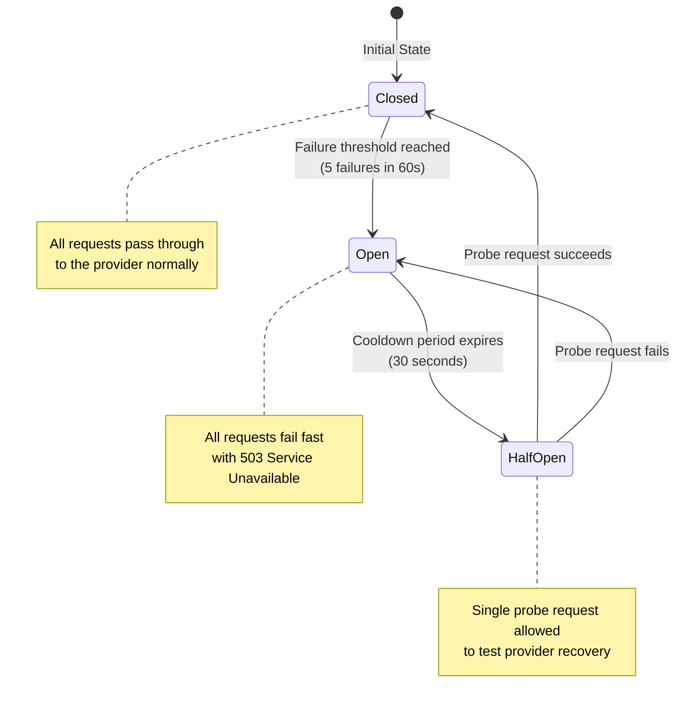

**Circuit Breaker Configuration:**

| Parameter         | Value      | Description                          |
| ----------------- | ---------- | ------------------------------------ |
| Failure Threshold | 5          | Failures needed to trip circuit      |
| Window Duration   | 60 seconds | Rolling window for counting failures |
| Cooldown Period   | 30 seconds | Time before probe attempt            |
| Timeout           | 30 seconds | Per-request timeout                  |
| Probe Count       | 1          | Requests allowed in half-open state  |

### 5.4 Error Handling & Retry Strategy

| Scenario             | Strategy                                 | Max Retries | Backoff            |
| -------------------- | ---------------------------------------- | ----------- | ------------------ |
| Provider returns 5xx | Retry with exponential backoff           | 2           | 1s, 3s             |
| Provider returns 429 | Respect `Retry-After` header             | 1           | Provider-specified |
| Network timeout      | Retry immediately (different connection) | 1           | 0s                 |
| Provider returns 4xx | Do not retry — return error to client    | 0           | —                  |
| Circuit breaker open | Fail fast — do not contact provider      | 0           | —                  |

---

## 6. Provider Abstraction

### 6.1 Strategy Pattern Design

The provider abstraction uses the Strategy Pattern, allowing the gateway to work with any AI provider through a common interface:

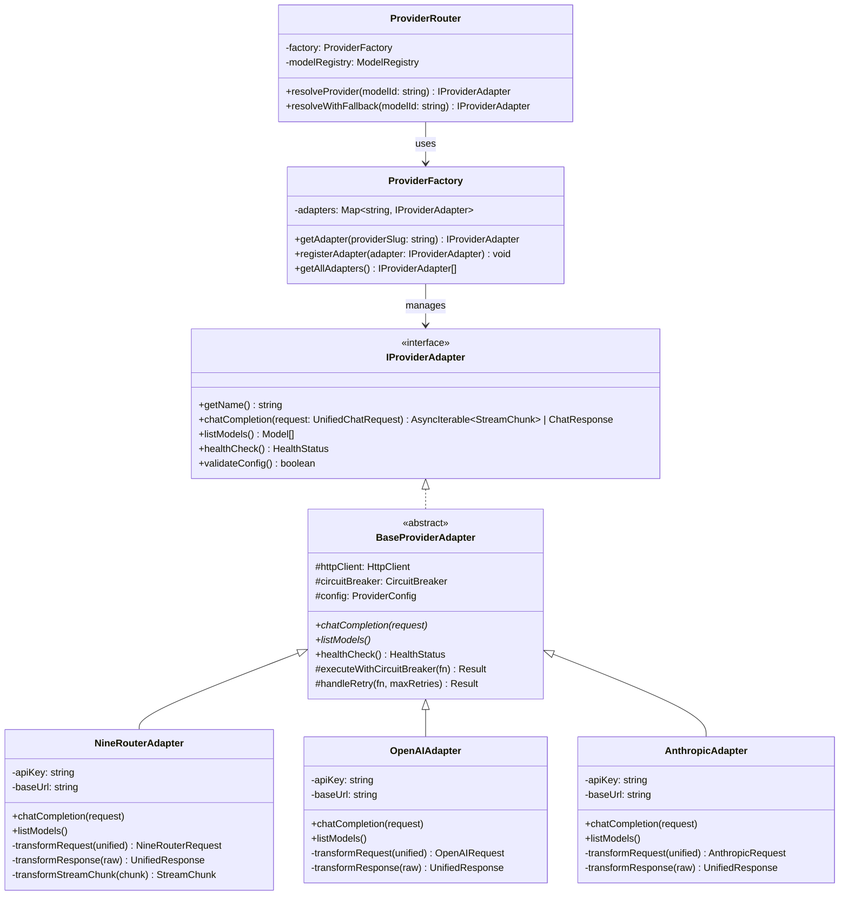

### 6.2 Provider Interface Contract

```typescript
interface IProviderAdapter {
  /** Unique provider slug (e.g., '9router', 'openai') */
  getName(): string;

  /** Execute a chat completion — returns stream or complete response */
  chatCompletion(
    request: UnifiedChatRequest,
    options: RequestOptions,
  ): Promise<ChatResponse | AsyncIterable<StreamChunk>>;

  /** List models available from this provider */
  listModels(): Promise<ProviderModel[]>;

  /** Perform a health check against this provider */
  healthCheck(): Promise<HealthStatus>;

  /** Validate provider configuration on startup */
  validateConfig(): boolean;
}
```

### 6.3 Adding a New Provider (Step-by-Step)

1. **Create adapter file:** `infrastructure/providers/new-provider.adapter.ts`
2. **Extend `BaseProviderAdapter`** and implement all abstract methods
3. **Implement `transformRequest()`** to convert unified format → provider format
4. **Implement `transformResponse()`** to convert provider format → unified format
5. **Implement `transformStreamChunk()`** if provider supports streaming
6. **Register in `ProviderFactory`** during container setup
7. **Add provider record** to `providers` table via migration/seed
8. **Add model records** to `models` table with pricing data
9. **Configure environment variables** for the provider's API key
10. **Write integration tests** against the provider's API

---

## 7. Security Architecture

### 7.1 Authentication Flows

The platform uses two distinct authentication mechanisms:

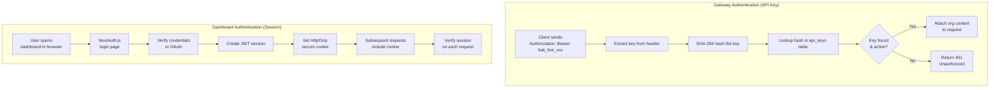

### 7.2 API Key Security

| Aspect             | Implementation                                                         |
| ------------------ | ---------------------------------------------------------------------- |
| **Generation**     | `crypto.randomBytes(32)` → Base62 encoding → prefixed with `bak_live_` |
| **Storage**        | Only SHA-256 hash stored in `api_keys.key_hash`                        |
| **Identification** | First 12 characters stored in `api_keys.key_prefix` for display        |
| **Comparison**     | `crypto.timingSafeEqual()` for constant-time hash comparison           |
| **Display**        | Full key shown once at creation, never retrievable again               |
| **Revocation**     | Soft-delete sets `deleted_at`, instantly blocks validation             |

### 7.3 Authorization Model (RBAC)

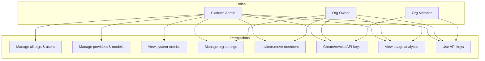

| Role        | Scope         | Capabilities                                                |
| ----------- | ------------- | ----------------------------------------------------------- |
| `admin`     | Platform-wide | Full system access — manage providers, users, view all orgs |
| `org_owner` | Organization  | Manage org settings, members, billing, all API keys         |
| `member`    | Organization  | Create/revoke own API keys, view org usage                  |

### 7.4 Security Layers

| Layer                | Implementation                                                                |
| -------------------- | ----------------------------------------------------------------------------- |
| **Input Validation** | Zod schemas on all endpoints with max length/count constraints                |
| **SQL Injection**    | Parameterized queries via Drizzle ORM (no raw SQL)                            |
| **XSS Prevention**   | Content-Security-Policy headers via Helmet                                    |
| **CSRF**             | SameSite cookies + CSRF tokens in dashboard                                   |
| **CORS**             | Configurable allowed origins (wildcard for gateway, restricted for dashboard) |
| **Request Size**     | Fastify body limit: 1MB default, 10MB for multimodal                          |
| **HTTP Headers**     | Helmet.js (X-Frame-Options, X-Content-Type-Options, etc.)                     |
| **Secrets**          | Environment variables, never committed to code                                |
| **Dependencies**     | Automated `npm audit` + Dependabot in CI                                      |
| **PII Redaction**    | Pino redaction paths strip API keys, passwords, auth headers from logs        |
| **Rate Limiting**    | Redis sliding window prevents brute-force and DDoS                            |

---

## 8. Deployment Architecture

### 8.1 Environment Overview

| Environment           | Infrastructure              | Purpose                          |
| --------------------- | --------------------------- | -------------------------------- |
| **Local Development** | Docker Compose + `pnpm dev` | Developer workstation            |
| **CI/CD**             | GitHub Actions              | Automated testing + image builds |
| **Staging**           | Docker Compose or K8s       | Pre-production validation        |
| **Production**        | Kubernetes                  | Scalable, resilient deployment   |

### 8.2 Production Deployment Diagram

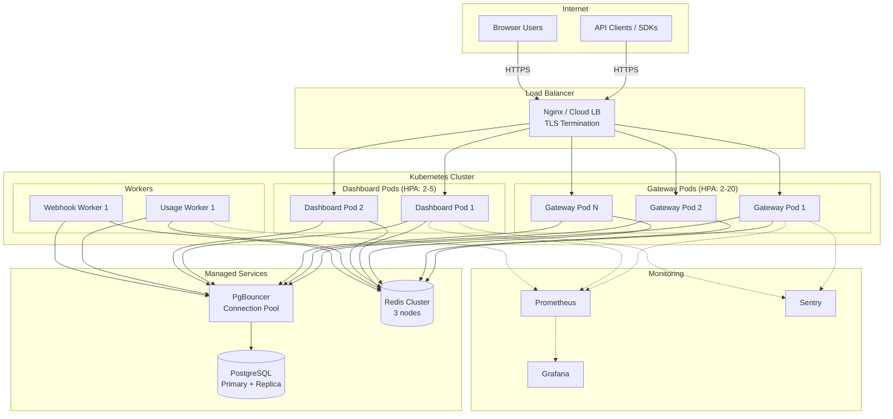

### 8.3 Kubernetes Resources

| Resource       | Application  | Configuration                                             |
| -------------- | ------------ | --------------------------------------------------------- |
| **Deployment** | Gateway      | 2-20 replicas, CPU/memory limits, rolling update strategy |
| **Deployment** | Dashboard    | 2-5 replicas, CPU/memory limits                           |
| **Deployment** | Usage Worker | 1-3 replicas                                              |
| **Service**    | Gateway      | ClusterIP, port 3000                                      |
| **Service**    | Dashboard    | ClusterIP, port 3001                                      |
| **Ingress**    | Both         | TLS termination, path-based routing                       |
| **HPA**        | Gateway      | Scale on CPU (70%) and custom metrics (RPS)               |
| **ConfigMap**  | All          | Non-sensitive configuration                               |
| **Secret**     | All          | API keys, DB credentials, JWT secrets                     |
| **PDB**        | Gateway      | minAvailable: 1 (ensure zero-downtime)                    |

### 8.4 CI/CD Pipeline

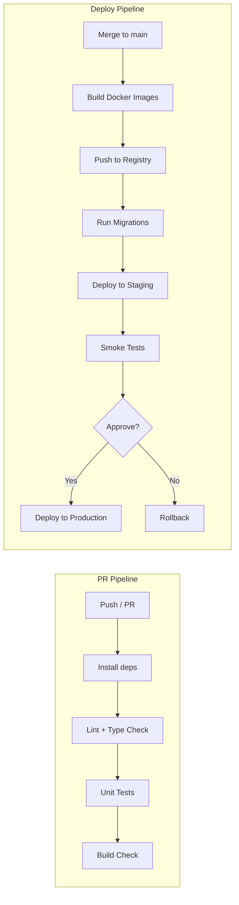

### 8.5 Local Development Setup

```yaml
# docker-compose.yml (simplified)
services:
  postgres:
    image: postgres:16-alpine
    ports: ['5432:5432']
    environment:
      POSTGRES_DB: baseapikey
      POSTGRES_USER: postgres
      POSTGRES_PASSWORD: postgres
    volumes:
      - pgdata:/var/lib/postgresql/data

  redis:
    image: redis:7-alpine
    ports: ['6379:6379']
    volumes:
      - redisdata:/data

volumes:
  pgdata:
  redisdata:
```

---

## 9. Sequence Diagrams

### 9.1 API Key Creation Flow

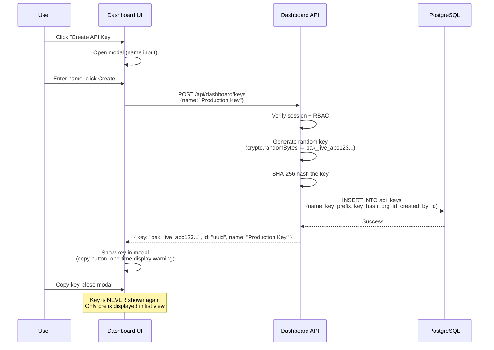

### 9.2 Provider Failover Flow

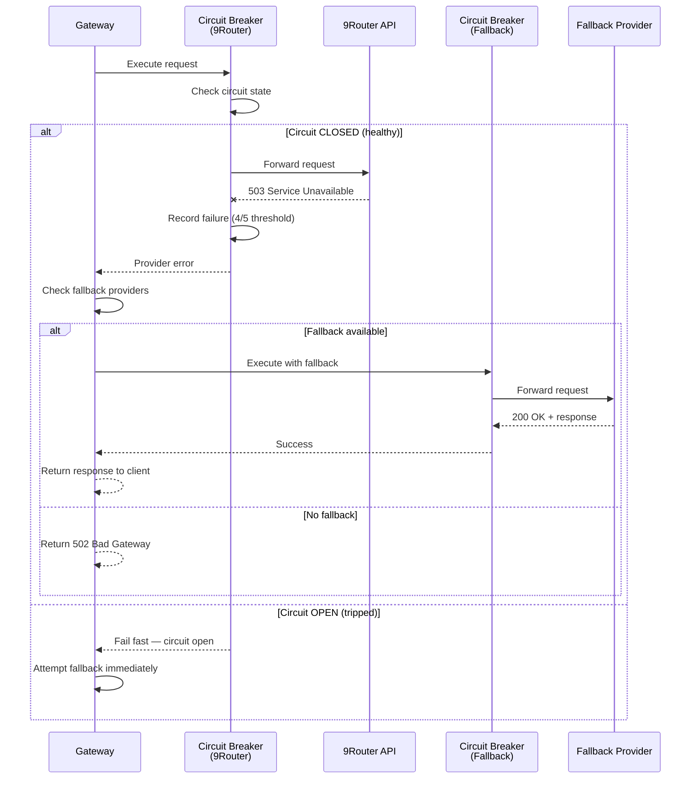

### 9.3 Rate Limiting Decision Flow

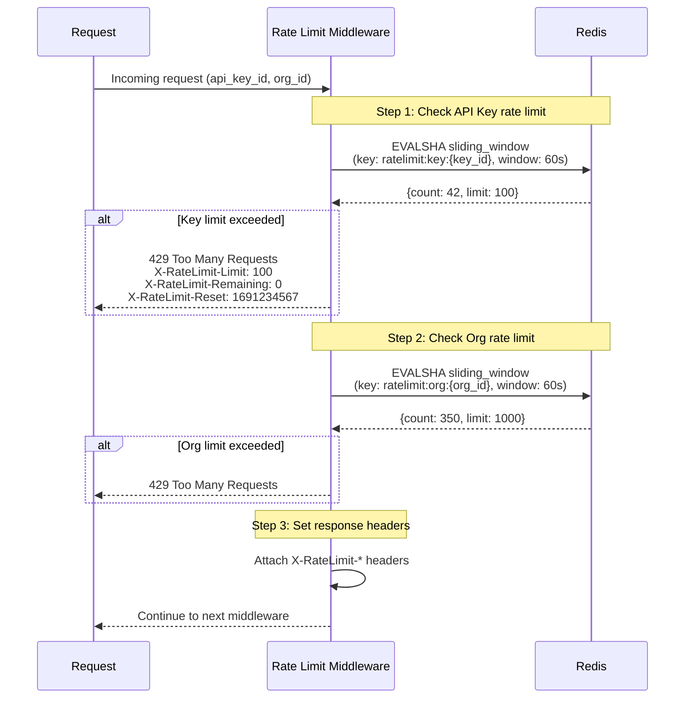

### 9.4 Webhook Delivery Flow

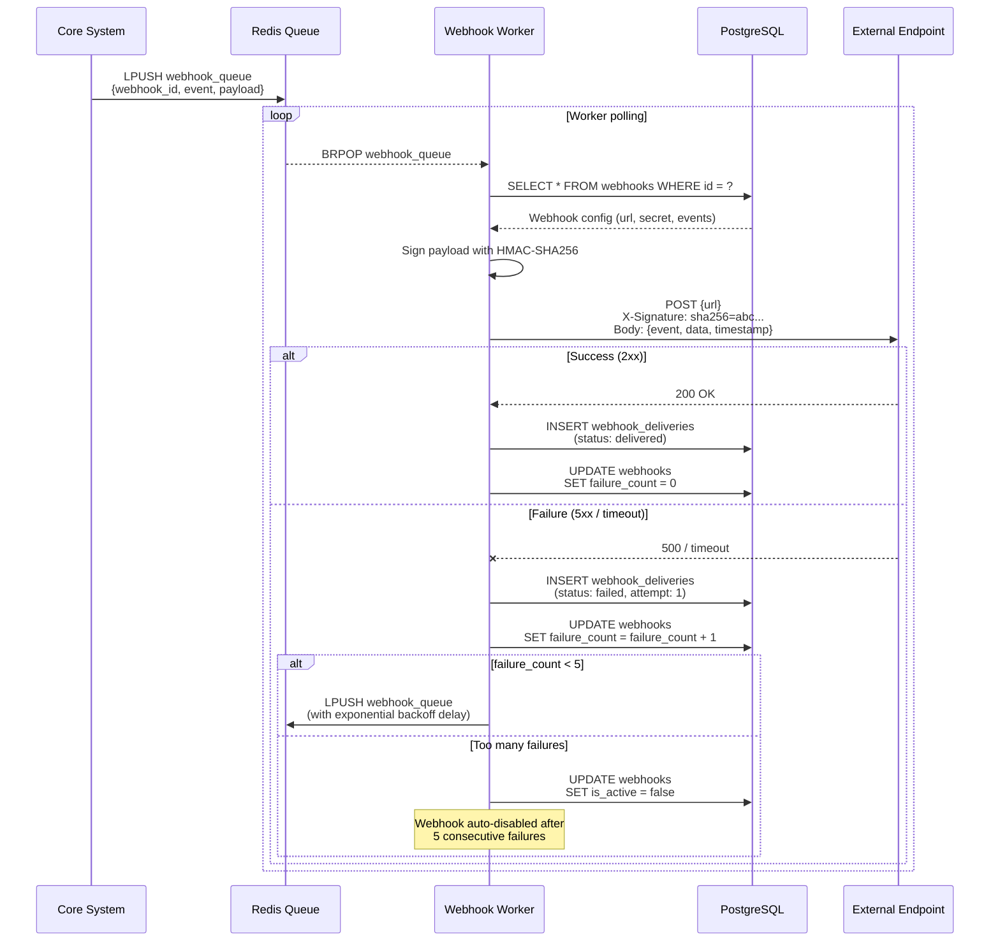

### 9.5 Usage Aggregation Flow

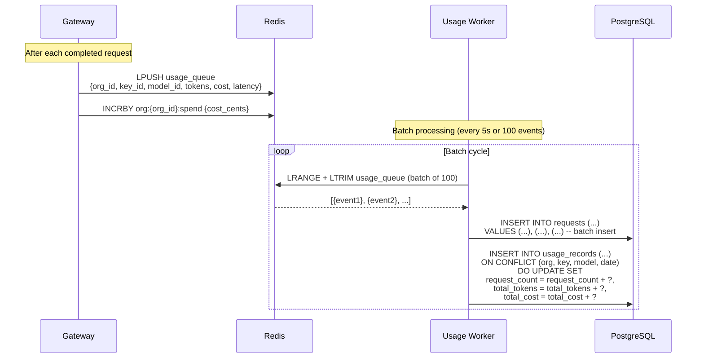

---

## Appendix: Key Design Principles

| Principle                     | Application                                                                                   |
| ----------------------------- | --------------------------------------------------------------------------------------------- |
| **Separation of Concerns**    | Data plane (gateway) and control plane (dashboard) are independent applications               |
| **Dependency Inversion**      | Use cases depend on port interfaces, not concrete implementations                             |
| **Stateless Gateway**         | No server-side sessions — all state in PostgreSQL/Redis, enabling horizontal scaling          |
| **Async by Default**          | Usage tracking, webhooks, and aggregation are async to minimize request latency               |
| **Fail Open vs. Fail Closed** | Rate limiting fails open on Redis failure (allow traffic); Auth fails closed (deny traffic)   |
| **Defense in Depth**          | Multiple security layers: input validation → auth → rate limit → spend check → CORS → headers |
