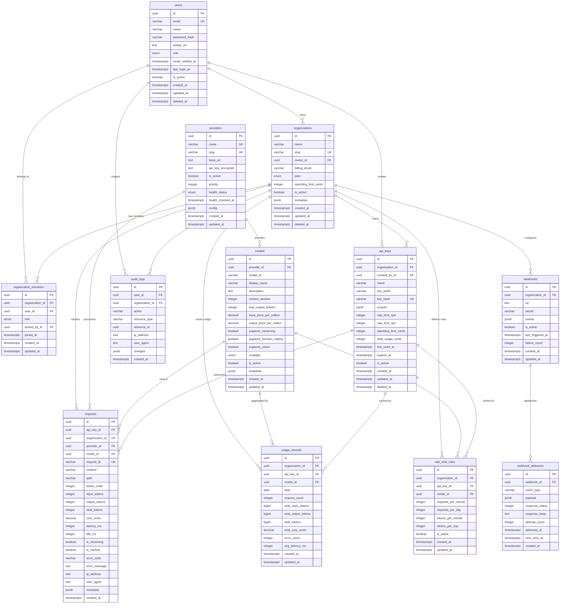

# BaseAPIKey — Database Design Document

> **Version:** 1.0
> **Last Updated:** 2026-08-06
> **Status:** Draft
> **Author:** Architecture Team

---

## Table of Contents

1. [Database Overview](#1-database-overview)
2. [Database Schema](#2-database-schema)
3. [ER Diagram](#3-er-diagram)
4. [Table Descriptions](#4-table-descriptions)
5. [Index Strategy](#5-index-strategy)
6. [Foreign Keys](#6-foreign-keys)
7. [Naming Conventions](#7-naming-conventions)

---

## 1. Database Overview

### 1.1 Technology Choices

| Component             | Technology             | Purpose                                                        |
| --------------------- | ---------------------- | -------------------------------------------------------------- |
| **Primary Database**  | PostgreSQL 16+         | Relational data — users, orgs, API keys, billing, audit logs   |
| **Cache / Ephemeral** | Redis 7+               | Rate limiting, caching, session store, async job queues        |
| **ORM**               | Drizzle ORM            | Type-safe database access, schema definition, query building   |
| **Migrations**        | Drizzle Kit            | Schema diffing, SQL migration generation, migration runner     |
| **Connection Pool**   | PgBouncer (production) | Connection multiplexing for high-concurrency gateway workloads |

### 1.2 Migration Strategy

- Migrations are generated via `drizzle-kit generate` based on schema diffs.
- Migrations produce idempotent SQL files stored in `packages/database/src/migrations/`.
- Migrations are applied via `drizzle-kit migrate` in CI/CD before deployment.
- Rollback migrations are not auto-generated — manual rollback scripts are written for critical migrations.
- Schema changes follow a **non-breaking migration** policy: add columns as nullable first, backfill, then add constraints.

### 1.3 Connection Pooling

| Environment           | Strategy                              | Pool Size                             |
| --------------------- | ------------------------------------- | ------------------------------------- |
| **Local Development** | Direct connection via `postgres.js`   | 5 connections                         |
| **Staging**           | Direct connection with increased pool | 10 connections                        |
| **Production**        | PgBouncer (transaction mode)          | 20-50 per pod, PgBouncer handles 200+ |

### 1.4 Primary Key Strategy

All tables use **UUID v7** as the primary key:

- Time-ordered for efficient B-tree indexing (no random page splits)
- Globally unique without central coordination (safe for distributed systems)
- Embeds creation timestamp (eliminates need for separate `created_at` index in some cases)
- Generated application-side using `uuidv7()` utility

---

## 2. Database Schema

### 2.1 `users`

| Column              | Type                  | Constraints      | Default    | Description                             |
| ------------------- | --------------------- | ---------------- | ---------- | --------------------------------------- |
| `id`                | uuid                  | PRIMARY KEY      | `uuidv7()` | Unique user identifier                  |
| `email`             | varchar(255)          | UNIQUE, NOT NULL | —          | User's email address                    |
| `name`              | varchar(255)          | NULL             | —          | User's display name                     |
| `password_hash`     | varchar(255)          | NULL             | —          | Bcrypt hash (null for OAuth-only users) |
| `avatar_url`        | text                  | NULL             | —          | URL to profile avatar image             |
| `role`              | enum(`admin`, `user`) | NOT NULL         | `'user'`   | Platform-level role                     |
| `email_verified_at` | timestamptz           | NULL             | —          | When email was verified                 |
| `last_login_at`     | timestamptz           | NULL             | —          | Most recent login timestamp             |
| `is_active`         | boolean               | NOT NULL         | `true`     | Account active status                   |
| `created_at`        | timestamptz           | NOT NULL         | `now()`    | Record creation time                    |
| `updated_at`        | timestamptz           | NOT NULL         | `now()`    | Last modification time                  |
| `deleted_at`        | timestamptz           | NULL             | —          | Soft-delete timestamp                   |

### 2.2 `organizations`

| Column                 | Type                              | Constraints               | Default    | Description                                      |
| ---------------------- | --------------------------------- | ------------------------- | ---------- | ------------------------------------------------ |
| `id`                   | uuid                              | PRIMARY KEY               | `uuidv7()` | Unique organization identifier                   |
| `name`                 | varchar(255)                      | NOT NULL                  | —          | Organization display name                        |
| `slug`                 | varchar(100)                      | UNIQUE, NOT NULL          | —          | URL-friendly identifier                          |
| `owner_id`             | uuid                              | FK → `users.id`, NOT NULL | —          | User who owns this organization                  |
| `billing_email`        | varchar(255)                      | NULL                      | —          | Email for billing communications                 |
| `plan`                 | enum(`free`, `pro`, `enterprise`) | NOT NULL                  | `'free'`   | Subscription plan tier                           |
| `spending_limit_cents` | integer                           | NULL                      | —          | Monthly spending cap in cents (null = unlimited) |
| `is_active`            | boolean                           | NOT NULL                  | `true`     | Organization active status                       |
| `metadata`             | jsonb                             | NULL                      | —          | Flexible metadata (custom settings, notes)       |
| `created_at`           | timestamptz                       | NOT NULL                  | `now()`    | Record creation time                             |
| `updated_at`           | timestamptz                       | NOT NULL                  | `now()`    | Last modification time                           |
| `deleted_at`           | timestamptz                       | NULL                      | —          | Soft-delete timestamp                            |

### 2.3 `organization_members`

| Column            | Type                             | Constraints                       | Default    | Description                  |
| ----------------- | -------------------------------- | --------------------------------- | ---------- | ---------------------------- |
| `id`              | uuid                             | PRIMARY KEY                       | `uuidv7()` | Unique membership identifier |
| `organization_id` | uuid                             | FK → `organizations.id`, NOT NULL | —          | Organization reference       |
| `user_id`         | uuid                             | FK → `users.id`, NOT NULL         | —          | User reference               |
| `role`            | enum(`owner`, `admin`, `member`) | NOT NULL                          | `'member'` | Role within the organization |
| `invited_by_id`   | uuid                             | FK → `users.id`, NULL             | —          | User who sent the invitation |
| `joined_at`       | timestamptz                      | NOT NULL                          | `now()`    | When user joined the org     |
| `created_at`      | timestamptz                      | NOT NULL                          | `now()`    | Record creation time         |
| `updated_at`      | timestamptz                      | NOT NULL                          | `now()`    | Last modification time       |

**Constraints:** `UNIQUE(organization_id, user_id)` — a user can belong to an organization only once.

### 2.4 `api_keys`

| Column                 | Type         | Constraints                       | Default    | Description                                              |
| ---------------------- | ------------ | --------------------------------- | ---------- | -------------------------------------------------------- |
| `id`                   | uuid         | PRIMARY KEY                       | `uuidv7()` | Unique API key identifier                                |
| `organization_id`      | uuid         | FK → `organizations.id`, NOT NULL | —          | Owning organization                                      |
| `created_by_id`        | uuid         | FK → `users.id`, NOT NULL         | —          | User who created this key                                |
| `name`                 | varchar(255) | NOT NULL                          | —          | Descriptive label (e.g., "Production Backend")           |
| `key_prefix`           | varchar(12)  | NOT NULL                          | —          | First 12 chars for identification (e.g., `bak_live_a1b`) |
| `key_hash`             | varchar(64)  | UNIQUE, NOT NULL                  | —          | SHA-256 hash of the full API key                         |
| `scopes`               | jsonb        | NOT NULL                          | `'[]'`     | Allowed models/endpoints (empty = all)                   |
| `rate_limit_rpm`       | integer      | NULL                              | —          | Per-minute rate limit override                           |
| `rate_limit_rpd`       | integer      | NULL                              | —          | Per-day rate limit override                              |
| `spending_limit_cents` | integer      | NULL                              | —          | Per-key spending cap in cents                            |
| `total_usage_cents`    | integer      | NOT NULL                          | `0`        | Cumulative usage cost in cents                           |
| `last_used_at`         | timestamptz  | NULL                              | —          | Most recent API call timestamp                           |
| `expires_at`           | timestamptz  | NULL                              | —          | Key expiration time (null = never)                       |
| `is_active`            | boolean      | NOT NULL                          | `true`     | Key active status                                        |
| `created_at`           | timestamptz  | NOT NULL                          | `now()`    | Record creation time                                     |
| `updated_at`           | timestamptz  | NOT NULL                          | `now()`    | Last modification time                                   |
| `deleted_at`           | timestamptz  | NULL                              | —          | Soft-delete timestamp (revocation)                       |

### 2.5 `providers`

| Column              | Type                                | Constraints      | Default     | Description                                               |
| ------------------- | ----------------------------------- | ---------------- | ----------- | --------------------------------------------------------- |
| `id`                | uuid                                | PRIMARY KEY      | `uuidv7()`  | Unique provider identifier                                |
| `name`              | varchar(100)                        | UNIQUE, NOT NULL | —           | Provider display name (e.g., "9Router")                   |
| `slug`              | varchar(100)                        | UNIQUE, NOT NULL | —           | URL-friendly identifier (e.g., "9router")                 |
| `base_url`          | text                                | NOT NULL         | —           | Provider API base URL                                     |
| `api_key_encrypted` | text                                | NOT NULL         | —           | AES-256 encrypted provider API key                        |
| `is_active`         | boolean                             | NOT NULL         | `true`      | Provider availability                                     |
| `priority`          | integer                             | NOT NULL         | `0`         | Routing preference (higher = preferred)                   |
| `health_status`     | enum(`healthy`, `degraded`, `down`) | NOT NULL         | `'healthy'` | Current provider health                                   |
| `health_checked_at` | timestamptz                         | NULL             | —           | Last health check timestamp                               |
| `config`            | jsonb                               | NULL             | —           | Provider-specific configuration (headers, timeouts, etc.) |
| `created_at`        | timestamptz                         | NOT NULL         | `now()`     | Record creation time                                      |
| `updated_at`        | timestamptz                         | NOT NULL         | `now()`     | Last modification time                                    |

### 2.6 `models`

| Column                      | Type                       | Constraints                   | Default    | Description                                         |
| --------------------------- | -------------------------- | ----------------------------- | ---------- | --------------------------------------------------- |
| `id`                        | uuid                       | PRIMARY KEY                   | `uuidv7()` | Unique model identifier                             |
| `provider_id`               | uuid                       | FK → `providers.id`, NOT NULL | —          | Provider offering this model                        |
| `model_id`                  | varchar(255)               | NOT NULL                      | —          | Provider's model identifier (e.g., "llama-3.1-70b") |
| `display_name`              | varchar(255)               | NOT NULL                      | —          | Human-readable name                                 |
| `description`               | text                       | NULL                          | —          | Model description and capabilities                  |
| `context_window`            | integer                    | NOT NULL                      | —          | Maximum context tokens                              |
| `max_output_tokens`         | integer                    | NULL                          | —          | Maximum output token limit                          |
| `input_price_per_million`   | decimal(12,6)              | NOT NULL                      | —          | Cost per 1M input tokens (USD)                      |
| `output_price_per_million`  | decimal(12,6)              | NOT NULL                      | —          | Cost per 1M output tokens (USD)                     |
| `supports_streaming`        | boolean                    | NOT NULL                      | `true`     | SSE streaming capability                            |
| `supports_function_calling` | boolean                    | NOT NULL                      | `false`    | Tool/function calling support                       |
| `supports_vision`           | boolean                    | NOT NULL                      | `false`    | Vision/image input support                          |
| `modality`                  | enum(`text`, `multimodal`) | NOT NULL                      | `'text'`   | Input modality type                                 |
| `is_active`                 | boolean                    | NOT NULL                      | `true`     | Model availability status                           |
| `metadata`                  | jsonb                      | NULL                          | —          | Additional model metadata                           |
| `created_at`                | timestamptz                | NOT NULL                      | `now()`    | Record creation time                                |
| `updated_at`                | timestamptz                | NOT NULL                      | `now()`    | Last modification time                              |

**Constraints:** `UNIQUE(provider_id, model_id)` — a model ID is unique per provider.

### 2.7 `requests`

| Column            | Type          | Constraints                       | Default    | Description                            |
| ----------------- | ------------- | --------------------------------- | ---------- | -------------------------------------- |
| `id`              | uuid          | PRIMARY KEY                       | `uuidv7()` | Internal record identifier             |
| `api_key_id`      | uuid          | FK → `api_keys.id`, NULL          | —          | API key used (null if key was deleted) |
| `organization_id` | uuid          | FK → `organizations.id`, NOT NULL | —          | Organization that made the request     |
| `provider_id`     | uuid          | FK → `providers.id`, NOT NULL     | —          | Provider that processed the request    |
| `model_id`        | uuid          | FK → `models.id`, NOT NULL        | —          | Model used                             |
| `request_id`      | varchar(64)   | UNIQUE, NOT NULL                  | —          | External-facing request identifier     |
| `method`          | varchar(10)   | NOT NULL                          | —          | HTTP method (POST, GET)                |
| `path`            | varchar(500)  | NOT NULL                          | —          | Request endpoint path                  |
| `status_code`     | integer       | NOT NULL                          | —          | HTTP response status code              |
| `input_tokens`    | integer       | NOT NULL                          | `0`        | Number of input/prompt tokens          |
| `output_tokens`   | integer       | NOT NULL                          | `0`        | Number of output/completion tokens     |
| `total_tokens`    | integer       | NOT NULL                          | `0`        | Total tokens (input + output)          |
| `cost_cents`      | decimal(10,4) | NOT NULL                          | `0`        | Calculated cost in cents               |
| `latency_ms`      | integer       | NOT NULL                          | —          | Total request duration in milliseconds |
| `ttfb_ms`         | integer       | NULL                              | —          | Time to first byte (streaming)         |
| `is_streaming`    | boolean       | NOT NULL                          | `false`    | Whether response was streamed          |
| `is_cached`       | boolean       | NOT NULL                          | `false`    | Whether response was served from cache |
| `error_code`      | varchar(50)   | NULL                              | —          | Error code (if request failed)         |
| `error_message`   | text          | NULL                              | —          | Error description                      |
| `ip_address`      | inet          | NULL                              | —          | Client IP address                      |
| `user_agent`      | text          | NULL                              | —          | Client User-Agent string               |
| `metadata`        | jsonb         | NULL                              | —          | Custom tags, trace IDs                 |
| `created_at`      | timestamptz   | NOT NULL                          | `now()`    | Record creation time                   |

**Partitioning:** This table is a candidate for **range partitioning by month** on `created_at` for production deployments with high request volume.

### 2.8 `usage_records`

| Column                | Type          | Constraints                       | Default    | Description                        |
| --------------------- | ------------- | --------------------------------- | ---------- | ---------------------------------- |
| `id`                  | uuid          | PRIMARY KEY                       | `uuidv7()` | Unique record identifier           |
| `organization_id`     | uuid          | FK → `organizations.id`, NOT NULL | —          | Organization reference             |
| `api_key_id`          | uuid          | FK → `api_keys.id`, NULL          | —          | Specific API key (null = all keys) |
| `model_id`            | uuid          | FK → `models.id`, NOT NULL        | —          | Model reference                    |
| `date`                | date          | NOT NULL                          | —          | Aggregation date                   |
| `request_count`       | integer       | NOT NULL                          | `0`        | Number of requests on this date    |
| `total_input_tokens`  | bigint        | NOT NULL                          | `0`        | Aggregated input tokens            |
| `total_output_tokens` | bigint        | NOT NULL                          | `0`        | Aggregated output tokens           |
| `total_tokens`        | bigint        | NOT NULL                          | `0`        | Aggregated total tokens            |
| `total_cost_cents`    | decimal(12,4) | NOT NULL                          | `0`        | Total cost in cents                |
| `error_count`         | integer       | NOT NULL                          | `0`        | Number of failed requests          |
| `avg_latency_ms`      | integer       | NOT NULL                          | `0`        | Average latency in milliseconds    |
| `created_at`          | timestamptz   | NOT NULL                          | `now()`    | Record creation time               |
| `updated_at`          | timestamptz   | NOT NULL                          | `now()`    | Last update time                   |

**Constraints:** `UNIQUE(organization_id, api_key_id, model_id, date)` — one record per org/key/model/day for upsert operations.

### 2.9 `rate_limit_rules`

| Column                | Type        | Constraints                   | Default    | Description                         |
| --------------------- | ----------- | ----------------------------- | ---------- | ----------------------------------- |
| `id`                  | uuid        | PRIMARY KEY                   | `uuidv7()` | Unique rule identifier              |
| `organization_id`     | uuid        | FK → `organizations.id`, NULL | —          | Org reference (null = global rule)  |
| `api_key_id`          | uuid        | FK → `api_keys.id`, NULL      | —          | Key reference (null = org-wide)     |
| `model_id`            | uuid        | FK → `models.id`, NULL        | —          | Model reference (null = all models) |
| `requests_per_minute` | integer     | NOT NULL                      | —          | RPM limit                           |
| `requests_per_day`    | integer     | NOT NULL                      | —          | RPD limit                           |
| `tokens_per_minute`   | integer     | NULL                          | —          | TPM limit                           |
| `tokens_per_day`      | integer     | NULL                          | —          | TPD limit                           |
| `is_active`           | boolean     | NOT NULL                      | `true`     | Rule active status                  |
| `created_at`          | timestamptz | NOT NULL                      | `now()`    | Record creation time                |
| `updated_at`          | timestamptz | NOT NULL                      | `now()`    | Last modification time              |

**Rule Resolution Priority:** Key-specific > Org-specific > Model-specific > Global.

### 2.10 `audit_logs`

| Column            | Type         | Constraints                   | Default    | Description                                         |
| ----------------- | ------------ | ----------------------------- | ---------- | --------------------------------------------------- |
| `id`              | uuid         | PRIMARY KEY                   | `uuidv7()` | Unique log entry identifier                         |
| `user_id`         | uuid         | FK → `users.id`, NULL         | —          | User who performed the action                       |
| `organization_id` | uuid         | FK → `organizations.id`, NULL | —          | Organization context                                |
| `action`          | varchar(100) | NOT NULL                      | —          | Action type (e.g., `api_key.created`, `user.login`) |
| `resource_type`   | varchar(100) | NOT NULL                      | —          | Type of resource affected                           |
| `resource_id`     | uuid         | NULL                          | —          | ID of the affected resource                         |
| `ip_address`      | inet         | NULL                          | —          | Source IP address                                   |
| `user_agent`      | text         | NULL                          | —          | Source User-Agent                                   |
| `changes`         | jsonb        | NULL                          | —          | Before/after state snapshot                         |
| `created_at`      | timestamptz  | NOT NULL                      | `now()`    | Event timestamp                                     |

**Note:** This table is **append-only** — records are never updated or deleted. Consider archiving after 1-3 years.

### 2.11 `webhooks`

| Column              | Type        | Constraints                       | Default    | Description                  |
| ------------------- | ----------- | --------------------------------- | ---------- | ---------------------------- |
| `id`                | uuid        | PRIMARY KEY                       | `uuidv7()` | Unique webhook identifier    |
| `organization_id`   | uuid        | FK → `organizations.id`, NOT NULL | —          | Owning organization          |
| `url`               | text        | NOT NULL                          | —          | Webhook target URL           |
| `secret`            | varchar(64) | NOT NULL                          | —          | HMAC-SHA256 signing secret   |
| `events`            | jsonb       | NOT NULL                          | —          | Subscribed event types array |
| `is_active`         | boolean     | NOT NULL                          | `true`     | Webhook active status        |
| `last_triggered_at` | timestamptz | NULL                              | —          | Most recent trigger time     |
| `failure_count`     | integer     | NOT NULL                          | `0`        | Consecutive failure count    |
| `created_at`        | timestamptz | NOT NULL                          | `now()`    | Record creation time         |
| `updated_at`        | timestamptz | NOT NULL                          | `now()`    | Last modification time       |

**Auto-disable:** Webhooks are automatically deactivated after 5 consecutive failures.

### 2.12 `webhook_deliveries`

| Column            | Type         | Constraints                  | Default    | Description                      |
| ----------------- | ------------ | ---------------------------- | ---------- | -------------------------------- |
| `id`              | uuid         | PRIMARY KEY                  | `uuidv7()` | Unique delivery identifier       |
| `webhook_id`      | uuid         | FK → `webhooks.id`, NOT NULL | —          | Parent webhook reference         |
| `event_type`      | varchar(100) | NOT NULL                     | —          | Event type delivered             |
| `payload`         | jsonb        | NOT NULL                     | —          | Delivered payload content        |
| `response_status` | integer      | NULL                         | —          | HTTP response status from target |
| `response_body`   | text         | NULL                         | —          | HTTP response body (truncated)   |
| `attempt_count`   | integer      | NOT NULL                     | `1`        | Delivery attempt number          |
| `delivered_at`    | timestamptz  | NULL                         | —          | Successful delivery timestamp    |
| `next_retry_at`   | timestamptz  | NULL                         | —          | Next retry attempt time          |
| `created_at`      | timestamptz  | NOT NULL                     | `now()`    | Record creation time             |

**Retention:** Delivery records are purged after 30-90 days to manage table size.

---

## 3. ER Diagram



---

## 4. Table Descriptions

### 4.1 `users`

| Aspect             | Details                                                                                                                              |
| ------------------ | ------------------------------------------------------------------------------------------------------------------------------------ |
| **Purpose**        | Core platform identity — represents a developer who uses the platform                                                                |
| **Business Rules** | Email must be unique. Users with `admin` role have platform-wide access. OAuth users may have null `password_hash`.                  |
| **Data Lifecycle** | Created on registration. Updated on profile changes or login. Soft-deleted on account closure — preserved for audit trail integrity. |
| **Partitioning**   | Not partitioned — low volume (thousands, not millions).                                                                              |

### 4.2 `organizations`

| Aspect             | Details                                                                                                                                      |
| ------------------ | -------------------------------------------------------------------------------------------------------------------------------------------- |
| **Purpose**        | Billing entity and tenant boundary — all API keys and usage belong to an organization                                                        |
| **Business Rules** | Every user gets a default personal org on registration. `slug` is URL-safe and globally unique. `spending_limit_cents` null means unlimited. |
| **Data Lifecycle** | Created on signup or manually. Updated for plan changes, settings. Soft-deleted when closed — preserves billing history.                     |
| **Partitioning**   | Not partitioned — low volume.                                                                                                                |

### 4.3 `organization_members`

| Aspect             | Details                                                                                                                                                                            |
| ------------------ | ---------------------------------------------------------------------------------------------------------------------------------------------------------------------------------- |
| **Purpose**        | Many-to-many relationship between users and organizations with role assignment                                                                                                     |
| **Business Rules** | A user can belong to multiple orgs with different roles. Unique constraint prevents duplicate membership. Owner role can only be held by one user (enforced at application layer). |
| **Data Lifecycle** | Created on invitation acceptance. Updated on role change. Hard-deleted when member is removed.                                                                                     |
| **Partitioning**   | Not partitioned — low volume.                                                                                                                                                      |

### 4.4 `api_keys`

| Aspect             | Details                                                                                                                                                                                                       |
| ------------------ | ------------------------------------------------------------------------------------------------------------------------------------------------------------------------------------------------------------- |
| **Purpose**        | Gateway authentication credentials — each key is scoped to an organization                                                                                                                                    |
| **Business Rules** | Full key displayed once at creation, only hash stored. `key_prefix` enables identification in dashboards. Scopes restrict which models/endpoints the key can access. Rate limit fields override org defaults. |
| **Data Lifecycle** | Created by org members. Updated for scope/limit changes. Soft-deleted when revoked (preserves audit trail).                                                                                                   |
| **Partitioning**   | Not partitioned — moderate volume.                                                                                                                                                                            |

### 4.5 `providers`

| Aspect             | Details                                                                                                                                                         |
| ------------------ | --------------------------------------------------------------------------------------------------------------------------------------------------------------- |
| **Purpose**        | Configuration for external AI API providers (e.g., 9Router)                                                                                                     |
| **Business Rules** | `api_key_encrypted` is AES-256 encrypted, decrypted only at runtime. `priority` determines routing preference. Health status updated by periodic health checks. |
| **Data Lifecycle** | Created by admin. Updated for config changes or health status. Rarely deleted — deactivated instead.                                                            |
| **Partitioning**   | Not partitioned — very low volume (< 20 rows).                                                                                                                  |

### 4.6 `models`

| Aspect             | Details                                                                                                                                 |
| ------------------ | --------------------------------------------------------------------------------------------------------------------------------------- |
| **Purpose**        | Catalog of AI models available through the platform with pricing data                                                                   |
| **Business Rules** | `model_id` is unique per provider. Pricing is defined per million tokens. `is_active` controls availability in the catalog and routing. |
| **Data Lifecycle** | Seeded on setup, updated when providers add/deprecate models. Deactivated rather than deleted to preserve request log integrity.        |
| **Partitioning**   | Not partitioned — low volume (< 500 rows).                                                                                              |

### 4.7 `requests`

| Aspect             | Details                                                                                                                                                                                                                   |
| ------------------ | ------------------------------------------------------------------------------------------------------------------------------------------------------------------------------------------------------------------------- |
| **Purpose**        | High-volume log of every API request processed by the gateway — critical for billing, debugging, and analytics                                                                                                            |
| **Business Rules** | Logged asynchronously to avoid impacting gateway latency. `request_id` is the external-facing correlation ID. `cost_cents` computed from token count × model pricing.                                                     |
| **Data Lifecycle** | Append-only — created after each API call. Never updated. Archived/purged after retention period (default: 90 days).                                                                                                      |
| **Partitioning**   | **Range partitioned by month on `created_at`** in production. Example: `requests_y2026m01`, `requests_y2026m02`, etc. Enables efficient partition pruning for date-range queries and cheap partition drops for retention. |

### 4.8 `usage_records`

| Aspect             | Details                                                                                                                                      |
| ------------------ | -------------------------------------------------------------------------------------------------------------------------------------------- |
| **Purpose**        | Daily aggregated usage metrics — powers dashboard charts and spending limit enforcement                                                      |
| **Business Rules** | One record per (org, key, model, date) combination. Updated via UPSERT on each batch cycle. `total_cost_cents` is authoritative for billing. |
| **Data Lifecycle** | Created/updated by usage aggregation worker. Permanent storage — never deleted (historical billing accuracy).                                |
| **Partitioning**   | Not partitioned initially — partitioned by month if table exceeds 10M rows.                                                                  |

### 4.9 `rate_limit_rules`

| Aspect             | Details                                                                                                                                                              |
| ------------------ | -------------------------------------------------------------------------------------------------------------------------------------------------------------------- |
| **Purpose**        | Configurable rate limiting rules at multiple granularities                                                                                                           |
| **Business Rules** | Null `organization_id` = global default. Null `api_key_id` = applies to all keys in org. Most specific rule takes precedence. Rules are loaded into Redis on change. |
| **Data Lifecycle** | Created by admin or org owner. Updated for limit adjustments. Hard-deleted when no longer needed.                                                                    |
| **Partitioning**   | Not partitioned — very low volume.                                                                                                                                   |

### 4.10 `audit_logs`

| Aspect             | Details                                                                                                                                                     |
| ------------------ | ----------------------------------------------------------------------------------------------------------------------------------------------------------- |
| **Purpose**        | Immutable security audit trail for all significant platform actions                                                                                         |
| **Business Rules** | Append-only — never modified or deleted. `changes` JSONB captures before/after state for mutations. Actions follow a `{resource}.{verb}` naming convention. |
| **Data Lifecycle** | Created on significant events. Kept minimum 1 year. Archived to cold storage after retention period.                                                        |
| **Partitioning**   | Range partitioned by month on `created_at` if volume warrants.                                                                                              |

### 4.11 `webhooks`

| Aspect             | Details                                                                                                                                                                                       |
| ------------------ | --------------------------------------------------------------------------------------------------------------------------------------------------------------------------------------------- |
| **Purpose**        | User-configured HTTP callbacks for platform events                                                                                                                                            |
| **Business Rules** | `secret` is used for HMAC-SHA256 payload signing. `failure_count` tracks consecutive failures — webhook auto-disables at 5 failures. `events` JSONB contains array of subscribed event types. |
| **Data Lifecycle** | Created by org owners/admins. Updated on config changes. Hard-deleted when removed.                                                                                                           |
| **Partitioning**   | Not partitioned — low volume.                                                                                                                                                                 |

### 4.12 `webhook_deliveries`

| Aspect             | Details                                                                                                                                                 |
| ------------------ | ------------------------------------------------------------------------------------------------------------------------------------------------------- |
| **Purpose**        | Delivery attempt log for webhooks — enables retry logic and debugging                                                                                   |
| **Business Rules** | Each delivery attempt creates a new record with incremented `attempt_count`. `next_retry_at` calculated with exponential backoff (1m, 5m, 15m, 1h, 6h). |
| **Data Lifecycle** | Created on each delivery attempt. Never updated. Purged after 30-90 days.                                                                               |
| **Partitioning**   | Not partitioned initially — consider if volume exceeds expectations.                                                                                    |

---

## 5. Index Strategy

### 5.1 `users` Indexes

| Index Name       | Columns                             | Type            | Rationale                                                            |
| ---------------- | ----------------------------------- | --------------- | -------------------------------------------------------------------- |
| `pk_users`       | `(id)`                              | btree           | Primary key (automatic)                                              |
| `uq_users_email` | `(email)`                           | btree           | Uniqueness enforcement + fast auth lookup by email                   |
| `idx_users_role` | `(role)` WHERE `deleted_at IS NULL` | btree (partial) | Admin user listing (low cardinality but useful for filtered queries) |

### 5.2 `organizations` Indexes

| Index Name                   | Columns      | Type  | Rationale                            |
| ---------------------------- | ------------ | ----- | ------------------------------------ |
| `pk_organizations`           | `(id)`       | btree | Primary key (automatic)              |
| `uq_organizations_slug`      | `(slug)`     | btree | Uniqueness + fast lookup by URL slug |
| `idx_organizations_owner_id` | `(owner_id)` | btree | Find all orgs owned by a user        |

### 5.3 `organization_members` Indexes

| Index Name                | Columns                      | Type  | Rationale                          |
| ------------------------- | ---------------------------- | ----- | ---------------------------------- |
| `pk_organization_members` | `(id)`                       | btree | Primary key (automatic)            |
| `uq_org_members_org_user` | `(organization_id, user_id)` | btree | Uniqueness + fast membership check |
| `idx_org_members_user_id` | `(user_id)`                  | btree | Find all orgs a user belongs to    |

### 5.4 `api_keys` Indexes

| Index Name                   | Columns                                        | Type            | Rationale                                                             |
| ---------------------------- | ---------------------------------------------- | --------------- | --------------------------------------------------------------------- |
| `pk_api_keys`                | `(id)`                                         | btree           | Primary key (automatic)                                               |
| `uq_api_keys_key_hash`       | `(key_hash)`                                   | hash            | **Critical:** Fast O(1) lookup during authentication on every request |
| `idx_api_keys_org_id`        | `(organization_id)` WHERE `deleted_at IS NULL` | btree (partial) | List active keys for an organization                                  |
| `idx_api_keys_created_by_id` | `(created_by_id)`                              | btree           | Find keys created by a specific user                                  |

### 5.5 `providers` Indexes

| Index Name          | Columns  | Type  | Rationale                        |
| ------------------- | -------- | ----- | -------------------------------- |
| `pk_providers`      | `(id)`   | btree | Primary key (automatic)          |
| `uq_providers_name` | `(name)` | btree | Uniqueness                       |
| `uq_providers_slug` | `(slug)` | btree | Uniqueness + fast lookup by slug |

### 5.6 `models` Indexes

| Index Name                    | Columns                                | Type            | Rationale                                |
| ----------------------------- | -------------------------------------- | --------------- | ---------------------------------------- |
| `pk_models`                   | `(id)`                                 | btree           | Primary key (automatic)                  |
| `uq_models_provider_model_id` | `(provider_id, model_id)`              | btree           | Uniqueness + model resolution query      |
| `idx_models_is_active`        | `(is_active)` WHERE `is_active = true` | btree (partial) | Filter active models for catalog listing |

### 5.7 `requests` Indexes

| Index Name                   | Columns                                       | Type            | Rationale                                          |
| ---------------------------- | --------------------------------------------- | --------------- | -------------------------------------------------- |
| `pk_requests`                | `(id)`                                        | btree           | Primary key (automatic)                            |
| `uq_requests_request_id`     | `(request_id)`                                | btree           | External request ID lookup                         |
| `idx_requests_org_created`   | `(organization_id, created_at DESC)`          | btree           | Dashboard: recent requests per org (primary query) |
| `idx_requests_key_created`   | `(api_key_id, created_at DESC)`               | btree           | Per-key request history                            |
| `idx_requests_model_created` | `(model_id, created_at DESC)`                 | btree           | Per-model analytics                                |
| `idx_requests_created_at`    | `(created_at)`                                | btree           | Partition pruning + time-range queries             |
| `idx_requests_error_code`    | `(error_code)` WHERE `error_code IS NOT NULL` | btree (partial) | Error analysis — only indexes failed requests      |

### 5.8 `usage_records` Indexes

| Index Name                    | Columns                                         | Type  | Rationale                             |
| ----------------------------- | ----------------------------------------------- | ----- | ------------------------------------- |
| `pk_usage_records`            | `(id)`                                          | btree | Primary key (automatic)               |
| `uq_usage_org_key_model_date` | `(organization_id, api_key_id, model_id, date)` | btree | Uniqueness + fast UPSERT operations   |
| `idx_usage_org_date`          | `(organization_id, date DESC)`                  | btree | Dashboard: usage charts by date range |

### 5.9 `rate_limit_rules` Indexes

| Index Name              | Columns                                      | Type            | Rationale                   |
| ----------------------- | -------------------------------------------- | --------------- | --------------------------- |
| `pk_rate_limit_rules`   | `(id)`                                       | btree           | Primary key (automatic)     |
| `idx_rate_rules_org_id` | `(organization_id)` WHERE `is_active = true` | btree (partial) | Active rules lookup per org |

### 5.10 `audit_logs` Indexes

| Index Name                    | Columns                              | Type  | Rationale                               |
| ----------------------------- | ------------------------------------ | ----- | --------------------------------------- |
| `pk_audit_logs`               | `(id)`                               | btree | Primary key (automatic)                 |
| `idx_audit_logs_org_created`  | `(organization_id, created_at DESC)` | btree | Dashboard: recent audit entries per org |
| `idx_audit_logs_user_created` | `(user_id, created_at DESC)`         | btree | User activity lookup                    |
| `idx_audit_logs_action`       | `(action)`                           | btree | Filter by action type                   |

### 5.11 `webhooks` Indexes

| Index Name            | Columns                                      | Type            | Rationale               |
| --------------------- | -------------------------------------------- | --------------- | ----------------------- |
| `pk_webhooks`         | `(id)`                                       | btree           | Primary key (automatic) |
| `idx_webhooks_org_id` | `(organization_id)` WHERE `is_active = true` | btree (partial) | Active webhooks per org |

### 5.12 `webhook_deliveries` Indexes

| Index Name                  | Columns                                             | Type            | Rationale                             |
| --------------------------- | --------------------------------------------------- | --------------- | ------------------------------------- |
| `pk_webhook_deliveries`     | `(id)`                                              | btree           | Primary key (automatic)               |
| `idx_deliveries_webhook_id` | `(webhook_id, created_at DESC)`                     | btree           | Delivery history per webhook          |
| `idx_deliveries_next_retry` | `(next_retry_at)` WHERE `next_retry_at IS NOT NULL` | btree (partial) | Worker: find deliveries pending retry |

---

## 6. Foreign Keys

### 6.1 Complete FK Relationship Table

| Source Table           | Column            | References          | ON DELETE    | ON UPDATE | Rationale                                                            |
| ---------------------- | ----------------- | ------------------- | ------------ | --------- | -------------------------------------------------------------------- |
| `organizations`        | `owner_id`        | `users(id)`         | **RESTRICT** | CASCADE   | Cannot delete a user who owns an org — must transfer ownership first |
| `organization_members` | `organization_id` | `organizations(id)` | **CASCADE**  | CASCADE   | Memberships removed when org is deleted                              |
| `organization_members` | `user_id`         | `users(id)`         | **CASCADE**  | CASCADE   | Memberships removed when user is deleted                             |
| `organization_members` | `invited_by_id`   | `users(id)`         | **SET NULL** | CASCADE   | Preserve membership even if inviter is deleted                       |
| `api_keys`             | `organization_id` | `organizations(id)` | **CASCADE**  | CASCADE   | Keys removed when org is deleted                                     |
| `api_keys`             | `created_by_id`   | `users(id)`         | **SET NULL** | CASCADE   | Preserve API key if creator is deleted                               |
| `models`               | `provider_id`     | `providers(id)`     | **CASCADE**  | CASCADE   | Models removed if provider is deleted                                |
| `requests`             | `api_key_id`      | `api_keys(id)`      | **SET NULL** | CASCADE   | Preserve request logs even if key is revoked/deleted                 |
| `requests`             | `organization_id` | `organizations(id)` | **RESTRICT** | CASCADE   | Cannot delete org with billing records — use soft delete             |
| `requests`             | `provider_id`     | `providers(id)`     | **RESTRICT** | CASCADE   | Preserve request log integrity                                       |
| `requests`             | `model_id`        | `models(id)`        | **RESTRICT** | CASCADE   | Preserve request log integrity                                       |
| `usage_records`        | `organization_id` | `organizations(id)` | **RESTRICT** | CASCADE   | Preserve billing integrity — cannot delete org with usage data       |
| `usage_records`        | `api_key_id`      | `api_keys(id)`      | **SET NULL** | CASCADE   | Preserve usage records when key deleted                              |
| `usage_records`        | `model_id`        | `models(id)`        | **RESTRICT** | CASCADE   | Preserve billing integrity                                           |
| `rate_limit_rules`     | `organization_id` | `organizations(id)` | **CASCADE**  | CASCADE   | Rules removed when org is deleted                                    |
| `rate_limit_rules`     | `api_key_id`      | `api_keys(id)`      | **CASCADE**  | CASCADE   | Rules removed when key is deleted                                    |
| `rate_limit_rules`     | `model_id`        | `models(id)`        | **CASCADE**  | CASCADE   | Rules removed when model is deleted                                  |
| `audit_logs`           | `user_id`         | `users(id)`         | **SET NULL** | CASCADE   | Preserve audit trail even if user is deleted                         |
| `audit_logs`           | `organization_id` | `organizations(id)` | **CASCADE**  | CASCADE   | Clean up audit logs for deleted orgs                                 |
| `webhooks`             | `organization_id` | `organizations(id)` | **CASCADE**  | CASCADE   | Webhooks removed when org is deleted                                 |
| `webhook_deliveries`   | `webhook_id`      | `webhooks(id)`      | **CASCADE**  | CASCADE   | Delivery history removed when webhook is deleted                     |

### 6.2 Cascade Strategy Summary

| Strategy     | Used For                                           | Rationale                                                |
| ------------ | -------------------------------------------------- | -------------------------------------------------------- |
| **CASCADE**  | Memberships, API keys, webhooks, rate rules        | Child data is meaningless without the parent             |
| **RESTRICT** | Requests, usage records referencing orgs/providers | Prevents data loss of billing-critical records           |
| **SET NULL** | Request → api_key, audit → user, member → inviter  | Preserves the record while removing the broken reference |

---

## 7. Naming Conventions

### 7.1 General Rules

| Element                     | Convention                       | Example                                          |
| --------------------------- | -------------------------------- | ------------------------------------------------ |
| **Tables**                  | snake_case, plural               | `users`, `api_keys`, `usage_records`             |
| **Columns**                 | snake_case                       | `created_at`, `spending_limit_cents`, `key_hash` |
| **Primary Keys**            | Always `id`                      | `users.id`, `api_keys.id`                        |
| **Foreign Keys**            | `{referenced_table_singular}_id` | `user_id`, `organization_id`, `provider_id`      |
| **Indexes**                 | `idx_{table}_{columns}`          | `idx_requests_org_created`                       |
| **Unique Constraints**      | `uq_{table}_{columns}`           | `uq_users_email`, `uq_api_keys_key_hash`         |
| **Primary Key Constraints** | `pk_{table}`                     | `pk_users`, `pk_api_keys`                        |

### 7.2 Column Naming Patterns

| Pattern        | Convention                     | Examples                                                  |
| -------------- | ------------------------------ | --------------------------------------------------------- |
| **Booleans**   | `is_` or `supports_` prefix    | `is_active`, `is_streaming`, `supports_vision`            |
| **Timestamps** | `_at` suffix                   | `created_at`, `updated_at`, `deleted_at`, `last_used_at`  |
| **Dates**      | Descriptive name               | `date` (for daily records)                                |
| **Counts**     | `_count` suffix or descriptive | `request_count`, `failure_count`, `attempt_count`         |
| **Money**      | `_cents` suffix (integer)      | `spending_limit_cents`, `total_usage_cents`, `cost_cents` |
| **JSON**       | Descriptive + `jsonb` type     | `metadata`, `scopes`, `events`, `changes`, `config`       |
| **Encrypted**  | `_encrypted` suffix            | `api_key_encrypted`                                       |
| **Hashed**     | `_hash` suffix                 | `key_hash`, `password_hash`                               |

### 7.3 Enum Naming

| Convention                       | Example                            |
| -------------------------------- | ---------------------------------- |
| All lowercase, snake_case values | `free`, `pro`, `enterprise`        |
| Short, descriptive names         | `admin`, `user`, `member`, `owner` |
| Status values follow a pattern   | `healthy`, `degraded`, `down`      |

### 7.4 Type Conventions

| Use Case      | PostgreSQL Type                     | Notes                                                      |
| ------------- | ----------------------------------- | ---------------------------------------------------------- |
| Primary keys  | `uuid` (v7)                         | Time-ordered, globally unique                              |
| Short strings | `varchar(N)`                        | Always specify max length                                  |
| Long text     | `text`                              | URLs, descriptions, error messages                         |
| Money/Cost    | `integer` (cents) or `decimal(N,M)` | Avoid floating point — use integer cents for simple values |
| Timestamps    | `timestamptz`                       | Always timezone-aware                                      |
| Flexible data | `jsonb`                             | For metadata, scopes, config                               |
| IP addresses  | `inet`                              | PostgreSQL native IP type                                  |
| Booleans      | `boolean`                           | Always provide a default                                   |
| Token counts  | `integer` or `bigint`               | `bigint` for aggregated totals                             |

---

## Appendix A: Redis Data Structures

While PostgreSQL is the primary database, Redis stores the following ephemeral/performance-critical data:

| Key Pattern                 | Type          | TTL  | Purpose                                           |
| --------------------------- | ------------- | ---- | ------------------------------------------------- |
| `ratelimit:key:{key_id}`    | Sorted Set    | 60s  | Sliding window rate limit per API key             |
| `ratelimit:org:{org_id}`    | Sorted Set    | 60s  | Sliding window rate limit per org                 |
| `org:{org_id}:spend_status` | String        | 300s | Cached spending limit status (ok/exceeded)        |
| `org:{org_id}:usage_cents`  | String        | —    | Running usage counter (synced to DB periodically) |
| `provider:{slug}:health`    | String        | 60s  | Cached provider health status                     |
| `model:catalog`             | String (JSON) | 300s | Cached model catalog for GET /v1/models           |
| `session:{session_id}`      | String (JSON) | 24h  | Dashboard session data (NextAuth)                 |
| `usage_queue`               | List          | —    | Async queue for usage event processing            |
| `webhook_queue`             | List          | —    | Async queue for webhook delivery                  |

## Appendix B: Partitioning Strategy

### `requests` Table Partitioning

For production deployments exceeding 1M requests/month, the `requests` table should be range-partitioned by month:

```sql
-- Parent table (declarative partitioning)
CREATE TABLE requests (
    id uuid NOT NULL,
    -- ... all columns ...
    created_at timestamptz NOT NULL DEFAULT now()
) PARTITION BY RANGE (created_at);

-- Monthly partitions (created automatically or via cron)
CREATE TABLE requests_y2026m01 PARTITION OF requests
    FOR VALUES FROM ('2026-01-01') TO ('2026-02-01');

CREATE TABLE requests_y2026m02 PARTITION OF requests
    FOR VALUES FROM ('2026-02-01') TO ('2026-03-01');
-- ... etc.
```

**Benefits:**

- Query pruning: date-range queries only scan relevant partitions
- Cheap retention: `DROP TABLE requests_y2025m01` is instant vs. deleting millions of rows
- Parallel scans: PostgreSQL can scan partitions in parallel
- Independent vacuuming: each partition is vacuumed separately
