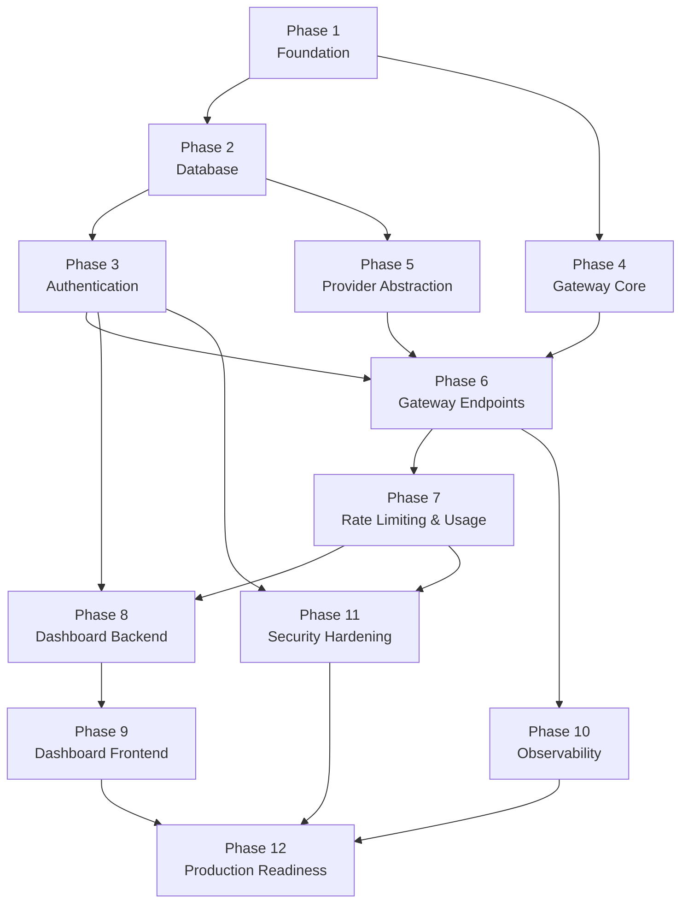

# BaseAPIKey — Task Breakdown

> **Historical planning document.** This file preserves the original architecture backlog and its
> unchecked boxes are not the current release status. The delivered implementation intentionally
> differs in places (for example, the Dashboard is a lightweight TypeScript console rather than
> Next.js). Use [`BACKEND_READINESS.md`](BACKEND_READINESS.md) for implemented scope and
> [`RELEASE_CHECKLIST.md`](RELEASE_CHECKLIST.md) for the authoritative production gates.

> **Version:** 1.0
> **Last Updated:** 2026-08-06
> **Status:** Draft
> **Author:** Architecture Team
> **Total Tasks:** 96
> **Estimated Effort:** ~150 developer-days

---

## Summary Table

| Phase     | Title                                      | Tasks  | Est. Effort   | Cumulative |
| --------- | ------------------------------------------ | ------ | ------------- | ---------- |
| Phase 1   | Project Foundation & Infrastructure        | 8      | 10 days       | 10 days    |
| Phase 2   | Database Foundation                        | 8      | 10 days       | 20 days    |
| Phase 3   | Authentication & Authorization             | 8      | 12 days       | 32 days    |
| Phase 4   | Gateway Core                               | 8      | 10 days       | 42 days    |
| Phase 5   | Provider Abstraction & 9Router Integration | 8      | 14 days       | 56 days    |
| Phase 6   | AI Gateway Endpoints                       | 8      | 14 days       | 70 days    |
| Phase 7   | Rate Limiting & Usage Tracking             | 8      | 12 days       | 82 days    |
| Phase 8   | Dashboard Backend API                      | 8      | 14 days       | 96 days    |
| Phase 9   | Dashboard Frontend                         | 8      | 16 days       | 112 days   |
| Phase 10  | Observability & Monitoring                 | 8      | 12 days       | 124 days   |
| Phase 11  | Security Hardening & Audit                 | 8      | 12 days       | 136 days   |
| Phase 12  | Production Readiness & Deployment          | 8      | 14 days       | 150 days   |
| **Total** |                                            | **96** | **~150 days** |            |

> **Timeline Estimate:**
>
> - 1 developer: ~7.5 months
> - 2 developers: ~4 months
> - 3 developers: ~3 months

---

## Table of Contents

1. [Phase 1: Project Foundation & Infrastructure](#phase-1-project-foundation--infrastructure)
2. [Phase 2: Database Foundation](#phase-2-database-foundation)
3. [Phase 3: Authentication & Authorization](#phase-3-authentication--authorization)
4. [Phase 4: Gateway Core](#phase-4-gateway-core)
5. [Phase 5: Provider Abstraction & 9Router Integration](#phase-5-provider-abstraction--9router-integration)
6. [Phase 6: AI Gateway Endpoints](#phase-6-ai-gateway-endpoints)
7. [Phase 7: Rate Limiting & Usage Tracking](#phase-7-rate-limiting--usage-tracking)
8. [Phase 8: Dashboard Backend API](#phase-8-dashboard-backend-api)
9. [Phase 9: Dashboard Frontend](#phase-9-dashboard-frontend)
10. [Phase 10: Observability & Monitoring](#phase-10-observability--monitoring)
11. [Phase 11: Security Hardening & Audit](#phase-11-security-hardening--audit)
12. [Phase 12: Production Readiness & Deployment](#phase-12-production-readiness--deployment)

---

## Phase 1: Project Foundation & Infrastructure

### P01-T01: Monorepo Initialization with Turborepo

**Description:** Initialize a new Turborepo project with pnpm workspaces. Set up the root `package.json`, `pnpm-workspace.yaml`, and `turbo.json` with the complete build pipeline. Create the top-level directory structure: `apps/`, `packages/`, `infrastructure/`, and `docs/`.

**Dependencies:** None

**Acceptance Criteria:**

- [x] Root `package.json` exists with project name `baseapikey` and pnpm workspace configuration
- [x] `pnpm-workspace.yaml` defines `apps/*` and `packages/*` as workspace members
- [x] `turbo.json` defines tasks: `build`, `dev`, `lint`, `type-check`, `test` with proper `dependsOn` and cache configuration
- [x] Directory structure matches architecture: `apps/gateway/`, `apps/dashboard/`, `apps/docs-site/`, `packages/database/`, `packages/shared/`, `packages/config/`, `packages/logger/`, `infrastructure/docker/`, `infrastructure/k8s/`
- [x] `pnpm install` runs successfully with no errors
- [x] `.gitignore` is properly configured (node_modules, dist, .env, etc.)

---

### P01-T02: TypeScript Configuration

**Description:** Create a shared TypeScript configuration package at `packages/config/tsconfig/`. Define base `tsconfig.json` with strict mode, and extend it with environment-specific configs: `node.json` for backend (Fastify, packages), and `next.json` for the Next.js dashboard. All apps and packages must extend these shared configs.

**Dependencies:** P01-T01

**Acceptance Criteria:**

- [x] `packages/config/tsconfig/base.json` exists with `strict: true`, `noUncheckedIndexedAccess: true`, `noImplicitReturns: true`, `forceConsistentCasingInFileNames: true`
- [x] `packages/config/tsconfig/node.json` extends base with `module: "NodeNext"`, `target: "ES2022"`
- [x] `packages/config/tsconfig/next.json` extends base with Next.js-specific settings
- [x] Every `apps/*` and `packages/*` project has a `tsconfig.json` that extends the appropriate shared config
- [x] Running `turbo run type-check` passes across all packages with zero errors

---

### P01-T03: ESLint & Prettier Configuration

**Description:** Set up ESLint and Prettier configurations as a shared package at `packages/config/eslint/` and `packages/config/prettier/`. Create environment-specific ESLint configs for Node.js and Next.js. Configure import ordering, unused variable detection, and TypeScript-aware rules. Integrate with Turborepo's `lint` task.

**Dependencies:** P01-T02

**Acceptance Criteria:**

- [x] `packages/config/eslint/` contains `base.js`, `node.js`, and `next.js` configurations
- [x] `packages/config/prettier/index.js` defines formatting rules (single quotes, trailing commas, 100 char line width)
- [x] `.prettierrc` at root delegates to the shared config
- [x] All apps and packages have local `.eslintrc.js` extending the shared config
- [x] `turbo run lint` executes across all packages successfully
- [x] Prettier and ESLint rules are compatible (no conflicting formatting rules)

---

### P01-T04: Environment Variable Management

**Description:** Establish a centralized environment variable validation system using Zod. Create validation schemas in `packages/shared/src/env/` that define, validate, and type all required environment variables for each application. Applications must fail fast on startup if required variables are missing or malformed.

**Dependencies:** P01-T01

**Acceptance Criteria:**

- [x] `packages/shared/src/env/gateway.env.ts` defines Zod schema for gateway env vars (`DATABASE_URL`, `REDIS_URL`, `PORT`, `LOG_LEVEL`, `NINE_ROUTER_API_KEY`, etc.)
- [x] `packages/shared/src/env/dashboard.env.ts` validates Dashboard host, port, public URL, and Gateway URL, including HTTPS requirements in production
- [x] Schema exports typed env object: `export const env = GatewayEnvSchema.parse(process.env)`
- [x] Applications crash with descriptive error messages if env vars are missing/invalid
- [x] `.env.example` at root documents all variables with descriptions and example values
- [x] No hardcoded secrets or configuration values in source code

---

### P01-T05: Docker Compose for Local Development

**Description:** Create a `docker-compose.yml` file in `infrastructure/docker/` that provisions PostgreSQL 16+ and Redis 7+ for local development. Configure persistent volumes for data, expose standard ports, and set default credentials matching the `.env.example`.

**Dependencies:** None

**Acceptance Criteria:**

- [x] `infrastructure/docker/docker-compose.yml` exists and is valid
- [x] PostgreSQL 16 Alpine service configured on port 5432 with persistent volume
- [x] Redis 7 Alpine service configured on port 6379 with persistent volume
- [x] Default credentials match `.env.example` (`POSTGRES_DB=baseapikey`, `POSTGRES_USER=postgres`, `POSTGRES_PASSWORD=postgres`)
- [x] `docker compose up -d` starts both services successfully
- [x] Both services accept connections from the host machine
- [x] Health checks configured for both services

---

### P01-T06: Shared Logger Package

**Description:** Create the `packages/logger/` package wrapping Pino for structured JSON logging. Configure log levels from environment variables, PII redaction paths, request ID enrichment, and pretty-printing for local development. Export a `createLogger()` factory function.

**Dependencies:** P01-T02, P01-T03

**Acceptance Criteria:**

- [x] `packages/logger/src/logger.ts` exports `createLogger(options)` factory function
- [x] Logger produces structured JSON output with fields: `timestamp`, `level`, `service`, `msg`
- [x] PII redaction configured for: `authorization` headers, `password` fields, `cookie` headers
- [x] `LOG_LEVEL` environment variable controls minimum log level
- [x] Pretty-printing enabled in development via `pino-pretty` (disabled in production)
- [x] Logger can be imported by apps: `import { createLogger } from '@baseapikey/logger'`
- [x] Unit tests verify log output format and redaction

---

### P01-T07: Shared Types & Utilities Package

**Description:** Initialize `packages/shared/` with core TypeScript types, utility functions, constants, and error classes used across all applications. This includes the `Result<T, E>` type, UUID v7 generator, API response envelope types, error codes, and role constants.

**Dependencies:** P01-T02, P01-T03

**Acceptance Criteria:**

- [x] `Result<T, E>` type defined in `packages/shared/src/utils/result.util.ts`
- [x] UUID v7 generator in `packages/shared/src/utils/id.util.ts`
- [x] SHA-256 hash utility in `packages/shared/src/utils/hash.util.ts`
- [x] API response types (`ApiResponse<T>`, `ApiError`, `PaginatedResponse<T>`) defined
- [x] Error codes constant object defined (`ERROR_CODES`)
- [x] Role constants defined (`ROLES`, `PERMISSIONS`)
- [x] `AppError` base class and subclasses (`ValidationError`, `AuthenticationError`, `NotFoundError`, etc.)
- [x] Package compiles successfully and is importable by apps

---

### P01-T08: CI Pipeline & Git Hooks

**Description:** Create a GitHub Actions CI workflow at `.github/workflows/ci.yml` that runs on every pull request. The workflow must install pnpm dependencies, run linting, type-checking, and tests. Additionally, set up Husky with lint-staged to enforce code quality on commits.

**Dependencies:** P01-T01, P01-T03

**Acceptance Criteria:**

- [x] `.github/workflows/ci.yml` exists with jobs: `lint`, `type-check`, `test`
- [x] Workflow triggers on pull requests to `main` and `develop` branches
- [x] Workflow uses pnpm with caching for fast installs
- [x] `turbo run lint type-check test` executes successfully in CI
- [x] Husky installed with pre-commit hook
- [x] lint-staged configured to run ESLint + Prettier on staged `.ts` and `.tsx` files
- [x] Commits with lint errors are rejected by the pre-commit hook

---

### P01-T09: CI/CD Foundation

**Description:** Establish a production-ready GitHub Actions CI pipeline under `.github/workflows/ci.yml` running on `push` and `pull_request` to `main` and `develop` branches. The pipeline checks out code, sets up Node.js 24 and pnpm, caches dependencies, runs TypeScript typecheck, ESLint, and builds the monorepo.

**Dependencies:** P01-T01, P01-T02, P01-T03, P01-T08

**Acceptance Criteria:**

- [x] GitHub Actions workflow `.github/workflows/ci.yml` created and validated
- [x] Configured for `push` and `pull_request` events
- [x] Node.js 24 and pnpm 11 with caching configured
- [x] TypeScript type-check job configured
- [x] ESLint lint job configured
- [x] Monorepo build job configured
- [x] Fails immediately if any step fails

---

### P01-T10: Git Hooks & Quality Gates

**Description:** Establish automated pre-commit and commit-msg quality gates using Husky, lint-staged, and Commitlint enforcing Conventional Commits, ESLint, Prettier, and TypeScript typecheck.

**Dependencies:** P01-T01, P01-T03, P01-T08, P01-T09

**Acceptance Criteria:**

- [x] Husky hooks installed (`.husky/pre-commit`, `.husky/commit-msg`)
- [x] `lint-staged` configured to run ESLint and Prettier on staged files
- [x] `pre-commit` hook runs `lint-staged` and TypeScript `type-check`
- [x] `commit-msg` hook configured with Commitlint enforcing Conventional Commits
- [x] Root `package.json` scripts added (`lint`, `lint:fix`, `format`, `format:check`, `typecheck`, `type-check`)
- [x] Failed quality checks block the commit
- [x] Git workflow and commit conventions documented in `README.md`

---

## Phase 2: Database Foundation

### P02-T01: Prisma Foundation

**Description:** Initialize `packages/database/` package with Prisma ORM and `@prisma/client`. Create `prisma/schema.prisma` configured with PostgreSQL datasource reading from `DATABASE_URL` env var and Prisma client generator. Set up PrismaClient singleton client factory in `packages/database/src/client.ts`.

**Dependencies:** P01-T04, P01-T05

**Acceptance Criteria:**

- [x] `packages/database/package.json` includes `@prisma/client` and `prisma` dependencies
- [x] `packages/database/prisma/schema.prisma` configured with PostgreSQL datasource and client generator
- [x] `packages/database/src/client.ts` exports `createPrismaClient()` factory and `prisma` singleton instance
- [x] Configuration reads from environment variables (`DATABASE_URL`)
- [x] Prisma schema validation (`db:validate`) and Client generation (`db:generate`) succeed
- [x] Package scripts: `db:generate`, `db:validate`, `db:migrate`, `db:push`, `db:studio` defined

---

### P02-T02: User Database Schema

**Description:** Design and implement the core User model in Prisma schema (`packages/database/prisma/schema.prisma`) as the foundation for authentication and user management with UUID primary key, enums for roles and status, unique email/username constraints, soft-delete, and indexes.

**Dependencies:** P02-T01

**Acceptance Criteria:**

- [x] User model defined in `packages/database/prisma/schema.prisma` mapped to `users`
- [x] Primary key `id` using UUID (`@default(uuid())`)
- [x] Unique constraints on `email` and `username`
- [x] Enums `UserRole` (`USER`, `ADMIN`) and `UserStatus` (`ACTIVE`, `SUSPENDED`, `DELETED`)
- [x] Standard metadata timestamps (`createdAt`, `updatedAt`, `deletedAt` for soft-delete)
- [x] Indexes on `email`, `username`, `status`, and `deletedAt`

---

### P02-T03: API Key Database Schema

**Description:** Design and implement the secure ApiKey model in Prisma schema (`packages/database/prisma/schema.prisma`) with key hashing, prefix identification, JSON permissions, status enum, foreign key relation to User, and database indexes.

**Dependencies:** P02-T02

**Acceptance Criteria:**

- [x] ApiKey model defined in `packages/database/prisma/schema.prisma` mapped to `api_keys`
- [x] Unique `keyHash` column for secure lookup without storing plaintext keys
- [x] `keyPrefix` column storing first 8-12 characters for display
- [x] `ApiKeyStatus` enum (`ACTIVE`, `REVOKED`, `EXPIRED`)
- [x] `permissions` JSON column default `[]`
- [x] One-to-many relationship: `User -> ApiKey[]` with foreign key `userId` (`onDelete: Cascade`)
- [x] Indexes created for `userId`, `status`, and `keyPrefix`

---

### P02-T04: Usage Tracking Database Schema

**Description:** Design and implement the Usage model in Prisma schema (`packages/database/prisma/schema.prisma`) to record every AI API request for analytics, quotas, rate limiting, and cost tracking with Decimal pricing, Int token counts, foreign key relations to User and ApiKey, and database indexes.

**Dependencies:** P02-T02, P02-T03

**Acceptance Criteria:**

- [x] Indexes created for `userId`, `apiKeyId`, `provider`, `model`, and `createdAt`

---

### P02-T05: AI Provider Database Schema

**Description:** Design and implement the Provider model in Prisma schema (`packages/database/prisma/schema.prisma`) to support multiple AI providers (9Router, OpenAI, Anthropic, Gemini, Groq, OpenRouter, DeepSeek) while keeping the gateway provider-agnostic. Features unique slug, encryptedApiKey field, provider capabilities flags, metadata JSON, and database indexes.

**Dependencies:** P02-T01

**Acceptance Criteria:**

- [x] Provider model defined in `packages/database/prisma/schema.prisma` mapped to `providers`
- [x] `slug` column configured with UNIQUE constraint
- [x] `encryptedApiKey` column for secret storage (plaintext keys are never stored)
- [x] `ProviderStatus` enum (`ACTIVE`, `INACTIVE`, `MAINTENANCE`)
- [x] Feature flags (`supportsStreaming`, `supportsImages`, `supportsEmbeddings`, `supportsAudio`, `supportsVision`)
- [x] Configurable default priority (100), timeoutMs (60000), and maxRetries (2)
- [x] Indexes created for `slug`, `status`, and `priority`

---

### P02-T06: AI Model Catalog Database Schema

**Description:** Design and implement the AIModel model in Prisma schema (`packages/database/prisma/schema.prisma`) to support dynamic resolution of AI model capabilities across providers (gpt-5, claude-sonnet, gemini-flash, deepseek, qwen, llama, etc.).

**Dependencies:** P02-T05

**Acceptance Criteria:**

- [x] AIModel model defined in `packages/database/prisma/schema.prisma` mapped to `ai_models`
- [x] Foreign key relation `Provider -> AIModel` (`onDelete: Cascade`)
- [x] Unique composite constraint on `(providerId, slug)`
- [x] `ModelCategory` enum (`CHAT`, `EMBEDDING`, `IMAGE`, `AUDIO`, `VISION`)
- [x] Token limits stored as Int (`contextWindow`, `maxOutputTokens`)
- [x] Pricing stored as Decimal (`inputPricePerMillion`, `outputPricePerMillion`)
- [x] Model capability flags (`supportsStreaming`, `supportsVision`, `supportsFunctionCalling`, `supportsJsonMode`, `supportsReasoning`)
- [x] Indexes created for `providerId`, `slug`, `category`, and `isActive`

---

### P02-T07: Audit Log Database Schema

**Description:** Design and implement the AuditLog model in Prisma schema (`packages/database/prisma/schema.prisma`) to record user, admin, and system actions for security, compliance, debugging, and monitoring.

**Dependencies:** P02-T02, P02-T03

**Acceptance Criteria:**

- [x] AuditLog model defined in `packages/database/prisma/schema.prisma` mapped to `audit_logs`
- [x] Optional foreign key relations `User? -> AuditLog` and `ApiKey? -> AuditLog` with `onDelete: SetNull` (preserving logs upon deletion)
- [x] `AuditSeverity` enum (`INFO`, `WARNING`, `ERROR`, `CRITICAL`)
- [x] Standard fields: `action`, `resource`, `resourceId`, `ipAddress`, `userAgent`, `requestId`, `metadata` JSON
- [x] Indexes created for `userId`, `apiKeyId`, `action`, `severity`, and `createdAt`

---

### P02-T08: Database Relations, Constraints & Optimization

**Description:** Review and optimize the entire Prisma schema (`packages/database/prisma/schema.prisma`) before creating migrations. Ensure all models (`User`, `ApiKey`, `Usage`, `Provider`, `AIModel`, `AuditLog`) have optimized composite indexes, correct cascading relationships (`Cascade`, `SetNull`), non-redundant index configurations, and strict naming conventions matching CODING_STANDARD.md.

**Dependencies:** P02-T01, P02-T02, P02-T03, P02-T04, P02-T05, P02-T06, P02-T07

**Acceptance Criteria:**

- [x] All 6 core models reviewed (`User`, `ApiKey`, `Usage`, `Provider`, `AIModel`, `AuditLog`)
- [x] Verified foreign key cascading strategies (`User/ApiKey -> Usage` as `Cascade`, `User/ApiKey -> AuditLog` as `SetNull`, `Provider -> AIModel` as `Cascade`)
- [x] Composite indexes added for high-throughput queries (`[userId, status]`, `[keyPrefix, status]`, `[userId, createdAt]`, `[apiKeyId, createdAt]`, `[provider, model]`, `[status, priority]`, `[providerId, isActive]`, `[action, severity]`, `[userId, createdAt]`, etc.)
- [x] Redundant standalone indexes on `@unique` columns removed (e.g. `Provider.slug`)
- [x] Prisma schema formatted and validated with zero errors

---

### P02-T09: Initial Database Migration

**Description:** Generate the first production-ready database migration script from the finalized Prisma schema in `packages/database/prisma/migrations/20260806000000_init_schema/migration.sql`.

**Dependencies:** P02-T08

**Acceptance Criteria:**

- [x] Initial SQL migration script generated deterministically in `packages/database/prisma/migrations/20260806000000_init_schema/migration.sql`
- [x] Defines all PostgreSQL enums (`user_role`, `user_status`, `api_key_status`, `provider_status`, `model_category`, `audit_severity`)
- [x] Defines all 6 core tables (`users`, `api_keys`, `usages`, `providers`, `ai_models`, `audit_logs`) with primary keys, column types, default values, and foreign key constraints
- [x] Creates composite and standalone indexes matching database performance requirements
- [x] Prisma Client regenerated and verified with 0 build/test/type-check/lint errors

---

### P02-T10: Production Database Seed

**Description:** Implement an idempotent production-ready database seed script using Prisma in `packages/database/prisma/seed.ts`. Seeds default Admin user (hashed password from environment), 9Router AI Provider (credentials from environment), and standard AI model catalog entries (`gpt-5`, `gpt-5-mini`, `claude-sonnet`, `gemini-2.5-pro`, `deepseek-chat`).

**Dependencies:** P02-T09

**Acceptance Criteria:**

- [x] Prisma seed script created in `packages/database/prisma/seed.ts`
- [x] Upserts default Admin User (reads credentials from environment variables)
- [x] Upserts default AI Provider (`9Router`, ACTIVE, priority 100, credentials from environment)
- [x] Upserts default AI Models (`gpt-5`, `gpt-5-mini`, `claude-sonnet`, `gemini-2.5-pro`, `deepseek-chat`) associated with 9Router
- [x] Seed is fully idempotent (multiple runs create no duplicate records using `upsert`)
- [x] Configured `"prisma": { "seed": "tsx prisma/seed.ts" }` and `db:seed` script in `packages/database/package.json`

---

## Phase 3: Authentication & Authorization

### P03-T01: Authentication Foundation

**Description:** Build the authentication foundation for the AI Gateway Platform. Establish the authentication module structure, configuration loader with Zod validation, Argon2 password hashing utility, HS256 JWT sign/verify utility, authentication error classes extending `AppError`, and dependency injection setup.

**Dependencies:** P01-T07, P02-T02

**Acceptance Criteria:**

- [x] Auth module structure created under `apps/gateway/src/modules/auth/` (`auth.config.ts`, `auth.module.ts`, `constants/`, `dto/`, `errors/`, `services/`, `types/`, `utils/`, `index.ts`)
- [x] JWT configuration loader with Zod schema for `JWT_ACCESS_SECRET`, `JWT_REFRESH_SECRET`, `JWT_ACCESS_EXPIRES_IN`, `JWT_REFRESH_EXPIRES_IN`
- [x] Argon2 password hashing & verification utility (`argon2.util.ts` & `password.service.ts`)
- [x] HS256 JWT sign & verify utility (`jwt.util.ts` & `jwt.service.ts`)
- [x] Authentication error definitions extending `AppError` (`InvalidTokenError`, `TokenExpiredError`, `InvalidCredentialsError`, `AuthConfigError`)
- [x] Unit tests in `apps/gateway/src/modules/auth/auth.test.ts` verifying Argon2 password hashing and JWT signing/verification with 100% pass rate

---

### P03-T02: User Registration

**Description:** Implement `POST /v1/auth/register` endpoint following Clean Architecture (Register DTO & response DTO with Zod validation, `IUserRepository` interface & `PrismaUserRepository` implementation, `RegisterService`, `RegisterController`, and Fastify route handler). Hashes passwords with Argon2, enforces email and username uniqueness, validates password strength, returns HTTP 201 with `{ id, email, username, fullName, createdAt }`, and ensures zero password leakage.

**Dependencies:** P03-T01, P02-T02

**Acceptance Criteria:**

- [x] `POST /v1/auth/register` endpoint implemented and registered in Fastify gateway app
- [x] Register DTO & validation: Valid email, username (3-30 chars, alphanumeric/underscore/hyphen), password (min 12 chars with uppercase, lowercase, number, special character)
- [x] Repository layer: `IUserRepository` interface and `PrismaUserRepository` implementation using `@baseapikey/database`
- [x] Service layer: `RegisterService` enforcing email and username uniqueness (409 ConflictError) and Argon2 password hashing
- [x] Controller layer: `RegisterController` returning HTTP 201 Created with `{ id, email, username, fullName, createdAt }`
- [x] Security: Never logs passwords, never returns `passwordHash` or plain password in response
- [x] Database: User record created with `role = USER`, `status = ACTIVE`, `emailVerified = false`
- [x] Integration & Unit tests in `apps/gateway/src/modules/auth/register.test.ts` verifying successful registration, duplicate email/username rejection (409), and invalid password/email rejection (400) with 100% pass rate

---

### P03-T03: User Login

**Description:** Implement `POST /v1/auth/login` endpoint following Clean Architecture (Login DTO & Response DTO with Zod validation, `IUserRepository` & `ISessionRepository` interfaces, `LoginService`, `LoginController`, `ILoginRateLimiter` interface, and Fastify route handler). Authenticates users using Argon2 constant-time verification, rejects suspended/deleted users, updates `lastLoginAt`, records multi-device session records with SHA-256 hashed refresh tokens, logs audit events, and issues signed Access & Refresh JWT token pairs containing required claims (`sub`, `email`, `role`, `apiVersion`, `tokenVersion`, `sessionId`).

**Dependencies:** P03-T01, P03-T02

**Acceptance Criteria:**

- [x] `POST /v1/auth/login` endpoint implemented and registered in Fastify gateway app
- [x] Login DTO & validation: Validates email and required password using Zod schema
- [x] Service layer: `LoginService` implementing constant-time password verification with Argon2, user status check (rejecting suspended and deleted accounts), `lastLoginAt` timestamp updating, multi-device session creation, audit logging, and signed JWT token pair generation
- [x] Device Sessions & Token Hashing: Stores only SHA-256 hash of refresh tokens (`hashSha256(refreshToken)`) in `UserSession` records to prepare for multi-device sessions and Refresh Token Rotation
- [x] JWT Claims: Signed access tokens contain `sub`, `email`, `role`, `apiVersion` ("v1"), `tokenVersion` (1), `sessionId`, and `type` ("access")
- [x] Controller layer: `LoginController` performing request validation without direct database/Prisma access (Clean Architecture)
- [x] Rate Limiter: `ILoginRateLimiter` interface and `NoopLoginRateLimiter` implementation created
- [x] Security & Zero Leakage: Returns generic `AuthenticationError('Invalid email or password')` on invalid credentials to prevent email enumeration, and never logs passwords, hashes, access tokens, or refresh tokens
- [x] Unit & Integration tests in `apps/gateway/src/modules/auth/login.test.ts` verifying successful login, rate limiter execution, hashed refresh token storage, JWT claims, audit logs, generic 401 credential error handling, suspended account rejection, and deleted account rejection with 100% pass rate

---

### P03-T04: Refresh Token & Session Management

**Description:** Implement `POST /v1/auth/refresh` endpoint following Clean Architecture (`RefreshTokenRequestSchema` DTO, `RefreshTokenResponseDto`, `ISessionRepository` & `PrismaSessionRepository`, `RefreshTokenService`, `RefreshController`, and Fastify route handler). Supports multi-device sessions, Argon2 hashing of stored refresh tokens, strict token verification, expired session rejection, revoked session rejection, automatic Refresh Token Rotation (RTR), security token reuse detection (revoking all user sessions on replay attempt), and audit logging.

**Dependencies:** P03-T01, P03-T03

**Acceptance Criteria:**

- [x] `POST /v1/auth/refresh` endpoint implemented and registered in Fastify gateway app
- [x] Prisma `Session` model created with `id`, `userId`, `refreshTokenHash`, `deviceId`, `deviceName`, `ipAddress`, `userAgent`, `expiresAt`, `lastUsedAt`, `revokedAt`, `createdAt`, `updatedAt`
- [x] Service layer: `RefreshTokenService` enforcing JWT signature verification, session existence check, Argon2 hash verification, expired/revoked session rejections, user status checks, and token rotation
- [x] Security: Argon2 hashes used for refresh token storage (zero plaintext storage) and automatic revocation of ALL user sessions if token reuse/theft is detected
- [x] Controller layer: `RefreshController` performing request validation without direct database/Prisma access (Clean Architecture)
- [x] Audit Logging: Logs `AUTH_REFRESH_SUCCESS`, `AUTH_REFRESH_FAILED`, and `AUTH_REFRESH_TOKEN_REUSE_DETECTED` events in `AuditLog`
- [x] Unit & Integration tests in `apps/gateway/src/modules/auth/refresh.test.ts` verifying successful refresh, token rotation, old session revocation, token reuse detection, expired session rejection, suspended user rejection, and HTTP POST 200/400 status codes with 100% pass rate

---

### P03-T05: Logout & Session Revocation

**Description:** Implement `POST /v1/auth/logout` and `POST /v1/auth/logout-all` endpoints following Clean Architecture (`LogoutRequestSchema` DTO, `LogoutAllRequestSchema` DTO, `LogoutService`, `LogoutController`, and Fastify route handlers). Supports revoking individual active sessions or all user sessions (`revokeAllUserSessions`), enforcing idempotency, invalidating associated refresh tokens, recording audit logs (`AUTH_LOGOUT_SUCCESS`, `AUTH_LOGOUT_ALL_SUCCESS`), and returning HTTP 204 No Content without exposing session or token metadata.

**Dependencies:** P03-T01, P03-T03, P03-T04

**Acceptance Criteria:**

- [x] `POST /v1/auth/logout` and `POST /v1/auth/logout-all` endpoints implemented and registered in Fastify gateway app
- [x] Service layer: `LogoutService` enforcing authentication context extraction (Bearer token & refresh token), single session revocation, and bulk user session revocation
- [x] Controller layer: `LogoutController` performing request validation without direct database/Prisma access (Clean Architecture) and returning HTTP 204 No Content
- [x] Security: Idempotent logout execution, zero token or session ID leakage, and zero plaintext token logging
- [x] Audit Logging: Logs `AUTH_LOGOUT_SUCCESS` and `AUTH_LOGOUT_ALL_SUCCESS` events in `AuditLog`
- [x] Unit & Integration tests in `apps/gateway/src/modules/auth/logout.test.ts` verifying single session logout, logout-all revocation, rejection of revoked tokens on refresh, idempotency, audit log creation, and HTTP 204 / 401 status codes with 100% pass rate

---

### P03-T06: Authentication Middleware & Route Protection

**Description:** Implement production-ready authentication middleware (`authenticate`), authentication guard (`requireAuth`), request user context utility (`getRequestUser`), standardized authentication errors (`MissingTokenError`, `InvalidTokenError`, `TokenExpiredError`, `InvalidTokenVersionError`, `UnauthorizedError`), and protected route handling (`MeController`, `GET /v1/auth/me`). Validates JWT Bearer format, token signature, expiration, `tokenVersion`, and active session status before attaching the authenticated user context (`userId`, `email`, `role`, `sessionId`, `tokenVersion`) to `request.user`.

**Dependencies:** P03-T01, P03-T03, P03-T04, P03-T05

**Acceptance Criteria:**

- [x] Authentication middleware (`authenticate`) reading `Authorization: Bearer <token>` header, verifying JWT signature, expiration, `tokenVersion`, and active session status
- [x] Authenticated user context (`request.user`) exposing `userId`, `email`, `role`, `sessionId`, `tokenVersion`
- [x] Authentication guard (`requireAuth`) and context helper (`getRequestUser`) for route protection
- [x] Standardized 401 error classes (`MissingTokenError`, `InvalidTokenError`, `TokenExpiredError`, `InvalidTokenVersionError`, `UnauthorizedError`)
- [x] Protected endpoint `GET /v1/auth/me` returning authenticated user context (`MeController`)
- [x] Security: Zero raw token logging, zero client-provided user ID trusting, and non-bypassable signature verification
- [x] Public routes (`/health`, `/v1/auth/register`, `/v1/auth/login`, `/v1/auth/refresh`) remain freely accessible without authentication
- [x] Unit & Fastify integration tests in `apps/gateway/src/modules/auth/middleware.test.ts` verifying valid tokens, missing headers, malformed Bearer formats, tampered signatures, expired tokens, revoked sessions, and public route accessibility with 100% pass rate

---

### P03-T07: Role-Based Access Control (RBAC) System

**Description:** Build a production-ready Role-Based Access Control (RBAC) system integrating with the authentication middleware. Includes roles (`ADMIN`, `USER`), permission system (`profile:read`, `profile:update`, `apikey:*`, `usage:read`, `users:*`, `providers:manage`, `models:manage`, `audit:read`, `system:manage`), `AuthorizationContext` permission resolver (`getUserPermissions`, `hasPermission`, `hasRole`), `requireRole` and `requirePermission` Fastify guards, combined `authorize` middleware, and 403 error definitions (`ForbiddenError`, `MissingRoleError`, `MissingPermissionError`).

**Dependencies:** P03-T01, P03-T03, P03-T04, P03-T05, P03-T06

**Acceptance Criteria:**

- [x] `ROLES` (`ADMIN`, `USER`) and `PERMISSIONS` constants with role-to-permission mapping (`ROLE_PERMISSIONS`) supporting future expansion
- [x] `AuthorizationContext` resolving user permissions from `request.user.role` with deny-by-default for unmapped roles
- [x] `requireRole(...allowedRoles)` Fastify preHandler guard rejecting non-matching user roles with `403 Forbidden` (`FORBIDDEN` / `MISSING_ROLE`)
- [x] `requirePermission(...requiredPermissions)` Fastify preHandler guard enforcing missing permissions check with `403 Forbidden` (`MISSING_PERMISSION`)
- [x] `authorize(options)` combined authorization middleware
- [x] Standardized error classes: `ForbiddenError` (403), `MissingRoleError` (403), `MissingPermissionError` (403), `UnauthorizedError` (401)
- [x] Clean Architecture: Decoupled authentication from authorization with zero client-provided role trusting
- [x] Unit & Fastify integration tests in `apps/gateway/src/modules/auth/rbac.test.ts` verifying `USER` accessing `USER` endpoints, `USER` denied `ADMIN` endpoints (403), `ADMIN` accessing `ADMIN` endpoints (200), missing permission (403), missing authentication (401), and permission resolution with 100% pass rate

---

### P03-T08: Session Management API

**Description:** Implement a production-ready Session Management module allowing authenticated users to view and manage their active sessions. Endpoints include `GET /v1/auth/sessions`, `GET /v1/auth/sessions/:id`, and `DELETE /v1/auth/sessions/:id`. Includes `SessionController`, `SessionService`, `ISessionRepository` extensions (`findActiveSessionsByUserId`), Zod validation schemas (`SessionParamsSchema`, `DeleteSessionQuerySchema`), response DTOs (`SessionItemResponseDto`, `SessionDetailResponseDto`), confirmation protection for current session revocation, audit logging (`AUTH_SESSION_REVOKE`), and 403 authorization checks.

**Dependencies:** P03-T01, P03-T03, P03-T04, P03-T05, P03-T06, P03-T07

**Acceptance Criteria:**

- [x] `GET /v1/auth/sessions` returns active sessions for authenticated user with `currentSession` boolean flag, `deviceName`, `ipAddress`, `userAgent`, timestamps, omitting hashes & JWTs
- [x] `GET /v1/auth/sessions/:id` returns detailed session information; returns `404 Not Found` if missing and `403 Forbidden` if session belongs to another user
- [x] `DELETE /v1/auth/sessions/:id` revokes target session; rejects attempts to revoke another user's session with `403 Forbidden`
- [x] Current session revocation confirmation protection: requires `?confirm=true` parameter when revoking current session, rejecting unconfirmed attempts with `400 Bad Request`
- [x] Revoked sessions immediately become unusable (rejected by `authenticate` middleware and `RefreshTokenService` with 401 Unauthorized)
- [x] `AuditLog` entry recorded for every revoked session (`AUTH_SESSION_REVOKE`) with metadata (IP address, User Agent, request ID)
- [x] Clean Architecture: Controllers never access Prisma directly; business logic encapsulated inside `SessionService`
- [x] Unit & Fastify integration test suite in `apps/gateway/src/modules/auth/session.test.ts` verifying list sessions, view session details, cross-user 403 access rejection, current session revocation confirmation, and revoked session refresh rejection with 100% pass rate

---

### P03-T09: Authentication Integration Testing

**Description:** Build a comprehensive integration test suite validating the complete authentication workflow end-to-end across all auth modules: User Registration, User Login, JWT Authentication, Refresh Token Rotation, Session Management, Logout, RBAC, and Authentication Middleware. Created test helpers and utilities (`auth-test-utils.ts`), mock repositories with explicit cleanup methods (`MockUserRepository`, `MockSessionRepository`), and integration test runner (`integration.test.ts`) covering 9 test groups and verifying audit logs for all key authentication events (`AUTH_REGISTER`, `AUTH_LOGIN_SUCCESS`, `AUTH_LOGOUT`, `AUTH_TOKEN_REFRESH`, `AUTH_SESSION_REVOKE`).

**Dependencies:** P03-T01, P03-T03, P03-T04, P03-T05, P03-T06, P03-T07, P03-T08

**Acceptance Criteria:**

- [x] Integration test setup, authentication test helpers, fixtures, and cleanup utilities created in `apps/gateway/src/modules/auth/testing/auth-test-utils.ts`
- [x] Registration test cases: successful registration (201), duplicate email (409), duplicate username (409), invalid password (400), invalid email (400)
- [x] Login test cases: successful login (200 with tokens), wrong password (401), unknown email (401), suspended user (401), deleted user (401)
- [x] JWT test cases: valid access token (200), expired access token (401), invalid signature (401), tampered token (401)
- [x] Refresh token test cases: successful token rotation (200), expired refresh token (401), revoked session refresh (401), token reuse detection (401 & session revoked), invalid refresh token (401/400)
- [x] Logout test cases: single session logout (204), logout all sessions (204), revoked token refresh rejection (401)
- [x] Middleware test cases: protected endpoint access (200), missing Authorization header (401), invalid Bearer format (401), unauthorized request (401)
- [x] RBAC test cases: USER accessing USER endpoint (200), USER denied ADMIN endpoint (403), ADMIN accessing ADMIN endpoint (200)
- [x] Session API test cases: list active sessions (200), session details (200), revoke session (200), cross-user session access rejection (403)
- [x] Audit Log event verification: `AUTH_REGISTER`, `AUTH_LOGIN_SUCCESS`, `AUTH_TOKEN_REFRESH`, `AUTH_SESSION_REVOKE`, and `AUTH_LOGOUT`
- [x] Deterministic execution, complete test isolation, zero production credentials, and 100% test pass rate in `apps/gateway/src/modules/auth/integration.test.ts`

---

### P03-T10: Authentication Security Hardening

**Description:** Perform a comprehensive security review and hardening of the entire authentication subsystem (Registration, Login, Refresh Tokens, Logout, Session Management, Authentication Middleware, and RBAC). Added JWT issuer/audience claims & validation, constant-time dummy Argon2 verification to eliminate email enumeration timing attacks, session expiry checks in middleware, request correlation headers (`X-Request-ID`, `X-Correlation-ID`), structured `AUTH_PERMISSION_DENIED` audit warning logs, and published `docs/SECURITY_REVIEW.md`.

**Dependencies:** P03-T01, P03-T02, P03-T03, P03-T04, P03-T05, P03-T06, P03-T07, P03-T08, P03-T09

**Acceptance Criteria:**

- [x] Complete security review and hardening of all authentication and authorization modules completed
- [x] JWT hardening: Expiration handling, issuer (`baseapikey-gateway`), audience (`baseapikey-api`), algorithm restrictions (`HS256`), malformed & unsigned JWT rejection verified
- [x] Password hardening: Argon2id parameters (64MB memory, 3 iterations, parallelism 4), constant-time verification, zero password logging, zero hash leakage in API responses verified
- [x] Email enumeration defense: Constant-time dummy Argon2 verification implemented in `LoginService` for non-existent users
- [x] Refresh Token hardening: Hashed token storage, automatic Refresh Token Rotation, token reuse detection, bulk session revocation, and revoked session rejection verified
- [x] Middleware & Session hardening: Malformed header rejection, expired token rejection, session revocation & expiration check in `authenticate` middleware verified
- [x] RBAC hardening: Default-deny, 403 Forbidden for unauthorized requests, 401 Unauthorized for unauthenticated requests, and `AUTH_PERMISSION_DENIED` warning logging verified
- [x] Security Headers: `X-Request-ID` and `X-Correlation-ID` header extraction and response header propagation added to Gateway Fastify app
- [x] Security Review Document created in `docs/SECURITY_REVIEW.md` detailing findings, fixes applied, security audit matrix, and future recommendations
- [x] All workspace verification checks (`pnpm build`, `pnpm test`, `pnpm run type-check`, `pnpm run lint`, `pnpm run format:check`) passing with 100% success rate

---

**Description:** Implement a cryptographically secure API key generation service. The service must generate keys with a recognizable prefix (`bak_live_`), a random payload using `crypto.randomBytes(32)`, and return both the cleartext key and its SHA-256 hash for database storage.

**Dependencies:** P01-T07

**Acceptance Criteria:**

- [ ] Key format: `bak_live_{base62_encoded_32_random_bytes}` (total ~50 characters)
- [ ] SHA-256 hash computed for database storage
- [ ] Key prefix (first 12 chars) extracted for identification display
- [ ] Entropy: minimum 256 bits from `crypto.randomBytes`
- [ ] Service returns: `{ key: string, keyHash: string, keyPrefix: string }`
- [ ] Unit tests verify key format, hash correctness, uniqueness, and entropy

---

### P03-T02: API Key Validation Middleware

**Description:** Create Fastify middleware that extracts the API key from the `Authorization: Bearer` header, computes its SHA-256 hash, looks it up in the database, and validates the key is active, not expired, and not revoked. Attach the authenticated context (org, key, user) to the request.

**Dependencies:** P03-T01, P02-T08

**Acceptance Criteria:**

- [x] Middleware extracts Bearer token from `Authorization` header
- [x] Missing/malformed header returns `401` with clear error message
- [x] Key hash lookup uses candidate `findActiveByPrefix` & Argon2id verification
- [x] Invalid hash returns `401 Unauthorized`
- [x] Revoked key (deletedAt set) returns `401 Unauthorized`
- [x] Expired key (expiresAt <= now) returns `401 Unauthorized`
- [x] Suspended/Deleted user account returns `401 Unauthorized`
- [x] Argon2id secure hash verification used for authentication
- [x] Successful auth attaches `{ apiKey, user }` context to request (without keyHash)
- [x] `lastUsedAt` updated asynchronously (fire-and-forget)

---

### P03-T03: API Key CRUD Use Cases

**Description:** Implement the complete API key lifecycle as application-layer use cases: create, list, get, update, and revoke. Creating a key returns the cleartext key once. Listing shows only key prefixes and metadata. Revoking performs a soft-delete.

**Dependencies:** P03-T01, P02-T08

**Acceptance Criteria:**

- [x] `CreateApiKeyUseCase`: generates key, stores hash, returns cleartext once
- [x] `ListApiKeysUseCase`: returns keys for user with prefix, name, dates (never full key or keyHash)
- [x] `GetApiKeyUseCase`: returns single key details (never full key or keyHash)
- [x] `UpdateApiKeyUseCase`: updates name and expiresAt (rejects updating revoked keys)
- [x] `RevokeApiKeyUseCase`: soft-deletes the key (sets `status = REVOKED`, `deletedAt`)
- [x] All endpoints enforce user-level access control (403 for cross-user access)
- [x] Unit and integration tests for all endpoints and audit logging

---

### P04-T04: API Key Permissions

**Description:** Implement a flexible API Key permission system controlling Gateway endpoint access (`chat:completions`, `embeddings:create`, `images:generate`, `audio:transcribe`, `audio:speech`, `models:list`), default permissions (`chat:completions`, `models:list`), `PermissionResolver`, `PermissionGuard`, `PermissionMiddleware`, `PermissionValidator`, `PermissionConstants`, `PATCH /v1/api-keys/:id/permissions`, and audit logging.

**Dependencies:** P04-T01, P04-T02, P04-T03

**Acceptance Criteria:**

- [x] Defined supported API key permissions and default permissions (`PermissionConstants`)
- [x] Implemented `PermissionValidator` for strict validation of permission arrays (rejecting unknown strings with 400)
- [x] Implemented `PermissionResolver` and `PermissionGuard` for checking granted permissions against requirements
- [x] Implemented `PermissionMiddleware` (`requireApiKeyPermission`) Fastify route guard returning `403 Forbidden` (`API_KEY_PERMISSION_DENIED`) when missing
- [x] Implemented `PATCH /v1/api-keys/:id/permissions` endpoint with ownership verification, revoked key check, and `AuditLog` event (`API_KEY_UPDATE_PERMISSIONS`)
- [x] Unit and integration tests covering default permissions, permission updates, validation failures, middleware guards, cross-user isolation, and audit logging

---

### P04-T05: API Key Rotation

**Description:** Implement secure API Key rotation (`POST /v1/api-keys/:id/rotate`) generating a new cryptographically secure API key (`sk_live_...`), updating Argon2id `keyHash` and `keyPrefix`, invalidating previous API keys immediately, enforcing ownership and status checks, returning plaintext key ONLY ONCE, and recording `API_KEY_ROTATE` in `AuditLog`.

**Dependencies:** P04-T01, P04-T02, P04-T03, P04-T04

**Acceptance Criteria:**

- [x] `POST /v1/api-keys/:id/rotate` endpoint generating new cryptographically secure API key with Argon2id hashing
- [x] Replaces `keyHash` and `keyPrefix` while preserving `id`, `userId`, `name`, `permissions`, and `createdAt`
- [x] Immediately invalidates previous API key (old key fails authentication with `401 Unauthorized`)
- [x] New rotated API key authenticates successfully
- [x] Ownership enforcement (403 Forbidden for cross-user rotation)
- [x] Rejection of revoked or expired key rotation attempts (400 / 401)
- [x] Rotation event recorded in `AuditLog` (`action: 'API_KEY_ROTATE'`)
- [x] Unit and integration tests for complete rotation lifecycle

---

### P04-T06: API Key Revocation

**Description:** Implement secure API Key revocation (`POST /v1/api-keys/:id/revoke`) permanently marking key status as `REVOKED`, setting `deletedAt` timestamp, blocking revoked keys immediately in authentication middleware (returning HTTP 401), preventing rotation or updates on revoked keys, preserving database records for audit history, and recording `API_KEY_REVOKE` in `AuditLog`.

**Dependencies:** P04-T01, P04-T02, P04-T03, P04-T04, P04-T05

**Acceptance Criteria:**

- [x] `POST /v1/api-keys/:id/revoke` endpoint permanently setting API key status to `REVOKED` and setting `deletedAt` timestamp
- [x] Standardized HTTP 200 response (`{ success: true, message: "API key revoked successfully." }`)
- [x] Authentication middleware updated to check candidate key status and immediately reject revoked keys with `401 Unauthorized` (`ApiKeyRevokedError`)
- [x] Ownership enforcement (403 Forbidden for cross-user revocation)
- [x] Re-revoking an already revoked key returns `400 Bad Request` (`ApiKeyAlreadyRevokedError`)
- [x] Revoked keys cannot be rotated or updated
- [x] Database records, usage history, and audit log history preserved without physical deletion
- [x] Revocation event recorded in `AuditLog` (`action: 'API_KEY_REVOKE'`)
- [x] Comprehensive unit and integration test suite covering revocation lifecycle

---

### P04-T07: API Key Usage Tracking

**Description:** Implement asynchronous usage tracking capturing every API request authenticated by an API key (`UsageTrackingService`, `AsyncUsageRecorder`, `UsageMiddleware`, `UsageRepository`, `Usage DTOs`, `Usage Events`). Records authentication context (`apiKeyId`, `userId`), request details (`requestId`, `endpoint`, `method`, `provider`, `model`, `clientIp`, `userAgent`), response details (`statusCode`, `latencyMs`), AI token usage (`promptTokens`, `completionTokens`, `totalTokens`, `estimatedCost`), status (`SUCCESS`/`FAILED`), updates `ApiKey.lastUsedAt`, and executes non-blockingly without storing prompt or response bodies.

**Dependencies:** P04-T01, P04-T02, P04-T03, P04-T04, P04-T05, P04-T06

**Acceptance Criteria:**

- [x] Created `UsageTrackingService` and `PrismaUsageRepository` persisting usage records to database
- [x] Created `AsyncUsageRecorder` executing non-blocking background recordings via `setImmediate`
- [x] Created Fastify `registerUsageTrackingHook` (`onRequest` / `onResponse`) measuring latency and capturing metadata
- [x] Asynchronously updates `ApiKey.lastUsedAt` timestamp upon request completion
- [x] Captured AI token metrics (`promptTokens`, `completionTokens`, `totalTokens`, `estimatedCost`) and derived status (`SUCCESS` / `FAILED`)
- [x] Strictly enforced security rules: zero storage of prompt contents, response contents, or authorization headers
- [x] Built comprehensive unit and integration test suite verifying successful requests, failed requests (e.g., HTTP 403), latency, token counts, and event emissions

---

### P04-T08: API Key Quotas & Limits

**Description:** Implement a production-ready quota and limit enforcement system (`QuotaService`, `requireQuota` middleware, `QuotaRepository`, `QuotaValidator`, `QuotaConstants`, `ApiKeyQuota` Prisma model) enforcing per-minute requests, daily requests, daily tokens, and monthly budget limits while handling reset intervals.

**Dependencies:** P04-T01, P04-T02, P04-T03, P04-T04, P04-T05, P04-T06, P04-T07

**Acceptance Criteria:**

- [x] Added `ApiKeyQuota` model and relation to Prisma schema (`packages/database/prisma/schema.prisma`)
- [x] Created `QuotaService` and `PrismaQuotaRepository` managing quota records, limit checks, and counter updates
- [x] Configurable default limits: 60 req/min, 10,000 req/day, 5,000,000 tokens/day, $100 monthly budget
- [x] Created Fastify `requireQuota` middleware rejecting requests exceeding limits with HTTP 429 Too Many Requests (`QuotaExceededError`, `DailyLimitExceededError`, `TokenQuotaExceededError`, `MonthlyBudgetExceededError`)
- [x] Implemented time window reset logic for per-minute, daily, and monthly counters
- [x] Enforced `QuotaValidator` preventing negative numbers or zero limits (returning HTTP 400 `InvalidQuotaConfigError`)
- [x] Built comprehensive unit & integration test suite in `apps/gateway/src/modules/quota/quota.test.ts` verifying limit enforcements, HTTP 429 error responses, counter updates, reset logic, and validation rules

---

### P04-T09: API Key Integration Testing

**Description:** Build a comprehensive integration test suite (`api-key-lifecycle-integration.test.ts`, `api-key-test-fixtures.ts`) testing the complete API key lifecycle and authentication flow across Generation, Authentication, Management, Permissions, Rotation, Revocation, Usage Tracking, Quotas & Limits, and Audit Logging.

**Dependencies:** P04-T01, P04-T02, P04-T03, P04-T04, P04-T05, P04-T06, P04-T07, P04-T08

**Acceptance Criteria:**

- [x] Created `createTestContainer`, `createTestUserHelper`, `createTestApiKeyHelper`, and test factories in `apps/gateway/src/modules/api-keys/testing/api-key-test-fixtures.ts`
- [x] Built master end-to-end integration test runner in `apps/gateway/src/modules/api-keys/api-key-lifecycle-integration.test.ts`
- [x] Verified full API key generation workflow (`sk_live_...` prefix, default permissions, `API_KEY_CREATE` audit logging)
- [x] Verified authentication edge cases (valid keys, invalid keys, expired keys, revoked keys, suspended users, missing headers, invalid Bearer format)
- [x] Verified management API operations and strict cross-user data isolation (HTTP 403 Forbidden)
- [x] Verified permission grant/revoke flow and permission middleware enforcement
- [x] Verified key rotation lifecycle (immediate old key invalidation and new key authentication)
- [x] Verified key revocation lifecycle (authentication blockage, rotation rejection, and update rejection on revoked keys)
- [x] Verified non-blocking usage tracking, token metric recording, and `lastUsedAt` updates
- [x] Verified quota limit enforcements (HTTP 429 Too Many Requests) and counter reset logic
- [x] Verified performance & latency benchmarks (authentication & request latency < 500ms under Argon2id verification)

---

### P04-T10: API Key Security Hardening

**Description:** Perform a comprehensive security review and hardening audit across the entire API Key Management ecosystem (`Generation`, `Authentication`, `Management`, `Permissions`, `Rotation`, `Revocation`, `Usage Tracking`, `Quotas & Limits`, `Audit Logging`, and `Request Correlation Headers`).

**Dependencies:** P04-T01, P04-T02, P04-T03, P04-T04, P04-T05, P04-T06, P04-T07, P04-T08, P04-T09

**Acceptance Criteria:**

- [x] Verified 256-bit entropy random generation (`crypto.randomBytes(32)`), `sk_live_` prefixing, and one-time plaintext key return
- [x] Verified Argon2id one-way hashing storage, keyPrefix lookup indexing, and zero storage of plaintext API keys
- [x] Verified constant-time Argon2id hash verification and explicit error handling for revoked (`401`), expired (`401`), and suspended user keys (`401`)
- [x] Verified strict user ownership enforcement and deny-by-default permission middleware (HTTP 403 Forbidden)
- [x] Verified immediate old key invalidation upon rotation and irreversible soft revocation
- [x] Verified zero leakage of prompt bodies, response bodies, Authorization headers, JWT tokens, or plaintext keys in usage logs
- [x] Verified non-negative quota counter bounds (`Math.max(0, ...)`) and validation rules
- [x] Prepared request correlation tracing headers (`X-Request-ID`, `X-Correlation-ID`)
- [x] Created comprehensive audit report in `docs/API_KEY_SECURITY_REVIEW.md`
- [x] Verified 100% green build, test, typecheck, lint, and code formatting across all packages

---

### P03-T04: NextAuth.js Dashboard Authentication

**Description:** Set up NextAuth.js v5 in the Next.js dashboard application with email/password credentials provider. Configure a custom Drizzle adapter for session/user persistence. Implement login, registration, and session management.

**Dependencies:** P02-T02

**Acceptance Criteria:**

- [ ] NextAuth.js v5 installed and configured in `apps/dashboard`
- [ ] Credentials provider configured for email/password login
- [ ] Password hashing using bcrypt with salt rounds = 12
- [ ] Custom Drizzle adapter integrates with the shared `users` table
- [ ] JWT-based sessions with configurable expiration (default: 24 hours)
- [ ] Session callback injects `userId`, `role`, `organizationId` into JWT
- [ ] `getServerSession()` returns typed session with custom properties
- [ ] Redirect to login page on unauthenticated dashboard access

---

### P03-T05: User Registration Flow

**Description:** Implement the complete user registration flow including email validation, password strength requirements, automatic personal organization creation, and initial organization membership setup.

**Dependencies:** P03-T04, P02-T08

**Acceptance Criteria:**

- [ ] Registration endpoint validates: email format, password strength (min 8 chars, mixed case, number)
- [ ] Duplicate email returns `409 Conflict`
- [ ] Password stored as bcrypt hash (never plaintext)
- [ ] Personal organization auto-created with slug derived from email
- [ ] User added as `owner` of the auto-created organization
- [ ] Registration returns session token (user is immediately logged in)
- [ ] Audit log entry created for `user.registered`

---

### P03-T06: Role-Based Access Control (RBAC) System

**Description:** Implement a comprehensive RBAC system with three roles: `admin` (platform-wide), `org_owner`, and `member`. Define permission mappings and create guard utility functions that can be used in both gateway middleware and dashboard server actions.

**Dependencies:** P02-T02, P01-T07

**Acceptance Criteria:**

- [ ] Permission matrix defined in `packages/shared/src/constants/roles.constant.ts`
- [ ] `admin` role: full platform access (manage providers, view all orgs/users)
- [ ] `org_owner` role: manage org settings, members, all keys within org
- [ ] `member` role: manage own keys, view org usage
- [ ] `hasPermission(role, action, resource)` utility function implemented
- [ ] `requireRole(...roles)` middleware factory for Fastify
- [ ] `checkOrgAccess(userId, orgId)` function verifies org membership
- [ ] Unit tests for permission matrix edge cases

---

### P03-T07: Dashboard Auth Middleware

**Description:** Create authentication and authorization middleware for the dashboard API routes. Implement session verification, RBAC guards, and organization context injection for protected routes.

**Dependencies:** P03-T04, P03-T06

**Acceptance Criteria:**

- [ ] Middleware verifies NextAuth session on all `/api/v1/*` dashboard routes
- [ ] Missing/invalid session returns `401 Unauthorized`
- [ ] Organization context (orgId, role) attached to request from session
- [ ] `requireOrgRole('owner', 'admin')` guard factory rejects unauthorized users with `403`
- [ ] `requirePlatformAdmin()` guard restricts admin-only routes
- [ ] Middleware is composable and reusable across route handlers

---

### P03-T08: Session Management & Organization Switching

**Description:** Implement session enrichment with organization context and build the organization switching mechanism. When a user switches their active organization, update the session to reflect the new org context, role, and permissions.

**Dependencies:** P03-T04, P03-T06

**Acceptance Criteria:**

- [ ] Session includes: `userId`, `email`, `activeOrganizationId`, `organizationRole`, `platformRole`
- [ ] API endpoint to list user's organizations: `GET /api/v1/me/organizations`
- [ ] API endpoint to switch active organization: `POST /api/v1/me/organizations/{id}/switch`
- [ ] Organization switch updates the JWT with new org context
- [ ] Switching to an org the user doesn't belong to returns `403 Forbidden`
- [ ] Default active org is the most recently accessed organization

---

## Phase 4: Gateway Core

### P04-T01: Fastify Application Setup

**Description:** Initialize the Fastify application in `apps/gateway/` with proper plugin architecture. Configure the server instance, register core plugins (CORS, Helmet), set up the route prefix structure (`/v1/`), and implement the application entry point.

**Dependencies:** P01-T04, P01-T06

**Acceptance Criteria:**

- [ ] `apps/gateway/src/server.ts` creates and starts a Fastify instance
- [ ] Server listens on configurable port (default: 3000) from env vars
- [ ] CORS plugin registered with configurable origins
- [ ] Route prefix `/v1/` established for gateway endpoints
- [ ] `pnpm dev` in gateway starts the server with hot reload
- [ ] Health check at `GET /health/live` returns `200 OK` immediately
- [ ] Server logs startup message with port and environment

---

### P04-T02: Request Validation with Zod

**Description:** Integrate Fastify with Zod for request validation using `fastify-type-provider-zod`. Configure the type provider so route handlers receive fully typed and validated request objects. Validation errors return structured `400` responses.

**Dependencies:** P04-T01

**Acceptance Criteria:**

- [ ] `fastify-type-provider-zod` installed and configured
- [ ] Route definitions use Zod schemas for `body`, `querystring`, `params`, and `headers`
- [ ] Validation errors return `400` with structured error format matching API conventions
- [ ] Type inference works — handlers receive typed `request.body`, `request.query`, etc.
- [ ] Custom error formatter serializes Zod issues into user-friendly messages
- [ ] String length limits, array size limits, and number ranges enforced in schemas

---

### P04-T03: Request ID Generation & Propagation

**Description:** Implement middleware that generates a unique UUID v7 `X-Request-Id` for every incoming request (or accepts a client-provided one). Ensure the ID is propagated to the logger context, included in all response headers, and available throughout the request lifecycle.

**Dependencies:** P04-T01, P01-T06

**Acceptance Criteria:**

- [ ] Every request gets a unique `X-Request-Id` (UUID v7)
- [ ] If client sends `X-Request-Id`, it is forwarded (not regenerated)
- [ ] `X-Request-Id` header included in all response headers
- [ ] Pino logger child instance created with `requestId` field for each request
- [ ] `request.id` is accessible in all route handlers and middleware
- [ ] Request ID appears in all log entries for the request lifecycle

---

### P04-T04: Structured Request/Response Logging

**Description:** Configure comprehensive request lifecycle logging using Pino. Log request start, completion (with status code, latency, and response size), and errors. Ensure sensitive data (authorization headers, request bodies) is redacted in production.

**Dependencies:** P04-T03

**Acceptance Criteria:**

- [ ] Request start logged at `info` level: method, path, user-agent
- [ ] Request completion logged at `info` level: status code, latency (ms), response size
- [ ] Error requests logged at `error` level with error details
- [ ] `Authorization` header redacted in all log entries
- [ ] Request body redacted in production (configurable via env)
- [ ] Latency measured with `process.hrtime.bigint()` for precision
- [ ] Pino serializers configured for request and response objects

---

### P04-T05: Global Error Handler

**Description:** Implement a centralized error handler for Fastify that catches all unhandled exceptions, maps them to standardized error responses, and prevents stack trace leakage to clients. Handle known `AppError` subclasses, Zod validation errors, and unexpected errors differently.

**Dependencies:** P04-T01, P01-T07

**Acceptance Criteria:**

- [ ] `setErrorHandler` configured on the Fastify instance
- [ ] `AppError` subclasses return their specific status code and error body
- [ ] Zod validation errors return `400` with field-level details
- [ ] Unknown errors return `500` with generic message (no stack trace)
- [ ] All errors logged internally with full stack trace and request context
- [ ] Error responses follow the standard envelope: `{ success: false, error: { code, message } }`
- [ ] `X-Request-Id` header included in error responses

---

### P04-T06: Security Headers & CORS

**Description:** Configure Helmet.js for HTTP security headers and set up CORS with environment-configurable allowed origins. The gateway API should allow broad CORS access (public API), while admin endpoints should be restricted.

**Dependencies:** P04-T01

**Acceptance Criteria:**

- [ ] `@fastify/helmet` registered with secure defaults
- [ ] Headers set: `X-Content-Type-Options: nosniff`, `X-Frame-Options: DENY`, `X-XSS-Protection`
- [ ] HSTS enabled with 1-year max-age
- [ ] CORS configured: gateway `/v1/` routes allow configurable origins (default: `*`)
- [ ] Request body size limit set to 1MB (configurable via env)
- [ ] Content-Security-Policy configured appropriately

---

### P04-T07: Graceful Shutdown

**Description:** Implement graceful shutdown handling for the Fastify gateway. On `SIGTERM` or `SIGINT`, the server must stop accepting new connections, wait for in-flight requests to complete (with a timeout), close database and Redis connections, and exit cleanly.

**Dependencies:** P04-T01, P02-T01

**Acceptance Criteria:**

- [ ] SIGTERM and SIGINT signal handlers registered
- [ ] Server stops accepting new connections immediately on signal
- [ ] In-flight requests allowed to complete (30-second timeout)
- [ ] Database connection pool closed gracefully
- [ ] Redis connection closed gracefully
- [ ] Process exits with code 0 on clean shutdown, code 1 on timeout
- [ ] Shutdown sequence logged at `info` level

---

### P04-T08: Dependency Injection Container

**Description:** Set up a lightweight dependency injection container that wires together all application components: repositories, services, use cases, and adapters. Use constructor injection following Clean Architecture principles. The container is initialized at application startup.

**Dependencies:** P04-T01, P02-T08

**Acceptance Criteria:**

- [ ] `apps/gateway/src/config/container.ts` creates and wires all dependencies
- [ ] Repositories instantiated with database client
- [ ] Use cases instantiated with their required port implementations
- [ ] Container exports typed accessors for all use cases and services
- [ ] No service locator anti-pattern — all dependencies injected via constructor
- [ ] Container setup is testable — can substitute mock implementations

---

## Phase 5: Provider Abstraction & 9Router Integration

### P05-T01: Provider Interface Contract

**Description:** Define the core `IProviderAdapter` interface and related types in the application layer. This contract specifies how all AI providers must behave: chat completion (streaming and non-streaming), model listing, and health checking. Define the unified request/response types.

**Dependencies:** P01-T07

**Acceptance Criteria:**

- [x] `IProviderAdapter` interface defined with methods: `chat()`, `streamChat()`, `chatCompletion()`, `listModels()`, `healthCheck()`, `getCapabilities()`, `getName()`
- [x] `UnifiedChatRequest` / `ProviderRequest` type defined (OpenAI-compatible: model, messages, temperature, max_tokens, stream, tools, etc.)
- [x] `ChatResponse` / `ProviderResponse` type defined for non-streaming responses
- [x] `StreamChunk` / `ProviderStreamChunk` type defined for SSE streaming chunks
- [x] `ProviderModel` type defined for model catalog entries
- [x] `ProviderCapabilities` and `HealthStatus` / `ProviderHealthStatus` discriminated union (`healthy` | `degraded` | `down`)
- [x] `ProviderError` class created with normalized categories (`AUTHENTICATION_ERROR`, `INVALID_REQUEST`, `MODEL_NOT_FOUND`, `RATE_LIMIT`, `TIMEOUT`, `PROVIDER_UNAVAILABLE`, `SERVER_ERROR`, `UNKNOWN_ERROR`) and retryability helper `isRetryableCategory()`
- [x] All provider abstraction types exported from `packages/shared`
- [x] Unit test suite created in `apps/gateway/src/modules/providers/provider.test.ts` verifying request/response representation, streaming async iterable, model listing, health checks, capabilities, error normalization, and request cancellation (`AbortSignal`)

---

### P05-T02: Provider Registry

**Description:** Create a `ProviderRegistry` class managing AI provider implementations through the provider contract created in P05-T01. The registry allows the gateway to register, unregister, query by provider ID, check existence, list all providers, and filter providers by capabilities (`chat`, `streaming`, `models`, `tools`, `vision`) without depending on concrete provider implementations.

**Dependencies:** P05-T01

**Acceptance Criteria:**

- [x] Created `ProviderRegistry`, `ProviderRegistration`, `ProviderLookupResult`, and `ProviderRegistryError` in `@baseapikey/shared`
- [x] Implemented `register(provider, metadata)`, `unregister(providerId)`, `get(providerId)`, `has(providerId)`, `list()`, `listRegistrations()`, and `getByCapability(capability)`
- [x] Enforced contract validation on registration (rejecting invalid objects or non-conforming provider adapters with HTTP 400 `INVALID_PROVIDER_CONTRACT`)
- [x] Enforced duplicate provider ID validation (rejecting duplicate registrations with HTTP 409 `DUPLICATE_PROVIDER_REGISTRATION`)
- [x] Enforced strict lookup error handling (throwing `ProviderRegistryError` HTTP 404 `PROVIDER_NOT_FOUND` when unknown provider is requested, without fallback)
- [x] Built comprehensive unit test suite in `apps/gateway/src/modules/providers/provider-registry.test.ts` covering registration, retrieval, listing, capability filtering, duplicate rejection, contract validation, unknown lookup errors, and unregistration

---

### P05-T02: Base Provider Adapter

**Description:** Implement an abstract `BaseProviderAdapter` class that handles common cross-cutting concerns: HTTP client configuration, retry logic with exponential backoff, timeout handling, and circuit breaker integration. All concrete provider adapters will extend this base.

**Dependencies:** P05-T01

**Acceptance Criteria:**

- [ ] `BaseProviderAdapter` abstract class with constructor accepting `ProviderConfig`
- [ ] HTTP client configured with configurable timeout (default: 30s)
- [ ] Retry logic: exponential backoff with configurable max retries (default: 2)
- [ ] Circuit breaker: configurable failure threshold (5), window (60s), cooldown (30s)
- [ ] `executeWithRetry(fn)` protected method available to subclasses
- [ ] `executeWithCircuitBreaker(fn)` protected method available to subclasses
- [ ] Common error mapping (network errors → `ProviderError`)
- [ ] Unit tests for retry and circuit breaker logic

---

### P05-T03: 9Router Provider Adapter

**Description:** Implement the concrete 9Router provider adapter extending `BaseProviderAdapter`. Map the unified request format to 9Router's API format, handle authentication, implement streaming via SSE, and normalize responses back to the unified format.

**Dependencies:** P05-T02

**Acceptance Criteria:**

- [x] `NineRouterProvider` class implements `IProviderAdapter`
- [x] Provider ID `"9router"` with capabilities (`supportsChat`, `supportsStreaming`, `supportsModels`, `supportsTools`, `supportsVision`)
- [x] `chat()` transforms normalized request, sends HTTP POST to 9Router `/chat/completions`, and maps response to `ProviderResponse`
- [x] `streamChat()` parses SSE stream chunks (`data: ...`, `data: [DONE]`) and yields normalized `ProviderStreamChunk`
- [x] `listModels()` retrieves available model catalog from 9Router `/models` and maps to `ProviderModel[]`
- [x] `healthCheck()` probes 9Router API status
- [x] `mapNineRouterError()` maps HTTP and network errors to `ProviderError` while redacting secrets
- [x] Support request cancellation via `AbortSignal` and timeout controller
- [x] `registerNineRouter()` module bootstrap function for ProviderRegistry integration
- [x] Comprehensive unit test suite in `apps/gateway/src/modules/providers/9router.test.ts` using mocked HTTP fetch responses

---

### P05-T04: Chat Completions API

**Description:** Implement the OpenAI-compatible Chat Completions endpoint (`POST /v1/chat/completions`) receiving requests authenticated with API keys, enforcing `chat:completions` permissions, validating DTO parameters, and routing requests through `ProviderRegistry` to the 9Router provider adapter.

**Dependencies:** P05-T03

**Acceptance Criteria:**

- [x] Implemented `POST /v1/chat/completions` route registered in Fastify
- [x] Integrated Phase 4 `authenticateApiKey` middleware and `requireApiKeyPermission('chat:completions')` guard
- [x] Built `validateChatCompletionRequest()` validating `model`, non-empty `messages`, valid roles (`system`, `user`, `assistant`, `tool`, `developer`), and parameter boundaries (`temperature`, `top_p`, `max_tokens`)
- [x] Enforced `stream: false` restriction for Task P05-T04 (rejecting `stream: true` with HTTP 400 `VALIDATION_ERROR`)
- [x] Implemented `ChatCompletionService` executing requests through `ProviderRegistry` and mapping normalized `ProviderResponse` into OpenAI-compatible response payload (including `choices` and `usage` token mapping)
- [x] Standardized error handling returning HTTP status codes for 400, 401, 403, 404, 429, 504, 502, and 500 without leaking secrets, Authorization headers, or internal stack traces
- [x] Built comprehensive unit and integration test suite in `apps/gateway/src/modules/chat/chat.test.ts`

---

### P05-T05: Streaming (SSE)

**Description:** Add production-ready Server-Sent Events (SSE) streaming support to `POST /v1/chat/completions` when `stream: true`. Streams normalized `ProviderStreamChunk` chunks progressively with `Content-Type: text/event-stream`, termination `data: [DONE]`, client disconnect cancellation, and non-buffering chunk delivery.

**Dependencies:** P05-T04

**Acceptance Criteria:**

- [x] Extended `POST /v1/chat/completions` controller to support `stream: true` using Fastify `reply.hijack()` and HTTP SSE headers (`text/event-stream`, `no-cache`, `keep-alive`)
- [x] Extended `validateChatCompletionRequest()` to allow `stream: true` (or boolean) while preserving non-streaming `stream: false` behavior
- [x] Implemented `ChatCompletionService.createStreamCompletion()` consuming `provider.streamChat()` and yielding OpenAI-compatible `ChatCompletionChunkDTO` chunks
- [x] Implemented progressive chunk delivery without memory accumulation and enforced `data: [DONE]` sent exactly ONCE at stream completion
- [x] Added client disconnect / abort signal propagation (`request.raw.on('close')`) to cancel upstream provider requests
- [x] Implemented SSE error handling (HTTP status code error prior to headers sent; SSE error chunk format if error occurs mid-stream)
- [x] Built comprehensive streaming unit & integration test cases in `apps/gateway/src/modules/chat/chat.test.ts`

---

### P05-T04: Provider Factory & Router

**Description:** Implement the `ProviderFactory` that manages provider adapter instances and the `ProviderRouter` that resolves a model ID to the correct provider adapter. The factory registers adapters at startup; the router queries the model catalog to determine routing.

**Dependencies:** P05-T03, P02-T04

**Acceptance Criteria:**

- [ ] `ProviderFactory` registers adapter instances by provider slug
- [ ] `ProviderFactory.getAdapter(slug)` returns the correct adapter or throws `NotFoundError`
- [ ] `ProviderRouter.resolveProvider(modelId)` queries model catalog → finds provider → returns adapter
- [ ] Unknown model ID returns `NotFoundError` with suggestion if close match exists
- [ ] Inactive provider returns `ProviderError` with message about unavailability
- [ ] Unit tests for factory registration and router resolution

---

### P05-T05: Model Catalog Service

**Description:** Implement the `ModelCatalogService` that manages the available models. This service reads from the database, supports caching (Redis, 5-minute TTL), and provides filtered/sorted listing for both gateway resolution and dashboard display.

**Dependencies:** P02-T04, P02-T08

**Acceptance Criteria:**

- [x] `ModelCatalogService` loads models from database with provider info
- [x] Models cached in Redis with 5-minute TTL (key: `model:catalog`)
- [x] `listModels()` returns all active models with pricing and capabilities
- [x] `getModel(modelId)` returns a single model by provider model ID
- [x] `resolveModel(modelId)` returns model + provider info for gateway routing
- [x] Cache invalidation method for admin model updates
- [x] Unit tests with mocked repository and cache

---

### P05-T06: Request Transformation Pipeline

**Description:** Build the request transformation layer that converts incoming OpenAI-compatible requests into the unified format, validates all parameters, and applies default values. This normalizer runs before the provider adapter receives the request.

**Dependencies:** P05-T01

**Acceptance Criteria:**

- [ ] Normalizer accepts OpenAI-format request body
- [ ] Validates message array structure (role, content)
- [ ] Applies defaults: temperature=1, stream=false
- [ ] Validates parameter ranges: temperature (0-2), max_tokens (1-128000)
- [ ] Extracts and normalizes model identifier
- [ ] Returns typed `UnifiedChatRequest` object
- [ ] Rejects invalid requests with descriptive `ValidationError`

---

### P05-T07: Response Transformation Pipeline

**Description:** Build the response transformation layer that converts provider-specific responses back into OpenAI-compatible format. Handle both non-streaming (JSON) and streaming (SSE) responses. Ensure usage statistics (token counts) are correctly mapped.

**Dependencies:** P05-T01

**Acceptance Criteria:**

- [ ] Non-streaming: transforms provider response into OpenAI `ChatCompletion` format
- [ ] Streaming: transforms each chunk into OpenAI `ChatCompletionChunk` format
- [ ] `usage` object correctly maps: `prompt_tokens`, `completion_tokens`, `total_tokens`
- [ ] `finish_reason` normalized to OpenAI values: `stop`, `length`, `content_filter`
- [ ] Response includes generated `id` field (format: `chatcmpl-{uuid}`)
- [ ] Response includes `created` timestamp and `model` field
- [ ] Unit tests for both streaming and non-streaming transformations

---

### P05-T08: Provider Health Monitoring Service

**Description:** Implement a periodic health check service that pings all active providers at configurable intervals. Update provider health status in the database and Redis cache. Log health transitions (healthy → degraded → down) as warnings/errors.

**Dependencies:** P05-T03, P02-T04

**Acceptance Criteria:**

- [ ] Health check runs every 60 seconds (configurable via env)
- [ ] Each active provider's `healthCheck()` method called
- [ ] Provider `health_status` and `health_checked_at` updated in database
- [ ] Health status cached in Redis (key: `provider:{slug}:health`)
- [ ] Status transitions logged: `info` for recovery, `warn` for degraded, `error` for down
- [ ] Health check failures don't crash the application
- [ ] Metrics emitted: `provider_health_check_duration_ms`, `provider_health_status`

---

## Phase 6: AI Gateway Endpoints

### P06-T01: Chat Completions Endpoint (Non-Streaming)

**Description:** Implement the `POST /v1/chat/completions` endpoint for non-streaming requests. Wire together the complete request pipeline: authentication → rate limiting → validation → spend check → model resolution → provider forwarding → response transformation → async logging.

**Dependencies:** P03-T02, P04-T02, P05-T03, P05-T06, P05-T07

**Acceptance Criteria:**

- [ ] Endpoint accessible at `POST /v1/chat/completions`
- [ ] Requires valid API key authentication (Bearer token)
- [ ] Request body validated with Zod schema
- [ ] Model resolved to provider via `ProviderRouter`
- [ ] Request forwarded to 9Router adapter
- [ ] Response returned in OpenAI `ChatCompletion` format
- [ ] End-to-end request works with a real or mocked 9Router API
- [ ] Response includes `usage` object with token counts

---

### P06-T02: Chat Completions Endpoint (Streaming)

**Description:** Implement SSE streaming support for the chat completions endpoint when `stream: true` is specified. Configure Fastify reply for `text/event-stream` content type, pipe provider stream chunks through the response transformer, and terminate with `[DONE]` signal.

**Dependencies:** P06-T01

**Acceptance Criteria:**

- [ ] When `stream: true`, response `Content-Type` is `text/event-stream`
- [ ] Each chunk formatted as SSE: `data: {json}\n\n`
- [ ] Chunks follow OpenAI `ChatCompletionChunk` format
- [ ] Stream terminates with `data: [DONE]\n\n`
- [ ] Back-pressure handled (slow clients don't crash the server)
- [ ] Client disconnection detected — provider stream aborted
- [ ] Token usage emitted with the final chunk or tracked separately
- [ ] Integration test verifies streaming with mocked provider

---

### P06-T03: Models Listing Endpoint

**Description:** Implement `GET /v1/models` endpoint that returns the list of available models in OpenAI-compatible format. The endpoint reads from the cached model catalog and filters to only active models.

**Dependencies:** P05-T05

**Acceptance Criteria:**

- [x] Endpoint accessible at `GET /v1/models`
- [x] Returns `{ object: "list", data: [{ id, object: "model", created, owned_by }] }`
- [x] Only active models included (`is_active = true`)
- [x] Response served from Redis cache (cache hit logged at `debug` level)
- [x] No authentication required (public endpoint)
- [x] Model details include: id, display name, context window, pricing

---

### P06-T04: Token Counting Service

**Description:** Implement a token counting utility that accurately counts input and output tokens for billing and usage tracking. Use `tiktoken` or a compatible library for tokenization. Support multiple encoding types for different model families.

**Dependencies:** P01-T07

**Acceptance Criteria:**

- [ ] Token counter supports common encodings (cl100k_base for GPT-4, etc.)
- [ ] `countTokens(text, encoding)` returns accurate token count
- [ ] `countMessageTokens(messages, model)` handles chat format overhead tokens
- [ ] Falls back to character-based estimation if exact encoding not available
- [ ] Performance: counting 10,000 tokens takes < 10ms
- [ ] Unit tests verify counts against known tokenizer outputs

---

### P06-T05: Cost Calculation Engine

**Description:** Build the cost calculation service that computes the monetary cost of each API request based on token usage and model pricing data. Use decimal arithmetic to avoid floating-point precision errors. Results are in cents (integer) for storage.

**Dependencies:** P06-T04, P05-T05

**Acceptance Criteria:**

- [ ] `calculateCost(inputTokens, outputTokens, modelPricing)` returns cost in cents
- [ ] Uses decimal arithmetic (no floating-point — use integer math or Decimal library)
- [ ] Formula: `(inputTokens / 1_000_000 * inputPricePerMillion) + (outputTokens / 1_000_000 * outputPricePerMillion)`
- [ ] Result rounded to 4 decimal places in cents (matches `cost_cents` decimal(10,4))
- [ ] Handles zero-token requests (cost = 0)
- [ ] Unit tests verify against known pricing calculations

---

### P06-T06: Asynchronous Request Logging

**Description:** Implement an async mechanism to log completed request details to the database without blocking the client response. Push request metadata (tokens, cost, latency, status) to a Redis queue for batch processing by a background worker.

**Dependencies:** P06-T01, P06-T05, P02-T05

**Acceptance Criteria:**

- [ ] After response is sent, request metadata pushed to Redis list (`usage_queue`)
- [ ] Queue message includes: api_key_id, org_id, provider_id, model_id, tokens, cost, latency, status_code, streaming flag
- [ ] Pushing to queue is fire-and-forget (failure doesn't affect client)
- [ ] Queue message serialized as JSON with request_id for correlation
- [ ] Redis push failure logged at `warn` level (degraded but not broken)
- [ ] If Redis is down, fallback to direct database insert (degraded mode)

---

### P06-T07: Provider Error Mapping

**Description:** Implement comprehensive error mapping from provider-specific errors to standardized gateway error codes. Map HTTP status codes, error messages, and error types from 9Router (and future providers) to the gateway's error taxonomy.

**Dependencies:** P06-T01, P04-T05

**Acceptance Criteria:**

- [ ] Provider 400 → Gateway 400 (bad request passed through)
- [ ] Provider 401 → Gateway 502 (gateway's provider auth failed — internal issue)
- [ ] Provider 429 → Gateway 429 (rate limited at provider level)
- [ ] Provider 500/502/503 → Gateway 502 (bad gateway)
- [ ] Provider timeout → Gateway 504 (gateway timeout)
- [ ] Provider context length exceeded → Gateway 400 with specific error code
- [ ] Error responses include `X-Request-Id` for debugging
- [ ] Provider error details logged internally but not exposed to client

---

### P06-T08: Request Pipeline Integration Testing

**Description:** Write comprehensive integration tests for the complete request pipeline: auth → rate limit → validate → route → forward → transform → respond → log. Test both streaming and non-streaming paths, error cases, and edge cases.

**Dependencies:** P06-T01, P06-T02, P06-T06, P06-T07

**Acceptance Criteria:**

- [ ] Integration test suite using Vitest with Fastify injection
- [ ] Test: successful non-streaming chat completion (end-to-end)
- [ ] Test: successful streaming chat completion (SSE format)
- [ ] Test: invalid API key returns 401
- [ ] Test: invalid request body returns 400 with validation errors
- [ ] Test: unknown model returns 404
- [ ] Test: provider error returns 502 with mapped error code
- [ ] Test: rate limited request returns 429 with headers
- [ ] All tests use mocked provider (no real API calls)
- [ ] Test coverage > 80% for the presentation and application layers

---

## Phase 7: Rate Limiting & Usage Tracking

### P07-T01: Redis Rate Limiter Implementation

**Description:** Implement a Redis-based sliding window rate limiter using Lua scripts for atomic operations. The limiter must support multiple windows (per-minute and per-day) and return remaining quota and reset time with each check.

**Dependencies:** P01-T05

**Acceptance Criteria:**

- [ ] Sliding window algorithm implemented as Redis Lua script (EVALSHA)
- [ ] `checkRateLimit(key, limit, windowSeconds)` returns `{ allowed, remaining, resetAt }`
- [ ] Atomic operation: check and increment in single Redis round-trip
- [ ] Supports per-minute (60s window) and per-day (86400s window) limits
- [ ] Expired entries cleaned up automatically (ZREMRANGEBYSCORE)
- [ ] Redis connection failure handling: fail-open with warning log
- [ ] Performance: < 1ms per check (measured in unit tests)
- [ ] Unit tests with Redis test container

---

### P07-T02: Rate Limit Middleware Integration

**Description:** Create Fastify middleware that integrates the Redis rate limiter into the request pipeline. Execute rate limit checks after authentication (so we know the key/org). Set standard rate limit headers on all responses.

**Dependencies:** P07-T01, P03-T02

**Acceptance Criteria:**

- [ ] Middleware executes after API key validation (needs key_id and org_id)
- [ ] Checks key-level RPM limit first, then org-level RPM limit
- [ ] Exceeded limit returns `429 Too Many Requests` with `Retry-After` header
- [ ] All responses include: `X-RateLimit-Limit`, `X-RateLimit-Remaining`, `X-RateLimit-Reset`
- [ ] Rate limit values sourced from: API key overrides > org plan defaults > global defaults
- [ ] Middleware is non-blocking if Redis is unavailable (fail-open with warning)

---

### P07-T03: Configurable Rate Limit Rules

**Description:** Implement the rate limit rule resolution system that supports multiple granularity levels: global defaults, per-organization (by plan), per-API-key overrides, and per-model limits. Most specific rule takes precedence.

**Dependencies:** P07-T02, P02-T05

**Acceptance Criteria:**

- [ ] Default rate limits defined per plan: Free (60 RPM, 1000 RPD), Pro (300 RPM, 10000 RPD), Enterprise (1000 RPM, 100000 RPD)
- [ ] API key-level overrides from `api_keys.rate_limit_rpm` and `rate_limit_rpd`
- [ ] Custom rules from `rate_limit_rules` table loaded and cached in Redis
- [ ] Rule resolution priority: API key override > rate_limit_rules > plan default > global
- [ ] Cache invalidation when rules are updated via admin API
- [ ] Unit tests for rule resolution with various combinations

---

### P07-T04: Usage Tracking Worker

**Description:** Implement the background worker that consumes usage events from the Redis queue, processes them in batches, and persists to the database. The worker inserts individual request logs and updates daily usage aggregations.

**Dependencies:** P06-T06, P02-T05

**Acceptance Criteria:**

- [ ] Worker process runs as a long-lived background task
- [ ] Consumes from Redis `usage_queue` using `BRPOP` (blocking pop)
- [ ] Batch processing: accumulates up to 100 events or 5 seconds, then writes
- [ ] Individual requests inserted into `requests` table via batch INSERT
- [ ] Daily usage aggregation via UPSERT into `usage_records` table
- [ ] Worker handles malformed events gracefully (log and skip)
- [ ] Worker handles database errors with retry (3 attempts, exponential backoff)
- [ ] Graceful shutdown: processes remaining queue items before exit

---

### P07-T05: Usage Aggregation Service

**Description:** Build the daily usage aggregation logic that maintains running totals in `usage_records`. Implement the UPSERT operation that atomically increments request counts, token totals, and cost for each (org, key, model, date) combination.

**Dependencies:** P07-T04

**Acceptance Criteria:**

- [ ] UPSERT query: `INSERT ... ON CONFLICT (org_id, key_id, model_id, date) DO UPDATE`
- [ ] Atomically increments: `request_count`, `total_input_tokens`, `total_output_tokens`, `total_cost_cents`, `error_count`
- [ ] Computes rolling `avg_latency_ms` using weighted average formula
- [ ] Handles null `api_key_id` for org-level aggregation
- [ ] Daily aggregation runs efficiently (< 50ms for 100-event batch)
- [ ] Unit tests verify correct aggregation across multiple batches

---

### P07-T06: Spending Limit Enforcement

**Description:** Implement the spending limit check middleware that blocks requests when an organization has exceeded its monthly spending cap. Cache spending status in Redis to avoid database queries on every request.

**Dependencies:** P07-T05

**Acceptance Criteria:**

- [ ] Middleware checks org spending status before routing to provider
- [ ] Spending status cached in Redis (key: `org:{org_id}:spend_status`, TTL: 5 minutes)
- [ ] Cache updated by usage worker when spending changes significantly
- [ ] Exceeded limit returns `402 Payment Required` with `{ code: 'SPENDING_LIMIT_EXCEEDED' }`
- [ ] API key-level spending limits also enforced (`api_keys.spending_limit_cents`)
- [ ] `total_usage_cents` on API key updated by usage worker
- [ ] Edge case: first request of the month resets the counter

---

### P07-T07: Spending Limit Alert Service

**Description:** Implement a service that monitors organization spending and triggers notifications when predefined thresholds are reached (75%, 90%, 100%). Track which alerts have been sent to prevent duplicates within a billing period.

**Dependencies:** P07-T05

**Acceptance Criteria:**

- [ ] Alert thresholds: 75%, 90%, 100% of org spending limit
- [ ] Alert state tracked in Redis to prevent duplicate notifications per billing period
- [ ] When threshold crossed, audit log entry created: `spending.threshold_reached`
- [ ] Alert data includes: org_id, current_spend, limit, percentage, threshold_level
- [ ] Future webhook integration point prepared (event: `spending.threshold_reached`)
- [ ] Only orgs with non-null `spending_limit_cents` are monitored

---

### P07-T08: Usage Tracking Integration Testing

**Description:** Write integration tests for the complete usage tracking pipeline: request → queue → worker → database aggregation → spending limit enforcement. Verify data integrity, concurrent processing safety, and edge cases.

**Dependencies:** P07-T04, P07-T05, P07-T06

**Acceptance Criteria:**

- [ ] Test: request logged to queue and persisted by worker
- [ ] Test: daily aggregation correctly increments across multiple requests
- [ ] Test: spending limit blocks requests when exceeded
- [ ] Test: spending limit allows requests when under limit
- [ ] Test: concurrent requests don't produce data races in aggregation
- [ ] Test: worker recovers from temporary database unavailability
- [ ] Test: Redis queue overflow handled gracefully
- [ ] All tests use test containers (PostgreSQL + Redis)

---

## Phase 8: Dashboard Backend API

### P08-T01: Dashboard API Foundation

**Description:** Set up the dashboard API routes using Next.js API routes or a separate Fastify instance. Configure session-based authentication middleware, standard response formatting, and error handling specific to the dashboard context.

**Dependencies:** P03-T07, P04-T05

**Acceptance Criteria:**

- [ ] Dashboard API routes prefixed with `/api/v1/`
- [ ] All routes protected by NextAuth session verification middleware
- [ ] Standard response envelope applied: `{ success, data, meta }` or `{ success, error }`
- [ ] Error handling returns consistent error format
- [ ] Organization context injected from session on every request
- [ ] CORS restricted to dashboard origin only

---

### P08-T02: User Profile Endpoints

**Description:** Implement endpoints for users to view and update their own profile information, list their organizations, and switch active organization context.

**Dependencies:** P08-T01

**Acceptance Criteria:**

- [x] `GET /api/v1/me` — returns current user profile (name, email, avatar, role)
- [x] `PATCH /api/v1/me` — updates user profile (name, avatar_url)
- [x] `GET /api/v1/me/organizations` — lists all orgs the user belongs to with role
- [x] `POST /api/v1/me/organizations/{id}/switch` — switches active organization
- [x] Input validation with Zod on all implemented mutation endpoints
- [x] Password field never included in responses
- [x] Unit tests for organization membership, switching service, RBAC, and owner safeguards

**Implemented account-security extensions:** `PATCH /api/v1/me/password`, email-verification
request/confirmation, and password-reset request/confirmation. One-time tokens are random, stored only
as SHA-256 digests in Redis, consumed atomically, expire by purpose, and password changes revoke all
active sessions. Organization listing and active-context switching are backed by the organization
domain model and a dedicated user preference table.

---

### P08-T03: Organization Management Endpoints

**Description:** Implement endpoints for organization CRUD operations, member management (invite, update role, remove), and organization settings. Enforce RBAC so only owners/admins can manage the organization.

**Dependencies:** P08-T01, P03-T06

**Acceptance Criteria:**

- [x] `GET /api/v1/organizations/{id}` — returns org details (owner or admin only)
- [x] `PATCH /api/v1/organizations/{id}` — updates org name, billing email, spending limit (owner only)
- [x] `GET /api/v1/organizations/{id}/members` — lists members with roles
- [x] `POST /api/v1/organizations/{id}/members` — adds a registered member by email
- [x] `PATCH /api/v1/organizations/{id}/members/{userId}` — updates member role
- [x] `DELETE /api/v1/organizations/{id}/members/{userId}` — removes member
- [x] RBAC enforced: only `owner` can change settings, `owner`/`admin` can manage members
- [x] Cannot remove the last owner from an organization

---

### P08-T04: API Key Management Endpoints

**Description:** Expose API key CRUD operations to the dashboard. Creating a key returns the cleartext key once in the response. Listing shows only key prefix, name, and metadata. Revoking performs a soft-delete.

**Dependencies:** P08-T01, P03-T03

**Acceptance Criteria:**

- [ ] `GET /api/v1/api-keys` — lists keys for active org (prefix, name, dates, last_used_at)
- [ ] `POST /api/v1/api-keys` — creates key, returns `{ key: "bak_live_...", id, name }` (cleartext once)
- [ ] `GET /api/v1/api-keys/{id}` — returns key details (never cleartext)
- [ ] `PATCH /api/v1/api-keys/{id}` — updates name, scopes, rate limits
- [ ] `DELETE /api/v1/api-keys/{id}` — revokes (soft-deletes) the key
- [ ] Cursor-based pagination on list endpoint
- [ ] All endpoints scoped to the user's active organization

---

### P08-T05: Usage Analytics Endpoints

**Description:** Create API endpoints that serve aggregated usage data for dashboard charts and summaries. Support date range filtering, grouping by model/key, and summary statistics.

**Dependencies:** P08-T01, P07-T05

**Acceptance Criteria:**

- [x] `GET /api/v1/usage` — returns daily usage data with date range filter
- [x] `GET /api/v1/usage/summary` — returns total requests, tokens, cost for period
- [x] Query params: `from`, `to` (ISO dates), `model_id`, `api_key_id`, `group_by`
- [x] Default range: last 30 days
- [x] Response formatted for chart consumption: `[{ date, requests, tokens, cost }]`
- [ ] Data scoped to active organization
- [ ] Response time < 200ms for 30-day range (indexed query)

---

### P08-T06: Model Catalog Endpoints

**Description:** Expose the model catalog to the dashboard for browsing, searching, and comparing models. Include pricing information, capabilities, and provider details.

**Dependencies:** P08-T01, P05-T05

**Acceptance Criteria:**

- [ ] `GET /api/v1/models` — returns all active models with full details
- [ ] `GET /api/v1/models/{id}` — returns single model details
- [ ] Response includes: display_name, model_id, provider, pricing, capabilities (streaming, vision, etc.)
- [ ] Filtering: `?provider=9router`, `?capability=streaming`
- [ ] Sorting: `?sort=input_price_per_million` (ascending/descending)
- [ ] Response served from cache (Redis, 5-minute TTL)

---

### P08-T07: Admin Management Endpoints

**Description:** Implement admin-only endpoints for platform-wide management: provider CRUD, global user listing, system health overview, and platform-wide usage statistics.

**Dependencies:** P08-T01, P03-T06

**Acceptance Criteria:**

- [x] Implemented admin endpoints require `admin` platform role (enforced by middleware)
- [x] `GET /api/v1/admin/providers` — lists all providers with health status
- [x] `POST /api/v1/admin/providers` — adds a new provider (name, url, encrypted api_key)
- [x] `PATCH /api/v1/admin/providers/{id}` — updates provider configuration
- [ ] `GET /api/v1/admin/users` — lists all platform users with pagination
- [ ] `GET /api/v1/admin/health` — returns system health (DB, Redis, providers)
- [ ] `GET /api/v1/admin/usage` — returns platform-wide usage statistics
- [x] Non-admin users receive `403 Forbidden` on implemented admin routes

**Implemented extensions:** provider/model administration, AES-256-GCM credential protection,
model-cache invalidation, and cursor-filtered audit-log queries. User, platform health, and global
usage admin endpoints remain separate backlog work.

---

### P08-T08: Pagination, Filtering & Sorting

**Description:** Implement reusable pagination, filtering, and sorting utilities that all list endpoints use consistently. Use cursor-based pagination with standardized query parameters and response metadata.

**Dependencies:** P08-T02, P08-T03, P08-T04

**Acceptance Criteria:**

- [x] Cursor-based pagination utility: accepts `cursor` and `limit` query params
- [x] Default `limit`: 20, maximum: 100 (enforced by Zod validation)
- [x] Pagination metadata in response: `{ cursor, limit, hasMore }`
- [ ] Sort utility: accepts `sort` param with `-` prefix for descending (e.g., `?sort=-created_at`)
- [ ] Filter utility: accepts field-value query params (e.g., `?status=active`)
- [ ] Date range filter: `?from=2026-08-01&to=2026-08-31` (ISO format)
- [ ] All list endpoints use these shared utilities consistently
- [ ] SQL query performance verified (indexed column sorting)

---

## Phase 9: Dashboard Frontend

### P09-T01: Next.js App Initialization & Design System

**Description:** Set up the Next.js App Router application, configure the styling system (CSS modules or Tailwind CSS), integrate a component library (shadcn/ui), and establish the design system foundations: color palette, typography, spacing, and dark/light mode support.

**Dependencies:** P01-T01

**Acceptance Criteria:**

- [ ] Next.js 14+ app running at `apps/dashboard` with App Router
- [ ] Component library (shadcn/ui) installed and configured
- [ ] Dark/light mode toggle implemented with system preference detection
- [ ] Base components available: Button, Input, Card, Dialog, Table, Badge, Toast
- [ ] Color palette defined: primary, secondary, accent, destructive, muted
- [ ] Typography: Inter or similar modern font configured via Google Fonts
- [ ] `pnpm dev` starts the dashboard on port 3001

---

### P09-T02: Authentication Pages

**Description:** Build the authentication UI: login page with email/password form, registration page with validation feedback, and forgot password page. Implement form validation, loading states, and error display.

**Dependencies:** P09-T01, P03-T04

**Acceptance Criteria:**

- [ ] Login page at `/login` with email/password form
- [ ] Registration page at `/register` with email, name, password fields
- [ ] Client-side form validation with immediate feedback
- [ ] Loading spinner during authentication requests
- [ ] Error messages displayed inline (invalid credentials, email taken, etc.)
- [ ] Successful login redirects to dashboard home
- [ ] Successful registration creates account and redirects to dashboard
- [ ] Unauthenticated users redirected to `/login`

---

### P09-T03: Dashboard Layout & Navigation

**Description:** Build the main dashboard shell: collapsible sidebar with navigation links, top header with org switcher and user menu, breadcrumb navigation, and responsive layout that works on mobile.

**Dependencies:** P09-T01, P03-T08

**Acceptance Criteria:**

- [ ] Sidebar with links: Overview, API Keys, Usage, Models, Settings
- [ ] Admin-only links visible only to admin users: Providers, Users
- [ ] Organization switcher dropdown in header showing all user's orgs
- [ ] User profile menu with: profile, preferences, logout
- [ ] Sidebar collapsible on mobile (hamburger menu)
- [ ] Active navigation item highlighted
- [ ] Breadcrumb component showing current location
- [ ] Layout responsive across desktop, tablet, and mobile breakpoints

---

### P09-T04: Dashboard Overview Page

**Description:** Build the main dashboard home page with summary statistics cards and a usage trends chart. Display current month's total requests, tokens, cost, and active API keys. Show a 30-day usage trend chart.

**Dependencies:** P09-T03, P08-T05

**Acceptance Criteria:**

- [ ] Stat cards: Total Requests, Total Tokens, Total Cost, Active Keys (current month)
- [ ] 30-day usage trend chart (line/area chart) showing daily requests and cost
- [ ] Chart library integrated (Recharts or Chart.js)
- [ ] Data fetched from `/api/v1/usage/summary` and `/api/v1/usage`
- [ ] Loading skeleton states while data is fetching
- [ ] Empty state displayed for new users with no usage
- [ ] Auto-refresh every 60 seconds

---

### P09-T05: API Key Management Page

**Description:** Build the API key management interface: table listing all keys with metadata, "Create Key" button with modal, copy-to-clipboard functionality, revoke confirmation dialog, and key detail view.

**Dependencies:** P09-T03, P08-T04

**Acceptance Criteria:**

- [ ] Table displays: key name, prefix (`bak_live_...`), created date, last used, status
- [ ] "Create Key" button opens modal with name input field
- [ ] On creation, modal displays the full key with copy button and warning: "This key will only be shown once"
- [ ] Copy-to-clipboard with success toast notification
- [ ] "Revoke" action shows confirmation dialog before deleting
- [ ] Revoked keys shown with "Revoked" badge (or filtered out)
- [ ] Empty state for organizations with no keys

---

### P09-T06: Usage Analytics Page

**Description:** Build a detailed analytics page with interactive charts, date range picker, filtering by model/key, and tabular usage breakdown. Display cost, token usage, and request counts over time.

**Dependencies:** P09-T03, P08-T05

**Acceptance Criteria:**

- [ ] Date range picker (last 7d, 30d, 90d, custom range)
- [ ] Line chart: daily cost over time
- [ ] Bar chart: requests per day, grouped by model
- [ ] Summary cards: total cost, total requests, total tokens, avg latency
- [ ] Table: per-model usage breakdown (model, requests, tokens, cost)
- [ ] Filter by API key dropdown
- [ ] Export data button (CSV download)
- [ ] Charts update when filters change (debounced)

---

### P09-T07: Organization Settings Page

**Description:** Build the organization settings interface: general settings form (name, billing email), member management table (invite, role change, remove), spending limit configuration, and plan information display.

**Dependencies:** P09-T03, P08-T03

**Acceptance Criteria:**

- [ ] General tab: edit org name, billing email (owner only)
- [ ] Members tab: table listing members with roles
- [ ] Invite member form: email input + role selector
- [ ] Role change dropdown: owner/admin can change member roles
- [ ] Remove member button with confirmation dialog
- [ ] Spending limit tab: set/update monthly spending cap
- [ ] Plan display: current plan with upgrade prompt (future feature)
- [ ] Save changes button with loading state and success toast

---

### P09-T08: Model Catalog & Admin Pages

**Description:** Build the model catalog browsing page and admin-only pages for provider management and user management. The catalog displays available models with capabilities and pricing. Admin pages provide provider health monitoring and configuration.

**Dependencies:** P09-T03, P08-T06, P08-T07

**Acceptance Criteria:**

- [ ] Model catalog page: grid/table of available models
- [ ] Model cards show: name, provider, context window, pricing, capabilities (badges)
- [ ] Model detail view with full description
- [ ] Admin: Provider management page (list providers, health status, toggle active)
- [ ] Admin: Add/edit provider form (name, URL, API key)
- [ ] Admin: User management page (list all users, roles, status)
- [ ] Admin pages only accessible to users with `admin` platform role
- [ ] 403 page shown for non-admin users attempting to access admin routes

---

## Phase 10: Observability & Monitoring

### P10-T01: Finalize Structured Logging

**Description:** Complete the logging implementation across all applications and packages. Ensure consistent log format, proper log levels per environment, and request correlation across all services.

**Dependencies:** P01-T06, P04-T04

**Acceptance Criteria:**

- [ ] All applications use `@baseapikey/logger` (no direct Pino imports)
- [ ] Log levels configurable per environment: development=debug, staging=info, production=info
- [ ] `pino-pretty` enabled only in development
- [ ] Every log entry includes: timestamp, level, service name, and message
- [ ] Request-scoped logs include requestId, apiKeyPrefix, organizationId
- [ ] No `console.log` or `console.error` statements in codebase (enforced by ESLint rule)

---

### P10-T02: PII Redaction Audit

**Description:** Conduct a thorough audit of all logging points to ensure PII is never logged. Configure Pino redaction paths comprehensively and add test coverage for redaction.

**Dependencies:** P10-T01

**Acceptance Criteria:**

- [ ] Full API keys never appear in any log output
- [ ] Passwords and password hashes never appear in logs
- [ ] Authorization headers redacted (`[REDACTED]`)
- [ ] Request body content (user prompts) optionally redacted in production
- [ ] Email addresses redacted in non-audit log contexts
- [ ] Pino redaction paths tested with unit tests (verify `[REDACTED]` in output)
- [ ] Log output audit documented with examples

---

### P10-T03: Prometheus Metrics Exporter

**Description:** Integrate `prom-client` into the gateway to expose Node.js runtime metrics and custom application metrics at a `/metrics` endpoint on an internal port (not exposed publicly).

**Dependencies:** P04-T01

**Acceptance Criteria:**

- [ ] `prom-client` installed and configured with default Node.js metrics
- [ ] `/metrics` endpoint available on internal port (9090, configurable)
- [ ] Default metrics: process CPU, memory, event loop lag, active handles
- [ ] Metrics endpoint NOT exposed on the public gateway port
- [ ] Metrics endpoint returns Prometheus text format
- [ ] Histogram: `http_request_duration_seconds` (method, path, status_code)
- [ ] Counter: `http_requests_total` (method, path, status_code)

---

### P10-T04: Custom Business Metrics

**Description:** Instrument the codebase with custom Prometheus metrics specific to the AI gateway: per-provider latency, token counts, cost tracking, rate limit hits, and circuit breaker state.

**Dependencies:** P10-T03

**Acceptance Criteria:**

- [ ] Histogram: `provider_request_duration_seconds` (provider, model, status)
- [ ] Counter: `provider_requests_total` (provider, model, status)
- [ ] Counter: `tokens_processed_total` (type: input/output, provider, model)
- [ ] Counter: `cost_cents_total` (provider, model)
- [ ] Counter: `rate_limit_hits_total` (type: key/org)
- [ ] Gauge: `circuit_breaker_state` (provider, state: closed/open/half-open)
- [ ] Gauge: `active_streaming_connections` (current count)
- [ ] All metrics labeled correctly for Grafana querying

---

### P10-T05: Grafana Dashboard Templates

**Description:** Create Grafana dashboard JSON templates that visualize the Prometheus metrics. Design dashboards for: gateway overview, provider health, usage analytics, and system resources.

**Dependencies:** P10-T04

**Acceptance Criteria:**

- [ ] Gateway Overview dashboard: request rate, latency distribution, error rate, active connections
- [ ] Provider Health dashboard: per-provider latency, error rate, circuit breaker state
- [ ] Usage dashboard: tokens processed, cost tracking, top models
- [ ] System dashboard: CPU, memory, event loop lag, connection pool usage
- [ ] Dashboard JSON files saved in `infrastructure/monitoring/grafana-dashboards/`
- [ ] Dashboards importable via Grafana's JSON import feature
- [ ] Alerting panels configured for: error rate > 1%, p99 latency > 5s

---

### P10-T06: Sentry Error Tracking

**Description:** Integrate Sentry into both the Fastify gateway and Next.js dashboard for real-time error tracking, performance monitoring, and exception alerting.

**Dependencies:** P04-T05

**Acceptance Criteria:**

- [ ] Sentry SDK initialized in gateway (`@sentry/node`)
- [ ] Sentry SDK initialized in dashboard (`@sentry/nextjs`)
- [ ] Unhandled exceptions captured and reported to Sentry
- [ ] Environment tag set (development, staging, production)
- [ ] Release tag set from Git commit SHA or package version
- [ ] Request context attached to Sentry events (requestId, userId, orgId)
- [ ] Sensitive data scrubbed before sending to Sentry
- [ ] Performance monitoring enabled (transaction tracing)

---

### P10-T07: Health Check Endpoints

**Description:** Implement comprehensive health check endpoints for container orchestration. The liveness probe confirms the process is running. The readiness probe verifies database and Redis connectivity.

**Dependencies:** P04-T01

**Acceptance Criteria:**

- [ ] `GET /health/live` — returns `200 { status: "ok" }` immediately (no dependency checks)
- [ ] `GET /health/ready` — verifies DB connection (`SELECT 1`) and Redis connection (`PING`)
- [ ] Readiness returns `200` only when all dependencies are healthy
- [ ] Readiness returns `503 Service Unavailable` if any dependency is down
- [ ] Response includes per-dependency status: `{ db: "ok", redis: "ok" }` or `{ db: "ok", redis: "error" }`
- [ ] Health check timeout: 5 seconds (don't hang indefinitely)
- [ ] Kubernetes probe configuration documented

---

### P10-T08: Alerting Rules Configuration

**Description:** Define alerting rules for Prometheus Alertmanager (or equivalent) that trigger notifications for critical incidents: elevated error rates, high latency, database issues, and provider outages.

**Dependencies:** P10-T05

**Acceptance Criteria:**

- [ ] Alert rule file saved in `infrastructure/monitoring/alertmanager.yml`
- [ ] Alert: Gateway error rate > 1% for 5 minutes (severity: warning)
- [ ] Alert: Gateway error rate > 5% for 5 minutes (severity: critical)
- [ ] Alert: Gateway p99 latency > 5 seconds for 10 minutes (severity: warning)
- [ ] Alert: Database connection pool exhausted (severity: critical)
- [ ] Alert: Redis connection failure (severity: critical)
- [ ] Alert: Provider circuit breaker open (severity: warning)
- [ ] Alert: Disk usage > 80% (severity: warning)
- [ ] Alert notification channels documented (email, Slack, PagerDuty)

---

## Phase 11: Security Hardening & Audit

### P11-T01: Security Audit of All Endpoints

**Description:** Conduct a systematic security audit of every API endpoint. Verify authentication guards, RBAC enforcement, tenant isolation (users can only access their own org's data), and input validation coverage.

**Dependencies:** Phase 6, Phase 8

**Acceptance Criteria:**

- [ ] Audit checklist created and completed for every endpoint
- [ ] Every gateway endpoint requires API key authentication
- [ ] Every dashboard endpoint requires session authentication
- [ ] RBAC correctly enforced (member cannot access admin endpoints)
- [ ] Tenant isolation verified: org A cannot access org B's keys, usage, or settings
- [ ] No endpoint allows accessing data across organization boundaries
- [ ] Audit findings documented with remediation status

---

### P11-T02: Input Validation Hardening

**Description:** Review and harden all Zod validation schemas across the codebase. Ensure every input has maximum length constraints, array size limits, and safe numeric ranges. Prevent oversized payloads from reaching business logic.

**Dependencies:** P04-T02

**Acceptance Criteria:**

- [ ] All string inputs have `max()` constraints (email: 255, name: 255, etc.)
- [ ] All array inputs have size limits (messages: max 100, scopes: max 50)
- [ ] Pagination `limit` clamped to max 100
- [ ] Numeric inputs have range validation (temperature: 0-2, max_tokens: 1-128000)
- [ ] JSONB fields validated for structure and size
- [ ] URL fields validated with URL schema
- [ ] Regex patterns validated where applicable (slug format, email format)
- [ ] Validation audit results documented

---

### P11-T03: API Key Security Hardening

**Description:** Review and harden the API key security implementation. Verify constant-time comparison, entropy quality, key format validation, and key rotation support.

**Dependencies:** P03-T01, P03-T02

**Acceptance Criteria:**

- [ ] `crypto.timingSafeEqual` used for all key hash comparisons (no `===`)
- [ ] Key generation entropy verified: 256 bits from `crypto.randomBytes`
- [ ] Key format validation regex: `/^bak_live_[a-zA-Z0-9]{32,}$/`
- [ ] Key prefix parsing doesn't leak timing information
- [ ] Expired keys rejected before hash comparison (short-circuit safe operations only)
- [ ] Key rotation: documentation for generating new key while old key has grace period
- [ ] Security test: verify timing-safe comparison with timing attack simulation

---

### P11-T04: Audit Log System

**Description:** Implement the audit logging system that records all security-significant actions to the `audit_logs` table. Log user authentication events, API key lifecycle, member management, and configuration changes.

**Dependencies:** P02-T05, P02-T08

**Acceptance Criteria:**

- [ ] Audit events logged: `user.login`, `user.login_failed`, `user.registered`
- [ ] Audit events logged: `api_key.created`, `api_key.revoked`, `api_key.updated`
- [ ] Audit events logged: `org.updated`, `org.member_invited`, `org.member_removed`, `org.member_role_changed`
- [ ] Audit events logged: `provider.created`, `provider.updated`, `provider.toggled`
- [ ] Each log includes: user_id, org_id, action, resource_type, resource_id, ip_address, changes (JSON diff)
- [ ] Audit logs are append-only (no UPDATE or DELETE operations)
- [ ] Dashboard endpoint: `GET /api/v1/audit-logs` (paginated, org-scoped)
- [ ] Admin endpoint: `GET /api/v1/admin/audit-logs` (platform-wide)

---

### P11-T05: Webhook System

**Description:** Implement the webhook notification system. Organizations can register webhook URLs for specific events. When events occur, the system delivers signed payloads with retry logic for failed deliveries.

**Dependencies:** P02-T05, P07-T07

**Acceptance Criteria:**

- [ ] Dashboard endpoints: CRUD for webhook management (`/api/v1/webhooks`)
- [ ] Webhook creation validates URL reachability (HEAD request)
- [ ] Payload signed with HMAC-SHA256 using webhook secret
- [ ] Signature included in `X-Webhook-Signature` header
- [ ] Delivery via background worker (Redis queue)
- [ ] Retry logic: exponential backoff (1m, 5m, 15m, 1h, 6h) up to 5 attempts
- [ ] Webhook auto-disabled after 5 consecutive failures
- [ ] Delivery history viewable in dashboard (`/api/v1/webhooks/{id}/deliveries`)
- [ ] Events supported: `api_key.created`, `api_key.revoked`, `spending.threshold_reached`

---

### P11-T06: IP Allowlisting

**Description:** Implement optional IP allowlisting for organizations and API keys. When configured, only requests from allowed IP addresses or CIDR blocks are accepted. Requests from other IPs receive a `403 Forbidden`.

**Dependencies:** P03-T02

**Acceptance Criteria:**

- [ ] `ip_allowlist` JSONB column added to `organizations` table (array of IPs/CIDRs)
- [ ] Gateway middleware checks client IP against allowlist (if configured)
- [ ] Supports individual IPs (`192.168.1.1`) and CIDR blocks (`10.0.0.0/24`)
- [ ] Empty/null allowlist means no restriction (all IPs allowed)
- [ ] Blocked requests return `403 Forbidden` with error code `IP_NOT_ALLOWED`
- [ ] IP extraction handles `X-Forwarded-For` header (configurable trust proxy)
- [ ] Dashboard UI for managing IP allowlist (add, remove IPs)

---

### P11-T07: Request Body Size & Rate Limits Hardening

**Description:** Configure and enforce request body size limits, header size limits, and connection-level rate limiting. Prevent resource exhaustion attacks through oversized payloads or excessive connection creation.

**Dependencies:** P04-T06, P07-T02

**Acceptance Criteria:**

- [ ] Fastify body limit: 1MB for standard requests, 10MB for multimodal (configurable)
- [ ] Header size limit: 16KB (Fastify default)
- [ ] Connection timeout: 30 seconds for idle connections
- [ ] Keep-alive timeout: 5 seconds
- [ ] Max concurrent connections: configurable (default: 10,000)
- [ ] Slowloris protection: request timeout of 30 seconds
- [ ] Oversized body returns `413 Payload Too Large`
- [ ] Configuration documented for all limits

---

### P11-T08: Dependency Vulnerability Scanning

**Description:** Integrate automated dependency vulnerability scanning into the CI pipeline. Configure `npm audit`, Dependabot, and/or Snyk to detect known vulnerabilities in dependencies. Critical vulnerabilities must block deployment.

**Dependencies:** P01-T08

**Acceptance Criteria:**

- [ ] `npm audit --production` step added to CI pipeline
- [ ] CI fails on `critical` or `high` severity vulnerabilities
- [ ] `.github/dependabot.yml` configured for automated dependency update PRs
- [ ] Dependabot configured for: npm (weekly checks), Docker (weekly checks), GitHub Actions (monthly)
- [ ] `pnpm audit` script available for local checking
- [ ] Process documented for handling vulnerability reports
- [ ] Known acceptable vulnerabilities documented with justification (if any)

---

## Phase 12: Production Readiness & Deployment

### P12-T01: Production Dockerfiles

**Description:** Write optimized, multi-stage Dockerfiles for the Fastify gateway and Next.js dashboard. Final images must be minimal (Alpine/distroless base), run as non-root users, and include health check instructions.

**Dependencies:** All application phases

**Acceptance Criteria:**

- [ ] `infrastructure/docker/Dockerfile.gateway` — multi-stage build for Fastify app
- [ ] `infrastructure/docker/Dockerfile.dashboard` — multi-stage build for Next.js app
- [ ] Build stage: installs all deps, compiles TypeScript
- [ ] Production stage: copies only production artifacts, uses Alpine or distroless base
- [ ] Final images run as non-root user (`node` user with UID 1001)
- [ ] Docker `HEALTHCHECK` instruction configured
- [ ] `.dockerignore` configured to exclude node_modules, .git, tests, docs
- [ ] Image size < 200MB for gateway, < 300MB for dashboard
- [ ] `docker build` completes successfully for both images

---

### P12-T02: Docker Compose Production Profile

**Description:** Create a production-ready Docker Compose configuration that runs the entire stack: gateway, dashboard, PostgreSQL, Redis, and monitoring services. Configure proper networking, restart policies, and resource limits.

**Dependencies:** P12-T01

**Acceptance Criteria:**

- [ ] `infrastructure/docker/docker-compose.prod.yml` configured
- [ ] All services: gateway, dashboard, postgres, redis, usage-worker
- [ ] Environment variables parameterized (loaded from `.env.production`)
- [ ] Restart policies: `unless-stopped` for all services
- [ ] Network isolation: internal network for inter-service communication
- [ ] Resource limits defined (memory, CPU) for each service
- [ ] Volume mounts for data persistence (PostgreSQL, Redis)
- [ ] Stack starts with `docker compose -f docker-compose.prod.yml up -d`

---

### P12-T03: Kubernetes Manifests

**Description:** Write Kubernetes manifests for production deployment. Include Deployments, Services, Ingress, ConfigMaps, Secrets, HPA (Horizontal Pod Autoscaler), and PodDisruptionBudgets for the gateway and dashboard.

**Dependencies:** P12-T01

**Acceptance Criteria:**

- [ ] `infrastructure/k8s/gateway/` — deployment, service, HPA YAML files
- [ ] `infrastructure/k8s/dashboard/` — deployment, service, HPA YAML files
- [ ] `infrastructure/k8s/ingress.yaml` — path-based routing with TLS
- [ ] `infrastructure/k8s/configmap.yaml` — non-sensitive configuration
- [ ] `infrastructure/k8s/secrets.yaml` — template for sensitive data (API keys, DB credentials)
- [ ] HPA: gateway scales 2-20 pods on CPU (70%) and memory (80%)
- [ ] HPA: dashboard scales 2-5 pods on CPU (70%)
- [ ] PodDisruptionBudget: minAvailable=1 for zero-downtime updates
- [ ] Liveness and readiness probes configured using health check endpoints
- [ ] Rolling update strategy: maxSurge=1, maxUnavailable=0

---

### P12-T04: CI/CD Deployment Pipeline

**Description:** Extend GitHub Actions with deployment workflows. Build Docker images on release tags, push to container registry, run database migrations, and deploy to staging and production with manual approval gates.

**Dependencies:** P12-T01, P01-T08

**Acceptance Criteria:**

- [ ] `.github/workflows/deploy-staging.yml` — triggers on merge to `develop`
- [ ] `.github/workflows/deploy-production.yml` — triggers on release tag
- [ ] Pipeline builds Docker images with Git SHA tag
- [ ] Images pushed to container registry (GitHub Container Registry or Docker Hub)
- [ ] Database migration step runs before deployment
- [ ] Staging deployment is automatic
- [ ] Production deployment requires manual approval (GitHub Environments)
- [ ] Rollback procedure documented (redeploy previous image tag)
- [ ] Deployment notifications sent to Slack/Discord

---

### P12-T05: Load Testing

**Description:** Write k6 load testing scripts to benchmark the gateway under various traffic patterns. Test sustained load, burst traffic, streaming connections, and identify performance bottlenecks.

**Dependencies:** P06-T08

**Acceptance Criteria:**

- [ ] `infrastructure/load-tests/k6-gateway.js` — main load test script
- [ ] Scenario: Sustained load — 100 RPS for 5 minutes
- [ ] Scenario: Burst traffic — ramp from 10 to 500 RPS over 2 minutes
- [ ] Scenario: Streaming connections — 50 concurrent streaming requests
- [ ] Scenario: Mixed workload — 70% non-streaming, 30% streaming
- [ ] Test reports: p50, p95, p99 latency, error rate, throughput
- [ ] Gateway sustains 500 RPS with < 100ms p95 overhead (excluding provider time)
- [ ] Results documented with graphs and recommendations

---

### P12-T06: API Documentation Site

**Description:** Create the public API documentation using Scalar powered by OpenAPI 3.1 specification. Document all gateway endpoints with request/response examples, authentication instructions, and error codes.

**Dependencies:** P06-T08

**Acceptance Criteria:**

- [ ] OpenAPI 3.1 specification file (`openapi.yaml`) complete
- [ ] All gateway endpoints documented: `/v1/chat/completions`, `/v1/models`
- [ ] Authentication section: API key setup, Bearer token usage
- [ ] Request/response examples for every endpoint
- [ ] Error codes reference table with descriptions
- [ ] Rate limiting section with headers explanation
- [ ] `apps/docs-site` serves the Scalar documentation
- [ ] Documentation accessible at `/docs` or separate subdomain

---

### P12-T07: Project Documentation

**Description:** Write comprehensive README.md and CONTRIBUTING.md files. The README covers: project overview, quick start, architecture summary, and deployment. CONTRIBUTING covers: development setup, PR guidelines, and coding standards reference.

**Dependencies:** None

**Acceptance Criteria:**

- [ ] Root `README.md` includes: project overview, feature list, quick start guide
- [ ] Quick start: clone, install, docker compose up, pnpm dev (< 5 minutes)
- [ ] Architecture overview section with link to full docs
- [ ] Environment variables table with descriptions
- [ ] Deployment section (Docker Compose and Kubernetes)
- [ ] `CONTRIBUTING.md`: development setup, branch naming, PR template, review process
- [ ] Code of Conduct referenced
- [ ] License specified

---

### P12-T08: Production Deployment Checklist & Disaster Recovery

**Description:** Create a production deployment checklist, operational runbook for common tasks (scaling, debugging, incident response), and disaster recovery plan (database backup/restore, Redis data persistence, failover procedures).

**Dependencies:** None

**Acceptance Criteria:**

- [ ] `docs/DEPLOYMENT_CHECKLIST.md` — step-by-step pre-deployment verification
- [ ] Checklist covers: env vars, DB migrations, DNS, TLS certs, monitoring, alerting
- [ ] `docs/RUNBOOK.md` — operational procedures for common tasks
- [ ] Runbook: how to rotate database credentials
- [ ] Runbook: how to rollback a bad deployment
- [ ] Runbook: how to handle a provider outage
- [ ] Runbook: how to scale the gateway up/down
- [ ] `docs/DISASTER_RECOVERY.md` — backup and recovery procedures
- [ ] DR: PostgreSQL backup strategy (pg_dump daily, WAL archiving for PITR)
- [ ] DR: Redis persistence configuration (RDB snapshots + AOF)
- [ ] DR: Recovery time objective (RTO) and recovery point objective (RPO) defined
- [ ] DR: Tested recovery procedure documented

---

## Dependency Graph (Phase Level)

